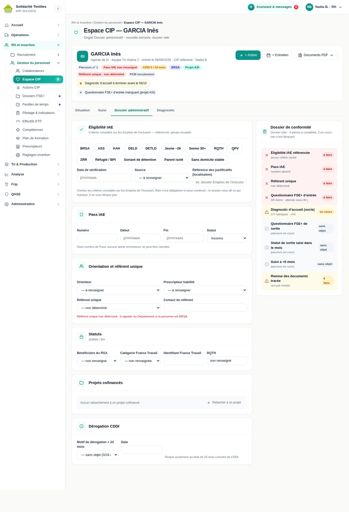
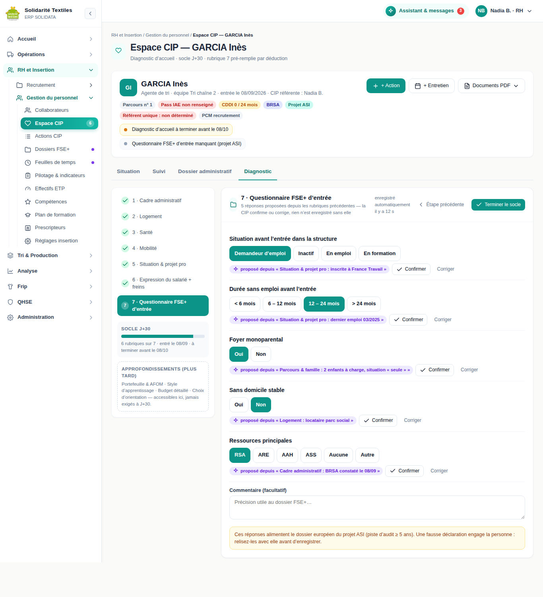
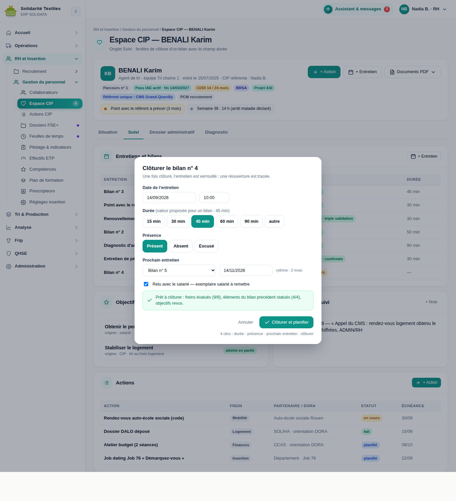

# Guide CIP — Dossier administratif et conformité FSE+

> **Livré le 13/09/2026 (PR A « Conformité immédiate »), complété le même jour (PR B « Cadre RSA et
> temps d'accompagnement »).** Ce guide complète le
> [Guide CIP — Le module Insertion au quotidien](GUIDE_CIP_INSERTION.md), qui reste le mode d'emploi de
> l'accompagnement lui-même (diagnostic, bilans, objectifs, actions, sortie). Ici, on ne parle que de ce
> que **l'autorité de tutelle et le cofinanceur européen exigent** : le dossier administratif de chaque
> salarié, le questionnaire FSE+ d'entrée et de sortie, le relevé à six mois, l'écran qui dit ce qui
> manque avant qu'un contrôleur ne le découvre — et, depuis la PR B, ce que la structure doit au
> référent unique externe des bénéficiaires du RSA (§ 9) et la feuille de temps de l'intervenant qui
> les accompagne (§ 10).
>
> - **Public** : CIP, RH, administrateur. Les écrans décrits sont réservés aux rôles **ADMIN et RH** — un
>   encadrant technique n'en voit aucun. La feuille de temps (§ 10) fait exception : un encadrant
>   technique qui mène lui-même des entretiens ou des actions voit **la sienne**, jamais celle d'un
>   collègue.
> - **Les copies d'écran de ce guide sont des maquettes**, validées le 12/09/2026 avant développement :
>   l'écran livré peut différer dans le détail.

---

## Sommaire

1. [Pourquoi ce guide](#1-pourquoi-ce-guide)
2. [Le dossier administratif d'un salarié](#2-le-dossier-administratif-dun-salarié)
3. [Le questionnaire FSE+ d'entrée, dans le diagnostic](#3-le-questionnaire-fse-dentrée-dans-le-diagnostic)
4. [La clôture d'un entretien : durée et présence](#4-la-clôture-dun-entretien--durée-et-présence)
5. [La sortie](#5-la-sortie)
6. [Le relevé à six mois](#6-le-relevé-à-six-mois)
7. [L'écran « Dossiers FSE+ — pièces à compléter »](#7-lécran--dossiers-fse--pièces-à-compléter-)
8. [Les projets cofinancés (Réglages insertion)](#8-les-projets-cofinancés-réglages-insertion)
9. [Le cadre RSA en structure d'accueil](#9-le-cadre-rsa-en-structure-daccueil)
10. [La feuille de temps](#10-la-feuille-de-temps)
11. [Ce qui protège les personnes](#11-ce-qui-protège-les-personnes)
12. [FAQ — 9 questions](#12-faq--9-questions)

---

## 1. Pourquoi ce guide

Trois documents transmis par la référente institutionnelle en septembre 2026 changent ce que la structure doit **prouver**, dossier par dossier :

1. **Les évolutions pour les BRSA en Seine-Maritime (loi Plein Emploi).** Tout bénéficiaire du RSA est inscrit à France Travail ; un **orienteur** l'a envoyé vers nous, et **un référent unique** — souvent extérieur à la structure — tient son parcours. Il faut savoir, pour chaque salarié, qui est qui.
2. **La Plateforme de l'inclusion.** Les critères d'éligibilité IAE, le Pass IAE et ses suspensions ou prolongations vivent sur *Les Emplois de l'inclusion*. Notre outil ne les remplace pas : il en garde la trace et prépare la saisie.
3. **Le cofinancement FSE+ (Ma Démarche FSE+).** L'Accompagnement Social Intensif est financé à ~60 % par l'Union européenne. Chaque participant doit avoir un **dossier individuel complet** : éligibilité prouvée à l'entrée, questionnaire d'entrée dès l'arrivée, **statut de sortie saisi dans le mois**, et **situation relevée à +6 mois**.

**Ce qui bloque un paiement FSE+** : une sortie non saisie dans le mois (la plateforme refuse alors le dépôt du bilan financier), un questionnaire d'entrée ou de sortie incomplet, un dossier sans preuve d'éligibilité, une feuille de temps non signée ou incohérente avec les congés. Ce sont les indicateurs de résultat qui valident la subvention : **le retard de saisie de la sortie est le seul qui ne se rattrape pas**, parce que la situation se recueille auprès de la personne, et qu'elle décroche vite.

---

## 2. Le dossier administratif d'un salarié

**Objectif** : réunir en un seul endroit ce que l'autorité demande sur la situation administrative, sans ressaisir ce qui existe déjà ailleurs.

*Maquette validée le 12/09/2026 — l'écran livré peut différer dans le détail.*

**Pas à pas**

1. Ouvrez la fiche d'un salarié dans **Espace CIP**, puis l'onglet **« Dossier administratif »** (3ᵉ onglet, juste après « Diagnostic »).
2. **Éligibilité IAE** — cliquez les critères constatés (14 au référentiel : bénéficiaire du RSA, ASS, AAH, demandeur d'emploi de longue ou très longue durée, jeune de moins de 26 ans, senior, RQTH, QPV, ZRR, réfugié, sortant de détention, parent isolé, sans domicile stable). Renseignez la **date de vérification**, la **source** (auto-prescription / prescripteur habilité) et la **référence des justificatifs** (« dossier Emplois de l'inclusion n°… »). **On référence, on ne dépose jamais** : une notification de droits porte le montant des ressources, la composition du foyer et parfois la santé. Elle reste sur la plateforme de l'État, qui fait foi ; notre outil en garde l'adresse, pas la copie.
3. **Pass IAE** — numéro, date de début, date de fin. Le **statut** (Actif / Suspendu / Prolongé / Expiré / Inconnu) est **calculé**, jamais saisi : il se déduit des dates et des événements. Bouton **« + Événement »** pour enregistrer une **suspension** ou une **prolongation** (type, du, au, motif, référence Emplois de l'inclusion). Une date de fin laissée vide s'affiche « en cours », pas « — ». Le bouton **« Bilan de prolongation (PDF) »** est là, comme avant ; il demande un numéro de Pass.
4. **Orientation et référent unique** — l'orienteur (Département-CMS, France Travail, mission locale, Cap emploi, CCAS, autre), le prescripteur habilité, la date de prescription, puis le **référent unique** et son contact. **Nous sommes structure d'accueil, pas référent unique** (arbitrage du 12/09/2026) : le contrat d'engagements réciproques est tenu par le CMS ou France Travail, et nous **alimentons** ce référent. C'est pourquoi son nom et son téléphone comptent autant que le reste : sans eux, personne ne sait à qui envoyer un point d'étape. Quand le référent est **France Travail**, cochez « Actualisation mensuelle requise » : le bouton « Actualisation faite aujourd'hui » enregistre chaque passage (une actualisation oubliée coupe les droits). Un référent **« non déterminé »** s'affiche en rouge, avec sa consigne : à signaler au Département si la personne est bénéficiaire du RSA.
5. **Statuts** — bénéficiaire du RSA (oui / non / non renseigné, avec sa date de constat), **catégorie France Travail** (A à G, avec sa date), identifiant France Travail. La RQTH s'affiche ici mais **se saisit au diagnostic** : deux saisies finiraient par se contredire. Cette section n'est visible que des rôles **ADMIN et RH**. Pour un responsable d'équipe, elle n'est pas « vide » : le serveur ne la lui envoie pas du tout.
6. **Bloc à coller sur les Emplois de l'inclusion** — sous l'éligibilité, un texte tout prêt (critères, prescripteur, numéro et dates du Pass, statut). Bouton **« Copier »** ; si le navigateur refuse la copie automatique, le texte reste sélectionnable d'un clic et l'écran vous le dit. Les champs manquants y sont écrits **« non renseigné »** : sur un formulaire officiel, un blanc se lit comme un oubli.
7. **Dérogation CDDI** — motif et date, requis seulement au-delà de 24 mois cumulés.
8. **Pièces du dossier** — dépôt de **quatre types seulement** : exemplaire signé d'un entretien, convention PMSMP, accusé de remise de document, autre pièce. PDF, JPEG ou PNG, 5 Mo maximum. Le contenu réel du fichier est vérifié : un document renommé en `.pdf` est refusé. **Aucun justificatif d'éligibilité ici** (voir point 2).
9. Colonne de droite : **« Dossier de conformité »**, les 9 pièces du dossier FSE+ avec leur état — **complet** (vert), **en cours** (ambre), **à faire** (rouge), **sans objet** (gris). Le lien « Compléter » ouvre directement l'onglet ou le champ concerné. Les 9 pièces, dans l'ordre : éligibilité IAE référencée · Pass IAE · référent unique · questionnaire FSE+ d'entrée · diagnostic d'accueil (socle) · questionnaire FSE+ de sortie · statut de sortie saisi dans le mois · suivi à +6 mois · remise des documents tracée.

*Maquette validée le 12/09/2026 — l'écran livré peut différer dans le détail.*

*Maquette validée le 12/09/2026 — l'écran livré peut différer dans le détail.*

**Ce qui est automatique** : le statut du Pass IAE (recalculé à chaque ouverture et à chaque saisie, y compris quand c'est le calendrier qui l'a fait changer), l'état des 9 pièces, les badges de l'en-tête de fiche (Pass IAE coloré selon son statut, BRSA, projet cofinancé, référent unique en rouge s'il manque), et le journal RGPD de chaque consultation et de chaque modification.

> **Points de vigilance**
> - **Rien n'est obligatoire pour continuer.** Le dossier vous dit ce qui manque, il ne vous bloque jamais.
>   Un nouvel entrant se saisit en trois minutes et se complète au fil des semaines.
> - **Chaque section a son propre bouton « Enregistrer »** : enregistrez la section où vous venez de
>   travailler. Une section que vous ne voyez pas ne peut pas être effacée par mégarde.
> - **« Non renseigné » n'est pas « non ».** Pour le statut BRSA, les deux réponses sont distinctes dans
>   tous les comptages et dans l'export.
> - Sans numéro de Pass, **aucune alerte d'échéance n'est calculable** — l'écran le dit sous le formulaire.

---

## 3. Le questionnaire FSE+ d'entrée, dans le diagnostic

**Objectif** : recueillir dès l'arrivée les cinq réponses que le dossier européen exige, sans rouvrir une conversation que vous venez d'avoir.

*Maquette validée le 12/09/2026 — l'écran livré peut différer dans le détail.*

**Pas à pas**

1. Dans le **diagnostic d'accueil**, allez à la rubrique **« Données FSE+ (entrée) »** (avant-dernière, juste avant « Freins & synthèse »).
2. Cinq questions, en boutons : **situation avant l'entrée** (demandeur d'emploi / inactif / en emploi / en formation), **durée sans emploi** (moins de 6 mois / 6 à 12 / 12 à 24 / plus de 24), **foyer monoparental**, **sans domicile stable**, **ressources principales** (RSA / ARE / AAH / ASS / aucune / autre). Un commentaire libre facultatif complète l'ensemble.
3. Quand une réponse peut se déduire des rubriques déjà remplies, elle apparaît **proposée** avec sa provenance : *« proposé depuis "Logement : hébergé chez un tiers" »*. Deux boutons : **Confirmer** (la réponse est posée) ou **Corriger** (la proposition disparaît et vous répondez vous-même). Une proposition ne s'affiche **que** si la case est vide, et elle ne revient pas après avoir été écartée.
4. En haut à droite, le compteur **« n/5 réponses »** : vert à 5/5, ambre sinon — **rouge** si la personne participe à une opération cofinancée.
5. Sous les questions, l'avertissement à lire avec la personne : ces réponses alimentent un dossier européen conservé au moins cinq ans, **une fausse déclaration engage la personne**.

**Ce qui est automatique** : les propositions et leur source, le compteur de complétude, la date de recueil (posée la première fois que les cinq réponses sont là, et **jamais repoussée** ensuite), le marquage rouge de la rubrique pour les participants ASI, et la conversion silencieuse des réponses saisies avant septembre 2026 (un dossier déjà rempli reste enregistrable).

> **Points de vigilance**
> - **Le délai est de 30 jours.** Le diagnostic d'accueil doit être réalisé dans le mois qui suit l'entrée ;
>   passé ce délai, l'alerte « questionnaire FSE+ d'entrée incomplet » devient critique pour un participant
>   ASI.
> - Une proposition **n'est jamais enregistrée toute seule**. Tant que vous n'avez pas cliqué, la case est
>   vide et compte comme manquante.
> - Le questionnaire porte des **statuts sociaux** (foyer, logement, ressources) : son écran est réservé
>   ADMIN/RH, comme le reste du dossier administratif.

---

## 4. La clôture d'un entretien : durée et présence

**Objectif** : mesurer le temps d'accompagnement et l'assiduité sans ajouter une minute de saisie.

*Maquette validée le 12/09/2026 — l'écran livré peut différer dans le détail.*

**Pas à pas**

1. Clôturez l'entretien comme avant (« Clôturer et planifier »). La fenêtre de clôture comporte désormais deux réglages de plus.
2. **Durée** : une rangée de boutons **15 / 30 / 45 / 60 / 90 min**, plus **« autre »** pour saisir une valeur libre. La valeur proposée dépend du type d'entretien — 90 min pour un diagnostic d'accueil, 45 pour un bilan intermédiaire, 30 pour une période d'essai ou un renouvellement, 60 pour un bilan de sortie, 15 pour un suivi post-sortie. **Un clic, cinq secondes.**
3. **Présence** : Présent / Absent / Excusé.
4. Si la personne était absente ou excusée, un **motif facultatif** apparaît : santé, démarche administrative, garde d'enfant, transport, autre — et une **référence de pièce** si un justificatif a été remis (« justificatif remis le 12/09, classé au dossier »).

**Ce qui est automatique** : la durée proposée par type, l'enregistrement de tout cela au moment de la clôture (jamais un début et une fin d'horloge à saisir), et la remontée dans les documents destinés au référent externe.

> **Points de vigilance**
> - **Le motif d'absence reste facultatif, et c'est délibéré.** Une absence sans motif ne sera **jamais**
>   imprimée « injustifiée » sur un document qui sort de la structure : votre silence ne peut pas se
>   retourner contre la personne, dont les droits dépendent de son assiduité.
> - La liste des motifs est volontairement **grossière** : « santé » ne dit rien d'un état de santé. **Ne
>   notez jamais la nature médicale**, et ne joignez jamais une pièce de santé.
> - La durée est **déclarative**. Elle sera annoncée comme telle sur les documents qui l'utiliseront.

---

## 5. La sortie

**Objectif** : que la sortie entre au dossier européen **dans le mois**, y compris quand la personne est partie sans entretien.

**Pas à pas — avec bilan de sortie (le cas normal)**

1. Menez le bilan de sortie comme d'habitude (catégorie officielle de sortie, documents remis, satisfaction).
2. Dans l'étape **« Sortie & documents »**, un bloc **« Sortie FSE+ »** : la **situation à la sortie** (emploi durable / emploi de transition / formation / autre sortie positive / inactivité / chômage / non renseignée), le **type de contrat** (CDI, CDD de 6 mois ou plus, CDD de moins de 6 mois, intérim, création d'activité, formation qualifiante, autre, sans objet) et un commentaire facultatif.
3. Laissé vide, ce bloc **se déduit de la catégorie de sortie** choisie plus haut — jamais d'une valeur inventée : la catégorie IAE « autre sortie » n'a pas d'équivalent européen et donne « Non renseignée ».
4. À la clôture, la sortie part dans le dossier de l'opération, dans la même opération d'enregistrement que le verrouillage de l'entretien.

**Pas à pas — sans bilan (la personne est partie)**

1. Depuis l'écran **« Dossiers FSE+ »** (§ 7), cliquez la case rouge **« Sortie »** de la ligne concernée — ou le lien « Compléter » du dossier de conformité sur sa fiche.
2. Trois réponses : **date de sortie**, **situation à la sortie**, **type de contrat**. C'est tout.
3. Enregistrez. La sortie entre au dossier tout de suite et **pourra être précisée plus tard** : si un bilan de sortie est finalement tenu, il complète la même ligne, il n'en crée pas une seconde.

**Ce qui est automatique**

- **À J+15 après la fin de contrat**, si aucune sortie n'est enregistrée : une alerte **critique** apparaît sur la fiche, et la relance quotidienne la dépose dans vos alertes (pour les participants de l'opération ASI).
- **À J+25**, un second rappel, avec la phrase qui compte : *au-delà, la situation ne se recueille plus auprès de la personne.*
- Le **délai de saisie** (date de saisie moins date de fin de contrat) est calculé et exporté. **C'est la colonne que l'autorité regarde en premier.** L'horodatage retenu est celui du **premier** recueil : une correction ultérieure ne vous crée pas un retard rétroactif.

> **Points de vigilance**
> - **Trois réponses valent mieux qu'un dossier vide.** Une sortie saisie sans bilan vaut infiniment mieux
>   qu'une sortie jamais saisie : elle se précise, l'autre se perd.
> - Les délais légaux à retenir : **30 jours** après le départ pour que la plateforme accepte le bilan
>   financier ; nos alertes sont posées avant (15 et 25 jours) pour vous laisser le temps d'appeler.
> - Ces réglages (15 et 25 jours) sont modifiables par l'administrateur dans **Réglages insertion**.

---

## 6. Le relevé à six mois

**Objectif** : produire l'indicateur de résultat qui valide la subvention.

**Pas à pas**

1. Six mois après la sortie, un entretien **« Suivi post-sortie (+6 mois) »** est planifié automatiquement, et la pièce « Suivi à +6 mois » du dossier de conformité passe à **à faire** à son échéance.
2. Saisissez la situation : depuis l'écran **« Dossiers FSE+ »** (case **+6 mois**) ou depuis la fiche. Deux champs : la **situation** et la **date du relevé**. Souvent deux minutes, au téléphone.
3. Les situations proposées sont celles de la sortie, **plus « Injoignable »**.

> **Points de vigilance**
> - **« Injoignable » n'est pas « Non renseignée ».** La première dit que vous avez cherché et que la
>   personne a changé de numéro ; la seconde dit que personne n'a appelé. L'autorité distingue les deux, et
>   l'export porte la différence. *(L'encart d'aide de la fenêtre conseille encore « Non renseignée » : c'est
>   un texte hérité d'un premier arbitrage, le bouton « Injoignable » existe bien — utilisez-le.)*
> - Le relevé ne peut se saisir **qu'après** la sortie : tant qu'elle manque, la pièce reste « sans objet »
>   et l'écran vous renvoie vers la sortie.
> - Le délai de six mois est un réglage (`insertion.post_sortie_mois`) : il valait trois mois avant
>   septembre 2026, il en vaut six depuis, parce que c'est la mesure que le cofinanceur attend.

---

## 7. L'écran « Dossiers FSE+ — pièces à compléter »

**Objectif** : voir d'un coup d'œil ce qui manque sur toute la cohorte, au lieu d'ouvrir quatorze fiches.

*Maquette validée le 12/09/2026 — l'écran livré peut différer dans le détail.*

**Pas à pas**

1. Menu **RH et Insertion → Gestion du personnel → « Dossiers FSE+ »** (juste après « Actions CIP »), rôles ADMIN/RH.
2. En haut, quatre indicateurs : **participants**, **dossiers complets** (n/N et pourcentage), **à traiter** (questionnaire d'entrée ou de sortie manquant), **relevés à +6 mois échus**.
3. Choisissez l'**opération** et la **période** (six trimestres glissants). Le bouton **« Incomplets d'abord »** remonte les dossiers qui demandent du travail.
4. Le tableau : **une ligne par participant, une colonne par pièce** (les 9 du dossier de conformité), et une dernière colonne « À faire » qui les nomme en toutes lettres. Un clic sur la ligne ouvre la fiche du salarié ; un clic sur une case rouge **Sortie**, **Saisie < 30 j** ou **+6 mois** ouvre directement le formulaire de saisie, sans quitter l'écran.
5. **Export FSE+ (CSV)** — le fichier nominatif des participants, `fse-participants_<code>_<année>_T<n>.csv`.
6. **Bilan d'exécution (JSON)** — l'agrégat, strictement non nominatif.

**Ce que contient l'export CSV** : **29 colonnes**, une par information, **en français**, une seule ligne d'en-tête, et cinq lignes de traçabilité en tête du fichier (export, généré le, généré par, périmètre, nombre de lignes, version de l'outil, et la mention *« Document de travail ERP — les saisies officielles font foi »*). Identité et situation administrative (identifiant interne, NOM, prénom, naissance, sexe, commune de résidence), projet et dates d'entrée/sortie, **critères d'éligibilité**, **BRSA**, **catégorie France Travail**, **type de référent unique**, dates de parcours et de fin de contrat, les **items du questionnaire d'entrée** (situation avant l'entrée, durée sans emploi, niveau d'instruction, foyer monoparental, sans domicile stable), la date de recueil et la complétude du questionnaire, la **sortie** (date, situation, date de saisie, **délai de saisie en jours**), la **situation à +6 mois** et sa date, et la **complétude du dossier** sur les 9 pièces.

**Ce qu'il ne contient pas** : **aucun frein**, aucune donnée de santé, rien du judiciaire, aucun commentaire de budget, aucune note de suivi, aucune note de profil, rien du PCM. La RQTH n'y figure **que** comme code d'éligibilité — jamais comme information médicale. Un champ non renseigné laisse une **cellule vide**, jamais un zéro (seule exception, dictée par l'autorité : la colonne BRSA écrit « Non renseigné » en toutes lettres).

**Un export à zéro ligne est refusé**, avec son motif affiché : un fichier vide remis à un financeur est pire qu'un fichier absent. Chaque génération est **inscrite au journal RGPD avant l'envoi** — si le journal ne peut pas s'écrire, l'export n'a pas lieu.

**Le bilan d'exécution** reprend les huit sections imposées : identification de l'opération, participants, indicateurs d'entrée item par item, **sorties avec la ligne « sortie non renseignée »**, **+6 mois avec la ligne « non relevée »**, taux de complétude **par pièce**, moyens (postes affectés, quotités, taux forfaitaire), et la **méthode de calcul de chaque taux écrite en toutes lettres**. Il est téléchargé au format JSON : c'est son **contenu**, que la direction met en forme et signe — la mise en page PDF signée n'est pas produite par l'outil aujourd'hui.

> **Points de vigilance**
> - L'export CSV est **nominatif** : il est réservé au contrôle et sa génération est tracée à votre nom.
> - Le tableau ne montre que les salariés **rattachés** à l'opération. Personne n'y entre par déduction d'un
>   statut social (voir § 8).
> - Les feuilles de temps par intervenant **ne sont pas encore déployées** (elles arrivent avec la PR B) : le
>   bilan écrit « non comptabilisable » plutôt qu'un zéro qui se lirait « aucune heure ».

---

## 8. Les projets cofinancés (Réglages insertion)

**Objectif** : savoir quelles opérations la structure porte, qui y participe, et quels postes y sont affectés.

**Pas à pas**

1. Menu **Administration → Réglages insertion** (`/admin/insertion`), section **« Projets cofinancés »**.
2. Deux opérations sont créées au premier démarrage :
   - **ASI 2026-2027** (`ASI-2026-2027`) — Accompagnement Social Intensif, FSE+ / Département 76 : l'opération **à participants**, celle que suit l'écran « Dossiers FSE+ ».
   - **Postes CIP en OCS 2026-2027** (`OCS-CIP-2026-2027`) — FSE+ / DDETS 76, cofinancement en **coûts simplifiés** : elle porte des **postes**, pas des personnes accompagnées.
3. Pour chaque projet : code, nom, type (ASI / OCS / autre), financeur, référence de convention, dates, **taux forfaitaire** et **part de cofinancement européen**, actif ou clos.
4. Bouton **« Postes »** : la liste des intervenants affectés, avec leur **quotité en pourcentage** et leurs dates. Sans quotité ni taux forfaitaire, une feuille de temps ne se rattache à aucun plan de financement — c'est ce que le contrôle vérifie.

> **Points de vigilance**
> - **Le rattachement d'un participant à un projet se saisit toujours à la main**, jamais déduit d'un statut
>   social : être bénéficiaire du RSA ne fait entrer personne dans une opération européenne.
> - **Aujourd'hui, aucun écran ne permet ce rattachement.** Le bouton « Rattacher à un projet » de la fiche
>   renvoie vers les réglages, où seuls les projets et les postes se gèrent. En attendant l'écran de
>   rattachement, demandez à votre administrateur (l'API existe et le geste est tracé).
> - Un projet se **clôt**, il ne se supprime pas : les dossiers qui s'y rattachent doivent rester lisibles
>   pendant toute la piste d'audit.

---

## 9. Le cadre RSA en structure d'accueil

**Objectif** : tenir ce que la réforme du RSA demande à une structure d'accueil qui n'est pas référent unique — savoir combien la personne travaille, l'assiduité aux rendez-vous, et alimenter le référent qui, lui, tient le contrat d'engagements réciproques.

**Solidarité Textiles n'écrit pas ce contrat** (arbitrage du 12/09/2026, voir § 2 point 4). Nous ne saisissons ni ses termes, ni ses avenants, ni les décisions de suspension : c'est le rôle du centre médico-social ou de France Travail, désigné comme **référent unique** dans la rubrique « Orientation et référent unique » (§ 2). Ce que nous devons, à la place, c'est **alimenter** ce référent — et le prouver.

### 9.1 Le compteur d'activité hebdomadaire

**Pas à pas**

1. Dans le Dossier administratif, section **« Activité hebdomadaire »**, juste après « Orientation et référent unique ». Un **badge discret** en en-tête de la fiche (« Activité : 18 h/sem. ») en donne un aperçu partout ailleurs.
2. Le compteur additionne, semaine ISO par semaine ISO, les **heures de travail** (importées de la paie) et les **minutes d'accompagnement** (entretiens et actions dont la durée a été saisie), plus les jours de PMSMP. **Le temps de travail en CDDI compte** dans le volume attendu de 15 à 20 heures — c'est la décision de la direction du 12/09/2026 : un salarié à 26 heures contractuelles est au-dessus du plancher par le seul fait de travailler.
3. Une frise de 52-53 cases, une par semaine, colorée : vert (au-dessus de 15 h), ambre (en dessous), bleu (arrêt de travail déclaré), gris (« pas encore relevé »).
4. Sous la frise, la liste des semaines basses avec leur **raison catégorisée** : arrêt déclaré, quotité contractuelle inférieure au plancher, congés, ou « non expliqué — à voir avec la personne ».

**Ce qui est automatique** : le calcul, la catégorisation des raisons, le signalement quand deux semaines consécutives sont basses.

> **Points de vigilance**
> - **Vous ne lirez jamais le mot « seuil » sur cet écran.** Une semaine basse s'affiche « en dessous de
>   15 h » — un constat, pas un jugement. C'est le référent, pas nous, qui juge du respect du contrat.
> - **Une semaine sans heures importées n'est jamais affichée à zéro.** Elle s'affiche « — », en gris, et
>   ne compte dans aucune moyenne : c'est un mois de paie qui n'est pas encore arrivé, pas une semaine
>   d'inactivité.
> - **Le signalement ne se déclenche jamais pendant un arrêt de travail déclaré**, et une semaine sans
>   relevé interrompt la série au lieu de la prolonger.

### 9.2 Deux entretiens dédiés

Dans **Entretiens & bilans**, bouton **« Nouvel entretien »**, le sélecteur de type propose désormais huit valeurs — les six habituelles, plus :

- **« Point avec le référent »** — le dialogue avec le professionnel qui tient le contrat d'engagements réciproques. Choisissez sa **modalité** : *tripartite* (la personne était présente) ou *bilatérale* (entre professionnels, sans elle) — c'est cette distinction que l'autorité regarde. Cet entretien est **hors du compte des bilans d'accompagnement**.
- **« Entretien de conciliation (protection des droits) »** — la réforme du RSA ouvre un droit de contestation avant sanction. Le formulaire **commence par les motifs légitimes** (un problème de santé, une garde d'enfant, un problème de transport, une démarche administrative, une formation ou une démarche d'emploi, un deuil ou un événement familial, autre motif) : la question posée est « qu'est-ce qui vous en a empêché ? », jamais « pourquoi n'avez-vous pas obéi ? ». Puis l'issue : maintien du parcours, reprise avec aménagement, réorientation, sans suite.

> **Point de vigilance** — Les motifs de conciliation sont **volontairement généraux** : « un problème de santé » ne dit rien d'un état de santé, et ne doit rien en dire. N'y ajoutez jamais de détail médical dans le texte libre qui les accompagne.

### 9.3 La fiche pour le référent

**Objectif** : produire, en un clic, le document que le référent unique attend — et rien de plus.

**Pas à pas**

1. Dans le Dossier administratif, section **« Fiche pour le référent »**, ou depuis le menu **« Fiche PDF ▾ »** en en-tête de la fiche du salarié (raccourci sur les douze derniers mois).
2. Choisissez la **période** et le **motif de la transmission** (entrée en parcours, renouvellement de contrat, sortie de parcours, à la demande du référent).
3. **« Voir ce qui serait transmis »** : un aperçu, qui **n'enregistre rien**. Vous y lisez les neuf rubriques et rien d'autre.
4. **« Générer la fiche »** : enregistre une **copie exacte** de ce qui part — ce qui a été transmis le 12 mars reste ce qu'il était le 12 mars, même si le dossier change ensuite. La fiche s'imprime aussitôt.
5. Dans l'historique, pour chaque fiche déjà produite : **« Tracer la remise »** — deux dates indépendantes, l'une pour le référent (avec le moyen : courriel, courrier, main propre, dépôt sur une plateforme), l'autre pour **l'exemplaire remis à la personne concernée**. Une date future est refusée.
6. Bouton **« Relevé d'assiduité »** à côté : rendez-vous proposés et honorés, absences **par motif catégorisé** — jamais « injustifiée » quand le motif n'a pas été renseigné.

**Ce que la fiche contient, et rien d'autre** — neuf rubriques : identité et destinataire, situation d'emploi, activité hebdomadaire (avec le nombre de semaines sous 15 h, jamais le mot « seuil »), assiduité, freins **hors santé et judiciaire** (mobilité, administratif, finances, logement, linguistique, famille, numérique — les deux axes sensibles n'ont **aucune trace** dans le document, pas même une mention de leur absence), actions et orientations, objectifs en cours, prochaines échéances, et les droits de la personne.

> **Sans référent déterminé, la fiche ne peut pas être produite.** Le bouton reste inactif et l'écran renvoie vers la rubrique « Orientation et référent unique » : un document sans destinataire n'existe pas.

### 9.4 L'actualisation France Travail

Quand le référent est **France Travail**, un bloc **« Actualisation France Travail »** apparaît sous la fiche : douze mois, chacun dans l'un de **trois états** — faite (vert), non faite (ambre), ou **« non constatée »** (gris, l'état par défaut). Un mois non vérifié n'est jamais présumé « non fait » : c'est ce qui protège la personne d'un manquement que personne n'a réellement constaté.

### 9.5 Le tableau de bord CIP

Le bloc **« Rendez-vous réguliers et rappels »** (menu Espace CIP) affiche désormais quatre listes : les actualisations France Travail du mois à faire, les points avec le référent qui arrivent à échéance (tous les trois mois, un point tenu **ou** une fiche remise), les salariés dont l'activité est basse depuis deux semaines consécutives, et les **référents non déterminés, en rouge** — un dossier sans référent est un signalement à faire au Département.

---

## 10. La feuille de temps

**Objectif** : produire, pour chaque intervenant et chaque mois, la pièce que le cofinancement en coûts simplifiés (l'opération OCS) exige — signée, cohérente avec les congés, sans jamais divulguer l'identité des personnes accompagnées.

**Pas à pas**

1. Menu **RH et Insertion → Temps d'accompagnement** (`/insertion/temps`). ADMIN et RH choisissent l'intervenant et le mois ; un **encadrant technique ou un manager n'a pas de sélecteur : sa feuille est la sienne**, le serveur refuse le reste avant même de lire quoi que ce soit.
2. Le tableau des lignes se compose **automatiquement** depuis les entretiens et les actions **dont la durée a été saisie à la clôture** — sans durée, aucune ligne n'apparaît, plutôt que d'inventer une dépense. Chaque ligne porte sa date, le projet (ASI, OCS ou « Hors projet »), l'activité et un identifiant interne à la place du nom — **jamais un nom de salarié**.
3. **« + Ajouter un temps »** pour un temps qui ne se rattache à aucun salarié — un atelier collectif, une réunion de projet : date, activité, projet, durée par une **rangée de boutons** (15 / 30 / 45 / 60 / 90 / 120 min) ou une valeur libre.
4. En pied de tableau : le total, la ventilation par projet avec la **quotité d'affectation** et le **taux forfaitaire**, et une **ligne de cohérence avec les congés** — « conforme » en vert, ou « à expliquer » en ambre avec le détail des jours en anomalie. Une incohérence **ne bloque rien** : elle s'imprime, et l'intervenant peut l'expliquer.
5. **« Valider (intervenant) »** : la feuille se **fige** — elle ne peut plus être modifiée, et devient le document que la RH va relire. **« Valider (RH) »** : contre-signature, réservée à une personne **différente** de l'intervenant — une même personne ne peut pas signer les deux volets.
6. **« Rouvrir »** (ADMIN uniquement, motif obligatoire) si une correction s'impose après coup : les deux signatures tombent, il faudra revalider.
7. **« Exporter CSV »** et **« Imprimer »** : le document destiné au cofinanceur — six colonnes en français, jamais un nom de bénéficiaire, le pied de traçabilité complet.

**Ce qui est automatique** : la composition des lignes, le calcul de la cohérence, le figement au moment de la validation, et l'agrégat annuel des **heures d'accompagnement** (onglet « Synthèse », ADMIN/RH) qui se compose des **mêmes lignes** que les feuilles signées — le chiffre annoncé au dialogue de gestion et les feuilles produites ne peuvent jamais se contredire.

> **Points de vigilance**
> - **Un mois sans aucune ligne ne peut pas être validé** : signer un mois à zéro heure affirmerait ce que
>   personne n'a constaté.
> - **Les durées sont déclaratives.** Le PDF le dit en toutes lettres : « durées déclarées par
>   l'intervenant à la clôture des entretiens ».
> - Une feuille non validée après le 10 du mois suivant est **signalée** à l'écran — ce n'est pas une
>   date limite qui vous serait opposée, seulement le moment où le retard devient visible.

---

## 11. Ce qui protège les personnes

De quoi répondre à un salarié qui demande « qu'est-ce que vous notez sur moi, et qui le voit ? ».

| Ce qui est en place | Ce que ça veut dire concrètement |
|---|---|
| **Chiffrement en base** | Les textes libres de santé, de contexte judiciaire et les notes de suivi de la CIP sont chiffrés : même une lecture technique directe de la base ne les rend pas lisibles. |
| **Masquage par rôle** | Un responsable d'équipe ne reçoit **ni** les statuts sociaux (BRSA, catégorie France Travail), **ni** les pièces du dossier, **ni** le bloc à coller, **ni** le questionnaire FSE+ — ces éléments sont **absents** de ce que le serveur lui envoie, pas simplement masqués à l'écran. L'encadrant technique, lui, ne voit que le volet professionnel. |
| **Justificatifs non déposés** | Les preuves d'éligibilité restent sur *Les Emplois de l'inclusion*. L'outil en garde la référence : c'est une surface d'exposition en moins. |
| **Journalisation** | Chaque consultation et chaque modification du dossier administratif, chaque dépôt, consultation ou suppression de pièce, chaque saisie de sortie ou de relevé à six mois, chaque export : tout est inscrit au journal RGPD. La trace dit **qui a fait quoi et quand**, **jamais** ce que le dossier contient. |
| **Ce que l'IA reçoit** | Un dossier **pseudonymisé** — jamais le nom, jamais les identifiants : la personne devient « Salarié A ». L'IA ne fixe aucun niveau de frein, ne classe aucune sortie, ne décide rien ; elle propose, vous disposez. Elle ne reçoit ni le détail judiciaire, ni les pièces. |
| **Absence sans motif** | Elle ne s'imprime **jamais** « injustifiée » sur un document qui sort de la structure. |
| **Exports vers l'extérieur** | Aucun frein, aucune donnée de santé, rien du judiciaire, aucune note. La RQTH n'apparaît que comme code d'éligibilité. |
| **Conservation** | Le dossier d'accompagnement est anonymisé deux ans après le dernier contact. **Deux exceptions assumées** : les données de sortie FSE+ et le rattachement au projet sont **conservés** — la piste d'audit européenne court au moins cinq ans, et c'est écrit au registre des traitements. À l'anonymisation, les pièces déposées, les événements du Pass et les critères d'éligibilité sont **supprimés** ; le nom de l'orienteur, celui du référent et ses coordonnées (des données de tiers) sont effacés. |
| **Fiche pour le référent et actualisation France Travail** | Les fiches déjà transmises et le registre d'actualisation sont **supprimés intégralement** à l'anonymisation du salarié. Sur la feuille de temps, seul le rattachement à la personne accompagnée (`employee_id`) est retiré : le document reste, en tant que pièce de financement, conservé au-delà — comme les données FSE+. |

**Ce qu'il faut dire à la personne, et qui n'est pas dans l'outil** : que ses réponses au questionnaire FSE+ partent dans un dossier européen conservé au moins cinq ans, qu'une fausse déclaration l'engage, et qu'elle sera recontactée six mois après sa sortie — elle peut s'y opposer, et l'opposition est consignée.

---

## 12. FAQ — 9 questions

**1. Je n'ai pas les justificatifs d'éligibilité sous la main : je bloque le dossier ?** Non. Cochez les critères, mettez la date de vérification quand vous l'aurez, et notez la référence du dossier sur les Emplois de l'inclusion. La pièce « Éligibilité IAE référencée » restera « en cours » — c'est un signalement, pas un verrou.

**2. Le statut du Pass affiché ne me paraît pas juste.** Il est **calculé** à partir des dates et des événements, dans cet ordre : pas de numéro → inconnu ; date de fin dépassée → expiré ; suspension couvrant aujourd'hui → suspendu ; prolongation enregistrée et Pass encore valide → prolongé ; sinon actif. Corrigez les dates ou l'événement fautif, et le statut suit. Il ne se force pas à la main, exprès.

**3. Un salarié est parti sans prévenir. Que faire tout de suite ?** Ouvrez « Dossiers FSE+ », cliquez sa case rouge « Sortie », saisissez la date et la situation que vous connaissez. Vous aurez trente jours pour préciser, mais la ligne existe. Ne l'ajournez pas : c'est la seule donnée du dossier qui ne se rattrape jamais.

**4. Je ne sais pas classer la situation de sortie.** Choisissez « Non renseignée » plutôt qu'une case approchante : une situation inventée dans une pièce d'audit coûte plus cher qu'un trou assumé. Vous la corrigerez au premier contact.

**5. Est-ce que j'ai le droit de déposer l'arrêt de travail qui justifie une absence ?** Non. Enregistrez le motif « santé » (qui ne dit rien de l'état de santé) et, si vous voulez, la **référence** de la pièce reçue — « justificatif remis le 12/09, classé au dossier ». Le document papier reste au dossier RH ; le module ne reçoit jamais de pièce de santé.

**6. L'export refuse de se générer et affiche un message.** C'est une réponse, pas une panne : soit aucune ligne ne correspond au périmètre choisi (l'outil refuse d'émettre un fichier vide), soit plusieurs opérations actives se disputent la sélection — le message nomme alors les candidates. Changez de période ou d'opération.

**7. Dois-je encore saisir sur les Emplois de l'inclusion et sur Ma Démarche FSE+ ?** Oui, comme avant. SOLIDATA **prépare, contrôle et trace** ; les plateformes de l'État font foi, et chaque export le rappelle en toutes lettres. Le bloc à copier du dossier administratif est là précisément pour raccourcir la saisie sur la plateforme, pas pour la remplacer.

**8. Qu'est-ce qui n'est pas encore livré ?** Deux choses, annoncées : la **réorganisation de la fiche en quatre onglets** et la remontée du questionnaire FSE+ dans le socle du diagnostic, avec la **PR C** ; et un **écran encadrant accessible par lien** (sans compte SOLIDATA) pour les renouvellements. La **feuille de temps mensuelle par intervenant**, l'**agrégat des heures d'accompagnement** et la **fiche pour le référent** externe (§ 9 et § 10) sont, eux, **livrés** depuis la PR B. Aujourd'hui, l'écran de renouvellement demande toujours un compte SOLIDATA.

**9. La base légale de la fiche pour le référent, c'est réglé ?** Pas encore, et nous le disons sans détour. L'entrée au registre est posée sur la mission d'intérêt public du dispositif, mais **c'est notre délégué à la protection des données qui doit la confirmer** avant que le traitement soit définitivement établi, et l'analyse d'impact déjà engagée pour le module doit être complétée de ce point précis. En attendant, la fiche continue d'être produite quand le référent en a besoin — la structure ne peut pas faire autrement — mais ce point figure explicitement parmi ce qui reste à trancher (voir [`PRESENTATION_AUTORITE_INSERTION.md`](PRESENTATION_AUTORITE_INSERTION.md) § 12).

---

*Guide établi le 13/09/2026 à la livraison de la PR A « Conformité immédiate » (dossier administratif, questionnaires FSE+, dossier de conformité, export participants et bilan d'exécution), **complété le même jour** à la livraison de la PR B « Cadre RSA et temps d'accompagnement » (§ 9 et § 10 : compteur d'activité, deux entretiens dédiés, fiche pour le référent tracée, relevé d'assiduité, actualisation France Travail, feuille de temps signée). Les illustrations sont les maquettes validées le 12/09/2026 : l'écran livré peut différer dans le détail. À réviser après la première recette avec la CIP et à la livraison de la PR C.*
