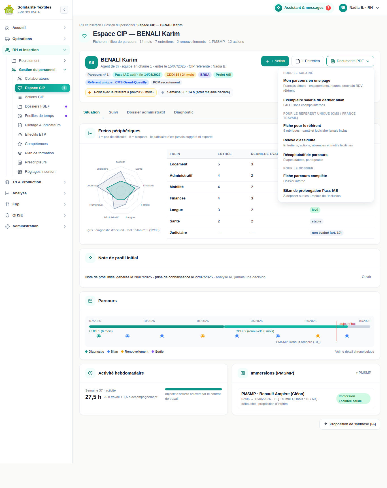
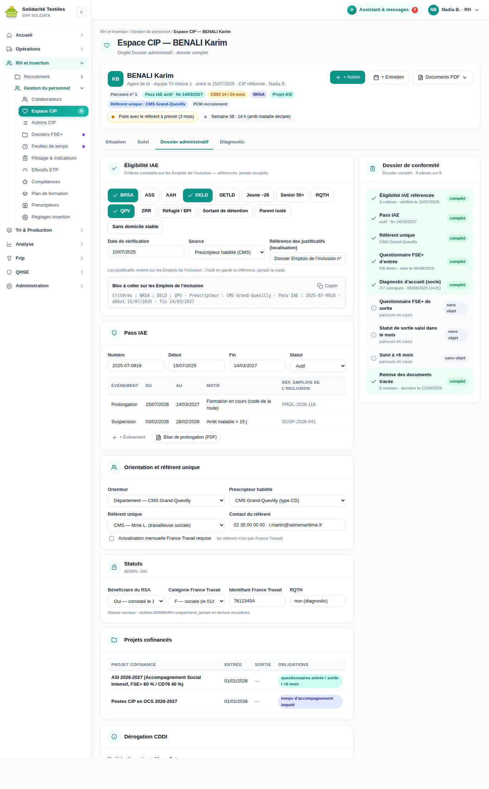
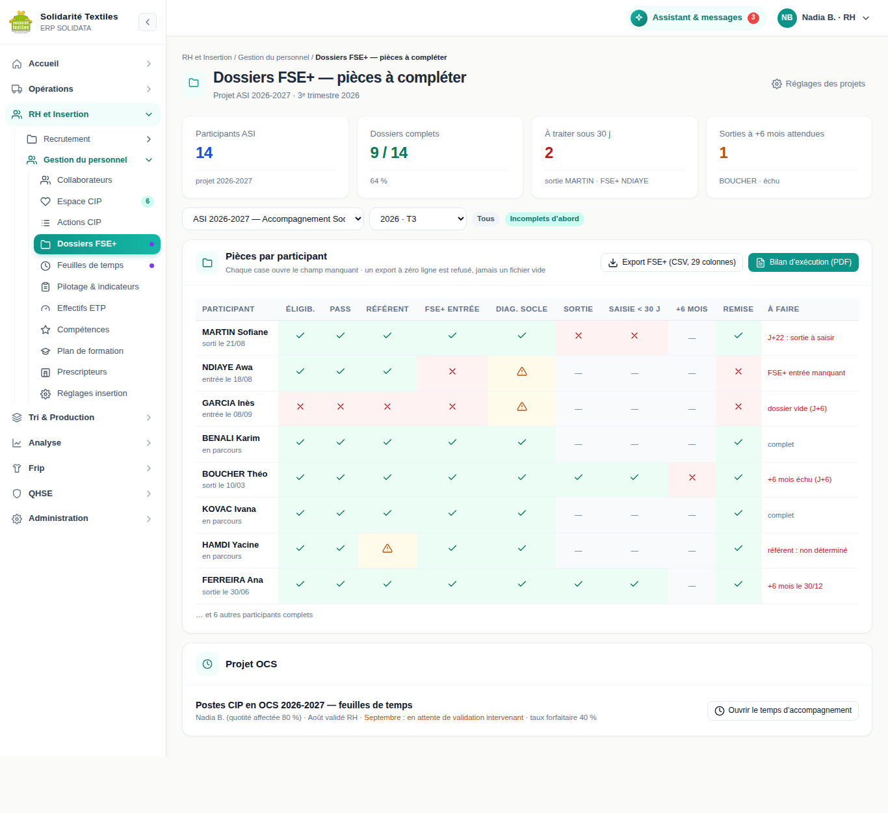

# SOLIDATA — Présentation à l'autorité de tutelle

**Le système d'information de l'accompagnement socio-professionnel de Solidarité Textiles**

*Destinataires : DDETS de Seine-Maritime (service Insertion par l'activité économique), Conseil départemental de Seine-Maritime, service instructeur des dossiers FSE+.*

*Document préparé pour une réunion de présentation d'une heure. Version du 13 septembre 2026.*

> **Comment lire ce document.** Il ne suppose aucune connaissance de l'outil ni aucune compétence
> informatique. Chaque section répond à une question posée par le service instructeur. Ce qui est
> **déjà en service** est indiqué comme tel ; ce qui est **en cours de réalisation** porte la mention
> « livraison prévue » et le chantier correspondant. Nous n'annonçons rien d'autre. **Aucune donnée
> nominative n'y figure** : les copies d'écran sont des maquettes, renseignées avec des noms fictifs.

**Vos neuf questions et leur réponse** : qu'est-ce que c'est, et que devient le dossier si l'auteur du
logiciel n'est plus là → **§ 1** · qui voit quoi → **§ 3** · où sont les données et qui y accède
techniquement → **§ 4** · comment vérifier qu'un document sort bien de l'outil → **§ 5** · tirer un
dossier au sort et l'imprimer → **§ 6** · que se passe-t-il si une donnée est fausse → **§ 7** · ce qui
part vers un prestataire d'intelligence artificielle → **§ 8** · combien de temps nous gardons quoi →
**§ 9** · le droit d'accès d'une personne → **§ 10**.

---

## 1. Ce qu'est SOLIDATA

### 1.1 Un logiciel développé pour la structure, et détenu par elle

SOLIDATA n'est pas un logiciel du commerce. C'est un **développement sur mesure**, réalisé pour
Solidarité Textiles et **dont la structure est propriétaire** : le code source lui appartient, il est
conservé dans un dépôt qu'elle contrôle, et aucun éditeur extérieur ne détient de droit sur lui. Ni
licence à renouveler, ni abonnement, ni clause empêchant de confier la suite à un autre prestataire.

Première mise en service le **8 mars 2026** ; version en service au 13 septembre 2026 : la **2.51.1**.
Chaque évolution est datée et décrite dans un journal de version conservé avec le code.

### 1.2 Ce qu'il couvre

SOLIDATA est l'outil de gestion **unique** de la structure — il remplace une dizaine de classeurs
bureautiques dispersés. Une trentaine de modules, regroupés en six familles :

| Famille | Ce que l'outil y fait |
|---|---|
| **Personnes** | Recrutement · **Insertion (accompagnement socio-professionnel)** · Gestion du personnel et contrats · Effectifs conventionnés en ETP · Temps de travail et pointage · Formation |
| **Collecte** | Conteneurs d'apport volontaire · Véhicules · Tournées · Application mobile des chauffeurs · Bordereaux de déchèterie |
| **Production** | Chaîne de tri · Production quotidienne · Stock et inventaires · Expéditions |
| **Commerce** | Clients et commandes · Boutiques de seconde main · Ventes au kilo · Contrôle de facturation |
| **Pilotage** | Finance et comptabilité · Reporting Métropole · Éco-organisme Refashion · Pilotage RSE · Énergie et gaz à effet de serre |
| **Conformité** | **Registre RGPD, journal d'audit, purges automatiques** · Santé-sécurité au travail · Habilitations par rôle |

Il est utilisé quotidiennement par la direction, la conseillère en insertion professionnelle, les
encadrants techniques, les responsables de boutique, les chauffeurs (sur téléphone) et les fonctions
support. Environ **46 salariés en parcours d'insertion** y sont suivis.

### 1.3 « Que devient le dossier si l'auteur du logiciel n'est plus là ? »

Question légitime. Nous la traitons sur quatre plans distincts.

**1. Le code source est détenu par la structure**, intégralement versionné dans un dépôt dont elle a
les accès. Un autre prestataire peut le reprendre : technologies courantes (Node.js, React,
PostgreSQL), aucun composant propriétaire, aucune dépendance à un service exclusif.

**2. La procédure de reconstruction est écrite.** Le guide de déploiement (`deploy/DEPLOIEMENT.md`) et
la note de reconstruction (`RECONSTRUCTION.md`) décrivent, commande par commande, la reconstruction
complète à partir d'un serveur nu, jusqu'à la restauration d'une sauvegarde.

**3. Les sauvegardes sont automatiques** (§ 4.3) et contiennent toute la base, module Insertion compris.

**4. Et surtout : le dossier est exploitable SANS le logiciel.** C'est le point décisif. Le module
Insertion dispose d'un **export tableur complet**, déjà en service : un classeur de cinq feuilles
(Informations, Salariés, Diagnostics, Entretiens, Plans d'action) au format Excel, ou un fichier CSV
par jeu de données. Il s'ouvre dans n'importe quel tableur, sur n'importe quel poste, sans SOLIDATA.
Nous recommandons d'en produire un **exemplaire annuel, archivé hors du système**, à l'appui du bilan.

> **En une phrase** : si l'outil disparaissait demain, le dossier d'accompagnement de chaque salarié
> resterait lisible dans un tableur, et le logiciel serait reconstructible à partir du code et des
> sauvegardes.

---

## 2. Le module Insertion en une page

Pour chaque salarié en parcours, le module tient **un dossier unique**, organisé autour d'entretiens
datés. Ce qu'il contient aujourd'hui :

- **Le dossier administratif** : critères d'éligibilité, Pass IAE (numéro, dates, alertes d'échéance
  à 7 mois et 2 mois), prescripteur, durée cumulée de contrat d'insertion avec alerte avant 24 mois,
  dérogation le cas échéant.
- **Le diagnostic d'accueil** : douze rubriques (logement, accès aux droits, santé, budget, mobilité,
  niveau de langue, situation et projet professionnels, expression du salarié, famille, volet européen
  d'entrée, volet judiciaire strictement minimisé), à réaliser sous 30 jours — dépassement signalé au
  tableau de bord.
- **Les neuf freins périphériques**, notés de 1 (pas de difficulté) à 5 (bloquant), réévalués à chaque
  entretien. Une case vide signifie « **non évalué** » — jamais « pas de difficulté ».
- **Les entretiens** : diagnostic, période d'essai, bilans en nombre libre, renouvellements, bilan de
  sortie, suivi après la sortie. Chacun est **gelé à sa clôture** : plus aucune modification sans
  réouverture motivée et tracée (§ 7).
- **Les objectifs et les actions** : chaque objectif porte son **origine** — « salarié » ou
  « conseillère » ; chaque action, sa nature, son objet, sa durée, le partenaire mobilisé, son résultat.
- **Les immersions professionnelles (PMSMP)** : bornes légales contrôlées (un mois par convention,
  60 jours sur douze mois glissants appréciés par entreprise d'accueil, deux conventions au plus) ;
  la convention officielle reste saisie sur *Immersion Facilitée*.
- **Les renouvellements de contrat** : formulaire de l'encadrant, avis de la conseillère, triple
  validation. **Les sorties** : quatre catégories officielles (emploi durable, emploi de transition,
  sortie positive, autres sorties), documents remis, satisfaction.
- **Le suivi après la sortie**, la trace de remise des documents, et le **journal de suivi** de la
  conseillère (ce qui se passe entre deux entretiens).

*Maquette de travail (noms fictifs). Évolution des neuf freins entre le diagnostic et le dernier bilan,
frise du parcours, activité de la semaine, immersions, menu des documents imprimables. La
réorganisation en quatre onglets est prévue au chantier C.*

*Maquette de travail (noms fictifs). Critères d'éligibilité cochés, Pass IAE et ses événements,
orienteur / prescripteur / référent unique, statuts sociaux réservés aux profils habilités, projets
cofinancés, et à droite le **dossier de conformité** — neuf pièces avec leur état. Chantier A, en cours.*

*Maquette de travail (noms fictifs). Par participant et par pièce : ce qui est complet, ce qui manque,
ce qui arrive à échéance. Chantier A, en cours.*

---

## 3. Qui voit quoi

Le principe : **un profil ne voit pas ce qu'il n'a pas à connaître, et ce qui lui est fermé est absent
de son écran — pas grisé, pas masqué : absent**. Le serveur retire l'information avant de l'envoyer au
navigateur ; il n'existe aucun moyen de la retrouver dans la page. Le module Insertion n'est ouvert
qu'à **trois profils** — administrateur, ressources humaines / conseillère, encadrant technique ; tous
les autres reçoivent un refus du serveur.

| Profil | Ce qu'il voit | Ce qu'il ne voit **pas** |
|---|---|---|
| **Administrateur** | L'ensemble du logiciel, la gestion des comptes, le paramétrage, les exports. Double authentification obligatoire. | Rien ne lui est fermé — mais rien ne lui permet non plus d'effacer une trace : ses consultations sensibles et ses exports sont journalisés comme ceux des autres. |
| **RH / conseillère en insertion (CIP)** | Le dossier d'insertion complet : diagnostic, neuf freins y compris santé et judiciaire, notes de suivi, note de profil, pièces signées, statuts sociaux, exports nominatifs. Double authentification obligatoire. | Les modules sans rapport avec sa mission (collecte, production, finance) selon le paramétrage des habilitations. |
| **Encadrant technique (profil « manager »)** | Le parcours, les entretiens, les objectifs et actions, les compétences métier, les renouvellements. | **Le frein santé et ses commentaires ; le frein judiciaire sous toute forme ; le commentaire budget ; les notes de suivi de la conseillère ; la note de profil ; les statuts sociaux et les pièces justificatives** (ces deux derniers points avec la livraison du chantier A). |
| **Autorité / auditeur externe** | Des **agrégats non nominatifs** uniquement : indicateurs d'insertion pour la Métropole, indicateurs de collecte, déclarations à l'éco-organisme en lecture. | **Le module Insertion en totalité** : aucun dossier individuel, aucun nom, aucun frein. Le serveur refuse l'accès. |
| **Délégué à la protection des données (DPO)** | Le registre des traitements, le journal d'audit, l'état et le déclenchement des purges, l'anonymisation, la production du droit d'accès. | Le contenu des dossiers d'insertion : il contrôle le dispositif, il ne lit pas les parcours. |
| **Finance** | La comptabilité, la trésorerie, les rapprochements bancaires — **en lecture seule** (toute écriture est refusée par le serveur). | Toute donnée de personnel : ni salarié, ni parcours, ni contrat. |
| **Chargé de communication** | Le tableau de bord général, le fil d'actualité, et l'écran d'affichage de l'atelier (2 onglets sur 8 du module correspondant). | Toute donnée de personnel, les pointages, les feuilles de temps, les exports de paie. L'assistant conversationnel lui est **fermé** — précisément pour qu'il ne puisse pas obtenir par la conversation ce que l'écran lui refuse. |
| **Chauffeur (application mobile)** | Sa tournée du jour, ses points de collecte, sa messagerie de service. Son identité de connexion **est le véhicule**, pas la personne. | Tout le reste : aucun accès aux modules de bureau, aucune donnée de personnel, aucun dossier d'insertion. |

**Trois garanties supplémentaires :** (1) **double authentification obligatoire** pour les profils qui
touchent aux données sensibles — administrateur, RH, DPO : mot de passe **et** code à usage unique
d'une application sur téléphone, vérification **renouvelée toutes les 24 heures** ; (2) **chiffrement
en base** des textes libres les plus sensibles (commentaires de santé, détail du frein judiciaire,
notes de suivi, note de profil) : lus directement dans la base, sans passer par l'application, ils sont
illisibles ; (3) **journalisation des consultations sensibles et de tous les exports nominatifs** — le
journal dit **qui a consulté quoi et quand, jamais ce que le document contenait**.

---

## 4. Où sont les données et qui y accède techniquement

### 4.1 L'hébergement

Les données sont hébergées chez **Scaleway, opérateur français, sur un serveur situé en France** : elles
ne quittent pas le territoire. Le serveur est un serveur dédié virtuel loué par la structure, organisé
en sept composants isolés les uns des autres (base de données, cache, serveur applicatif, interface
bureau, interface mobile, serveur web, renouvellement du certificat). L'accès depuis internet est
**chiffré exclusivement** (HTTPS, certificat renouvelé automatiquement), protégé par un pare-feu et par
le blocage des tentatives répétées de connexion. **La base de données n'est jamais exposée à
internet** : elle n'est joignable que depuis le serveur applicatif.

### 4.2 Qui détient les accès techniques

L'accès d'administration au serveur (connexion sécurisée à distance) est détenu par la direction et
par le développeur de l'outil. Il est distinct des comptes applicatifs : il permet d'exploiter la
machine, non de consulter un dossier sans laisser de trace — toute lecture faite par l'application
reste journalisée. Nous vous communiquerons en séance le nombre exact de personnes concernées.

### 4.3 Les sauvegardes

Deux chaînes de sauvegarde indépendantes coexistent, délibérément :

| Chaîne | Quand | Où | Conservation |
|---|---|---|---|
| **Applicative** | **Mardi et vendredi à 4 h** (heure de Paris), automatique | Volume dédié du serveur applicatif | 8 sauvegardes automatiques ; les sauvegardes manuelles ne sont jamais purgées |
| **Serveur** | **Chaque nuit à 2 h** (sous réserve que la tâche planifiée soit installée) **et à chaque mise à jour** de l'application | Répertoire du serveur, hors du dossier de l'application | 30 jours pour les quotidiennes, 90 jours pour celles des mises à jour |

**Ce que nous ne faisons pas encore, et nous le disons** : la copie automatique des sauvegardes vers
un stockage **distant** (hors du serveur) est écrite et prête, mais **n'est pas activée**. C'est notre
principal point de fragilité en cas de perte complète du serveur, et il est inscrit à notre plan de
travail.

---

## 5. Comment vérifier qu'un document que nous vous envoyons sort bien de l'outil

Un fichier tableur se modifie : aucun dispositif ne peut le rendre inaltérable une fois qu'il vous est
parvenu. Ce que nous pouvons garantir, c'est que **le fichier porte en lui-même de quoi le recouper**.

**Ce qui existe déjà** : le tableau des freins (23 colonnes) comporte une première feuille
« Informations » — nom de l'export, date et heure, nombre de lignes, filtres appliqués, règle de calcul,
mention de confidentialité. C'est le modèle que nous généralisons. **Ce qui est en cours de réalisation
(chantier A, livraison prévue)** :

1. **Un en-tête de traçabilité sur tous les exports**, dans les mêmes termes : nom de l'export, date
   et heure, **compte qui l'a généré**, périmètre en toutes lettres (les filtres), **nombre de
   lignes**, version de l'outil, et la mention :
   *« Document de travail — les saisies officielles (ASP, Emplois de l'inclusion, Immersion
   Facilitée, Ma Démarche FSE+) font foi. »*
2. **Un journal des exports** : chaque génération d'un fichier nominatif inscrit une ligne au registre
   (date, compte, type, nombre de lignes). Si l'inscription échoue, **l'export échoue aussi** : mieux
   vaut ne rien produire qu'un document non tracé. Pour tout fichier reçu, vous pouvez donc nous
   demander la ligne de journal correspondante et vérifier que tout concorde.
3. **Un export à zéro ligne est refusé**, avec un message qui en dit la raison. Il ne peut plus
   sortir de fichier vide qui se lirait « aucun bénéficiaire ». C'est une correction de fond : elle
   répond au défaut le plus grave que vous aviez relevé.

---

## 6. Le geste de contrôle sur place : tirer un dossier au hasard et l'imprimer

**C'est possible aujourd'hui, sans développement supplémentaire.** Le chemin, tel que nous le ferons
devant vous :

| Étape | Geste | Durée |
|---|---|---|
| 1 | Menu **RH et Insertion → Gestion du personnel → Espace CIP** | 5 s |
| 2 | Vous désignez une personne dans la liste ; nous ouvrons sa fiche | 10 s |
| 3 | Bouton **« Fiche PDF »** → la fiche de parcours complète s'ouvre dans une fenêtre d'impression au format A4 | 20 s |
| 4 | Onglet **Diagnostic** → **« PDF dossier »** → le diagnostic d'accueil complet | 20 s |
| 5 | Onglet des entretiens → chaque entretien → **« PDF dossier »** (un bilan = un document daté) ; le cas échéant **« Bilan de prolongation (PDF) »** du Pass IAE | 20 s par pièce |

Sur un dossier ordinaire (un diagnostic, trois à sept entretiens), **l'ensemble se produit en deux à
trois minutes**. Deux précisions d'honnêteté : chaque document existe en **deux variantes** —
« exemplaire salarié », en français simple et sans champ interne, et « exemplaire dossier », complet,
celui que vous consulterez ; et l'impression passe par la fenêtre d'impression du navigateur (papier
ou enregistrement en PDF), sans bouton unique « tout imprimer » — nous l'avons noté.

---

## 7. Que se passe-t-il si une donnée est fausse

C'est la démonstration à laquelle vous attachez le plus de prix, et celle dont nous sommes le plus
sûrs. **Le principe** : à sa clôture, un entretien est **verrouillé** — toute modification est refusée
par le serveur, avec un message indiquant la marche à suivre. Ce n'est pas un réglage d'affichage,
c'est un refus au niveau des données. **La correction, geste par geste :**

1. Ouvrir l'entretien concerné. Le bandeau indique qu'il est clôturé, avec la date de verrouillage.
2. Bouton **« Réouvrir cet entretien… »**. Il n'est proposé qu'aux profils administrateur et RH.
3. Une **zone de motif s'ouvre — obligatoire**. Sans motif écrit, le bouton de validation reste
   inactif.
4. À la validation, trois choses se produisent **dans la même opération** : l'**état antérieur complet**
   est copié dans un historique des versions, avec l'action « réouverture », l'auteur et le motif ; le
   verrou est levé ; et **les validations existantes sont annulées** — un entretien rouvert doit être
   revalidé, on ne peut donc pas retoucher discrètement un document déjà signé.
5. La correction est saisie, puis l'entretien est clôturé de nouveau : une seconde copie de son état
   est déposée dans l'historique. **La trace porte donc l'avant et l'après.**

**Ce qui n'est pas encore fait, et nous le disons** : cet historique est conservé et restituable, mais
**il n'a pas encore d'écran de consultation** (seul le journal de suivi de la conseillère en a un). Nous
vous le montrerons par une extraction directe de la base ; l'écran est à inscrire au chantier C.

---

## 8. Ce qui part vers un prestataire d'intelligence artificielle

L'outil comporte une aide à la rédaction (préparation d'entretien, proposition de synthèse, note de
profil à l'arrivée d'un salarié) qui s'appuie sur un modèle de langage fourni par un prestataire
extérieur — **Anthropic**, modèle Claude — joint par une interface de programmation.

**Quatre règles, inscrites dans le code et vérifiables :**

1. **Aucune identité ne part.** Noms et prénoms sont remplacés avant tout envoi par des jetons stables
   — « Salarié A », « Salarié B » ; la table de correspondance ne quitte jamais notre serveur. Le
   remplacement couvre aussi les **mentions du nom à l'intérieur des textes libres** (observations,
   bilans), y compris sans accents ou en majuscules.
2. **La date de naissance exacte ne part pas** : elle est remplacée par une **tranche d'âge**. Les
   identifiants (matricule, titre de séjour, numéro de sécurité sociale, coordonnées bancaires) et
   les coordonnées (adresse électronique, téléphone) sont masqués.
3. **Le frein judiciaire ne part jamais. Le détail du frein de santé ne part jamais.** C'est une
   liste blanche : seules les rubriques explicitement autorisées sont transmises. Ce n'est pas un
   filtre qui retire ce qu'il reconnaît, c'est une sélection qui ne laisse passer que ce qui est
   nommé.
4. **L'outil propose, la conseillère décide.** Un niveau de frein n'est **jamais** écrit par la
   machine : une suggestion s'affiche, la conseillère la confirme ou la corrige, et c'est sa décision
   qui est enregistrée. Chaque document produit avec cette aide porte la mention « analyse assistée,
   jamais une décision ».

**Comment le vérifier** : le composant qui réalise cette transformation est isolé, sans accès à la
base ni au réseau, et couvert par des tests automatisés. Nous pouvons vous montrer en séance **le
contenu exact envoyé au prestataire** pour un dossier donné. En revanche, la localisation précise du
traitement chez le prestataire, les clauses de sous-traitance et la durée de conservation de son côté
relèvent de l'écrit et non du logiciel : elles figureront dans l'analyse d'impact et dans le contrat.

---

## 9. Combien de temps nous gardons quoi

Ce ne sont pas des durées écrites sur le papier : ce sont des **effacements exécutés
automatiquement**, chacun inscrit dans un registre consultable à l'écran (module RGPD, onglet
« Automatisations & purges ») avec son seuil, la provenance de ce seuil et **la date de son dernier
passage réel** — « jamais exécuté » étant écrit tel quel le cas échéant.

| Donnée | Durée | Ce qui se passe à l'échéance |
|---|---|---|
| **Dossier d'insertion d'un salarié sorti** | **24 mois** après la fin de parcours (paramétrable) | **Anonymisation** : identité, coordonnées, textes libres effacés. Les agrégats non nominatifs (niveaux de freins, catégorie de sortie) sont conservés pour les statistiques. |
| **Données du cofinancement européen (FSE+)** | **Conservées au-delà**, volontairement | **Elles échappent à l'anonymisation** : les questionnaires d'entrée et de sortie survivent, pour tenir la piste d'audit d'au moins cinq ans. C'est un choix explicite, inscrit au registre. |
| **Candidature non recrutée** | **24 mois** | Anonymisation (identité, CV, notes d'entretien, documents). |
| **Test de personnalité d'une personne non recrutée** | **90 jours** après la passation | Suppression définitive (session, réponses, rapport). |
| **Réponses détaillées au test de personnalité** | **30 jours** après la passation, **pour tout le monde** | Suppression des 20 réponses. Seule la synthèse est conservée. Fondement : la minimisation, pas l'issue du recrutement. |
| **Pièces signées déposées dans le dossier** | Suivent le dossier | Supprimées à l'anonymisation (chantier A). |
| **Bordereaux signés de déchèterie** | **3 ans** | Suppression du document et des signatures manuscrites. |
| **Messagerie interne** | **365 jours** | Suppression des messages. |
| **Positions GPS des véhicules** | **90 jours** | Suppression définitive. |

**La preuve d'exécution.** Chaque passage d'une purge — automatique ou déclenché à la main par
l'administrateur ou le délégué à la protection des données — inscrit une ligne au journal, **même
lorsqu'il n'a rien eu à supprimer** : c'est la preuve qu'une vérification a eu lieu. Écran montrable
en séance.

---

## 10. Le droit d'accès d'une personne à son dossier

**Qui produit la réponse.** La direction, la conseillère en insertion ou le délégué à la protection
des données — trois profils habilités, pour qu'une absence ne bloque pas une demande.

**Sous quelle forme** — trois pièces assemblées : (1) un **extrait de données brutes** produit par la
fonction « droit d'accès » du module RGPD (fiche du salarié et contrats) — **chaque production est
inscrite au journal d'audit** ; (2) les **documents lisibles de son parcours** dans leur variante
« exemplaire salarié », en français simple : fiche de parcours, diagnostic d'accueil, chacun de ses
entretiens ; (3) une **note d'accompagnement** rappelant les finalités, les durées de conservation et
les voies de recours.

**En combien de temps.** Le règlement donne **un mois**, prolongeable de deux mois pour une demande
complexe. La production technique prend moins d'une heure ; le délai réel est celui de la relecture
et de la vérification d'identité du demandeur.

**Ce qui en est retiré** : les informations concernant des **tiers** (nom d'un partenaire,
appréciation portant sur une autre personne, message d'un collègue — le droit d'accès porte sur les
données du demandeur, pas sur celles des autres), et les **éléments d'organisation interne** qui ne
sont pas des données le concernant.

**Ce qui n'en est PAS retiré** : ses propres données de santé, son propre volet judiciaire, ses propres
notes — une personne a le droit de lire ce que nous avons écrit sur elle. C'est d'ailleurs pourquoi la
conception impose, à la saisie, de n'écrire que le **niveau de difficulté et son impact sur
l'organisation du travail, jamais la nature des faits**.

---

## 11. Ce que la structure demande à l'autorité

Quatre éléments nous manquent et ne dépendent pas de nous. Sans eux, nous risquons de coder un
formulaire qui ne sera pas le vôtre.

| # | Ce que nous demandons | Pourquoi, et ce que nous en ferons |
|---|---|---|
| 1 | **La maquette du questionnaire participant *Ma Démarche FSE+*** en vigueur (entrée, sortie, situation à six mois) | Notre questionnaire d'entrée comporte cinq questions **de notre cru**. Nous avons construit le nouveau schéma pour qu'un item s'ajoute sans reprise technique — mais la liste doit être la vôtre, pas la nôtre. |
| 2 | **Les cibles conventionnelles de l'annexe financière** (ETP conventionnés, taux de sorties attendus) | L'outil affiche aujourd'hui « objectif non paramétré » plutôt qu'un chiffre inventé. Nous préférons cette mention à un chiffre faux — mais nous préférerions encore mieux la vraie cible, saisie **avant** le bilan. |
| 3 | **La trame de reporting Convergence** | Pour composer le document depuis l'outil, au lieu de le reconstituer à la main. |
| 4 | **La liste des critères d'éligibilité de l'arrêté en vigueur**, et **la table des codes motifs de sortie de l'ASP** | Nous transformons une zone de texte libre en liste cochable : la liste doit être celle qui fait foi. Les codes de sortie de l'ASP nous donneront l'exhaustivité des sorties **sans aucune saisie supplémentaire**. |

### La demande de fond : le renforcement de l'accompagnement

Le point le plus important de cette section n'est pas technique : la structure accompagne **environ
46 parcours avec 0,86 équivalent temps plein de conseillère en insertion professionnelle**, soit plus
de cinquante accompagnements par équivalent temps plein.

Les obligations nouvelles — questionnaires européens d'entrée et de sortie, relevé à six mois,
feuilles de temps par projet cofinancé, suivi du volume d'activité hebdomadaire, alimentation
trimestrielle du référent unique, relevé d'assiduité — **ajoutent de la saisie**. L'outil peut en
économiser une part (pré-remplissages, reprise de ce qui est déjà connu, fin des ressaisies).
**Il ne peut pas en économiser la totalité.**

Nous demandons donc, au titre de l'appel à projets 2026-2027, **le renforcement du poste de
conseillère en insertion professionnelle**, et nous documenterons cette demande avec l'indicateur que
le chantier B produira : le **volume d'heures d'accompagnement réellement dispensées** — des heures
constatées, non estimées.

---

## 12. Calendrier

Quatre chantiers successifs. L'ordre n'est pas neutre : **le volet européen passe en premier**, parce
que c'est le seul où le retard est irrattrapable — un questionnaire d'entrée non recueilli ne se
recueille plus, et un statut de sortie saisi hors délai bloque le dépôt des bilans financiers de tout
un projet.

| Chantier | Contenu | État |
|---|---|---|
| **A — Conformité immédiate** | Réparation de l'export européen (il sortait vide en silence : corrigé, et un export à zéro ligne est désormais **refusé avec un motif**) · Journalisation de tous les exports nominatifs et en-tête de traçabilité partout · Suivi après la sortie porté à **+6 mois** · Saisie du Pass IAE · **Critères d'éligibilité cochables** · Statut de bénéficiaire du RSA, catégorie France Travail, orienteur / prescripteur / **référent unique** · Suspension et prolongation du Pass IAE · **Projets cofinancés et rattachement daté des participants** · **Questionnaires d'entrée et de sortie typés**, avec écran de saisie de la sortie · Alerte « sortie non renseignée » à J+15 et J+25 · **Dossier de conformité en neuf pièces** · Export européen en **29 colonnes, une par question, en français** | **En cours de réalisation** |
| **B — Cadre RSA et temps d'accompagnement** | Référent unique et points d'étape · **Fiche d'alimentation du référent** · Relevé d'assiduité et motifs légitimes d'absence · Compteur d'activité hebdomadaire (15-20 h) · **Durée des entretiens et volume d'heures d'accompagnement** · **Feuille de temps mensuelle par intervenant et par projet**, validée | Prévu, après A |
| **C — Espace de la conseillère réorganisé** | Tableau de bord des échéances · Liste des parcours avec recherche et filtres · Fiche en quatre onglets · Diagnostic resserré · Écran de l'encadrant technique accessible par lien direct · **Documents pour le salarié** : « Mon parcours en une page » en français simple, récapitulatif partageable, rappels de rendez-vous | Prévu |
| **D — Reporting et documentation** | **Dénominateur des taux de sortie corrigé** (toutes les sorties de la période, avec une ligne « sortie non documentée ») · Chiffre ASP en premier dans la synthèse, base **1 820 h** seule dans les documents de conventionnement · Typologie par critère d'éligibilité · **Freins levés** par axe · Débouché des immersions · Documentation mise à jour | Prévu |

**Déjà en production** : le dossier individuel complet ; le verrouillage des entretiens à la clôture
et leur historique ; la journalisation des consultations sensibles ; le chiffrement des textes de
santé et de justice ; le masquage par profil ; les purges automatiques ; l'export tableur complet ; le
tableau des freins en 23 colonnes avec sa feuille « Informations » ; la synthèse agrégée pour comité de
pilotage ; les effectifs conventionnés avec la doctrine « **le chiffre ASP fait foi** » ; les alertes
d'échéance du Pass IAE et des 24 mois de contrat.

### Trois décisions de la direction (12 septembre 2026)

1. **Solidarité Textiles n'est pas référent unique** de ses salariés bénéficiaires du RSA : elle est
   **structure d'accueil**. Le contrat d'engagement est tenu par le centre médico-social ou par France
   Travail. Nous ne rédigerons pas un contrat en double : nous **alimenterons le référent**, et nous
   le prouverons.
2. **Deux projets cofinancés** en 2026-2027 : l'accompagnement social intensif, et les postes de
   conseillère en coûts simplifiés.
3. **Le dénominateur des taux de sortie sera corrigé** : toutes les sorties de la période, plus une
   ligne « sortie non documentée ». Les deux méthodes seront imprimées côte à côte en 2026, pour que
   la rupture de série soit annoncée et non découverte.

---

## Ce que nous vous montrerons en séance

Reprise point par point de vos cinq conditions.

| # | Votre condition | Ce que nous ferons |
|---|---|---|
| **1** | **Tirez un dossier au hasard devant moi et imprimez-le en entier, en moins de cinq minutes.** | Vous désignez la personne. Nous ouvrons sa fiche et produisons devant vous la fiche de parcours, le diagnostic et chaque entretien, en documents A4 datés (§ 6). |
| **2** | **Corrigez devant moi un entretien déjà clôturé.** | Nous montrons d'abord le **refus** de modification, puis la réouverture : motif obligatoire, copie de l'état antérieur, **annulation des validations**, correction, nouvelle clôture. Puis nous ouvrons la base pour vous montrer les deux versions conservées (§ 7). |
| **3** | **Montrez la matrice « qui voit quoi », puis prouvez-la.** | Le tableau du § 3, puis une connexion **en direct avec un compte d'encadrant technique** : vous constaterez que les volets santé, judiciaire et budget sont **absents de l'écran**, et absents de la réponse du serveur. |
| **4** | **Générez devant moi l'export participants et la synthèse de dialogue de gestion, montrez la ligne de journal, puis provoquez un export vide.** | Les deux exports produits en séance, puis la ligne inscrite à l'instant dans le journal d'audit (date, compte, nombre de lignes). Puis un export sur un périmètre sans participant : **refus motivé, aucun fichier produit**. *Ces exports sont livrés par le chantier A : si la séance précède la livraison, nous les montrerons sur notre environnement de recette et nous le dirons.* |
| **5** | **Apportez les pièces hors logiciel.** | L'analyse d'impact relative à la protection des données validée par notre délégué, la trace de la consultation des représentants du personnel, et la note d'information remise aux salariés dans sa version diffusée avec sa trace de remise. **Nous savons que ce sont les seules lignes du dossier sur lesquelles vous n'avez aucune marge d'appréciation.** Nous ne les présenterons pas comme faites tant qu'elles ne le seront pas. |

---

## Annexe — Lexique

| Terme | Signification |
|---|---|
| **ACI** | Atelier et chantier d'insertion — la forme juridique de notre activité d'insertion |
| **AIPD** | Analyse d'impact relative à la protection des données — étude obligatoire avant la mise en service d'un traitement à risque |
| **ASI** | Accompagnement social intensif — dispositif cofinancé par le Fonds social européen et le Département |
| **ASP** | Agence de services et de paiement — verse l'aide au poste ; ses états mensuels **font foi** |
| **BRSA** | Bénéficiaire du revenu de solidarité active |
| **CDDI** | Contrat à durée déterminée d'insertion — 24 mois au maximum, sauf dérogation |
| **CER** | Contrat d'engagements réciproques — signé entre le bénéficiaire du RSA et son référent unique |
| **CIP** | Conseillère (ou conseiller) en insertion professionnelle |
| **CMS** | Centre médico-social — service social du Département |
| **CSF** | Contrôle de service fait — vérification européenne des dépenses, six à douze mois après le bilan |
| **DDETS** | Direction départementale de l'emploi, du travail et des solidarités |
| **DELD / DETLD** | Demandeur d'emploi de longue durée / de très longue durée |
| **DORA** | Annuaire national des services d'insertion, avec orientation en ligne |
| **ETI** | Encadrant technique d'insertion — encadre le travail et évalue les compétences métier |
| **ETP** | Équivalent temps plein. **Base 1 820 h/an** pour le conventionnement — c'est la seule base que nous emploierons dans les documents qui vous sont destinés |
| **FSE+** | Fonds social européen plus — cofinancement européen |
| **MDFSE+** | *Ma Démarche FSE+* — plateforme de gestion des dossiers européens |
| **OCS** | Options de coûts simplifiés — remboursement forfaitaire, qui exige des feuilles de temps |
| **Pass IAE** | Agrément de 24 mois délivré par la plateforme des Emplois de l'inclusion |
| **PMSMP** | Période de mise en situation en milieu professionnel — l'immersion en entreprise |
| **QPV / ZRR** | Quartier prioritaire de la politique de la ville / zone de revitalisation rurale |
| **RGPD** | Règlement général sur la protection des données |
| **RQTH** | Reconnaissance de la qualité de travailleur handicapé |
| **SIAE** | Structure d'insertion par l'activité économique |

---

*Document rédigé le 13 septembre 2026 par Solidarité Textiles à l'attention de son autorité de tutelle.
Aucune donnée nominative n'y figure ; les copies d'écran sont des maquettes renseignées avec des noms
fictifs. Ce qui est présenté comme « en cours de réalisation » relève du plan d'action arrêté par la
direction le 12 septembre 2026 et n'est pas présenté comme livré. Nous nous engageons à dater chaque
affirmation de nos prochaines notes : « livré le… » ou « prévu pour… ».*
