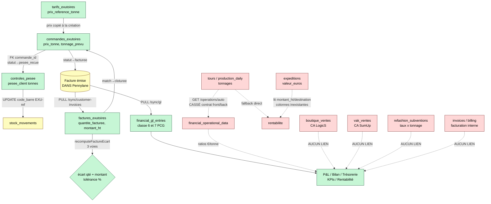

# Audit structurel de flux — « Flux financier : de l'opération au P&L »

**Projet :** SOLIDATA (ERP Solidarité Textiles)
**Date :** 11 juillet 2026
**Périmètre :** chaîne financière complète, du tarif exutoire jusqu'au pilotage (P&L, trésorerie, rentabilité), plus les circuits boutiques (LogicS), VAK (SumUp), subventions Refashion et facturation interne.
**Question centrale :** un euro gagné sur le terrain se retrouve-t-il correctement dans le pilotage financier, sans double compte ni trou ?

---

## 1. Synthèse

La chaîne « vente exutoire » est **bien construite sur sa partie basse** (tarif → commande → pesée → rapprochement facture Pennylane → clôture). Le rapprochement facturation est un vrai outil de contrôle à trois niveaux (quantité facturée vs pesée client vs prix commande), avec tolérance paramétrable, détection des orphelins et rapprochement manuel. Le P&L, le bilan et la trésorerie reposent sur le **Grand Livre analytique importé de Pennylane** (`financial_gl_entries`), ce qui est le **bon choix comptable** : la vérité du P&L est la comptabilité, pas une ré-agrégation opérationnelle (pas de risque de double compte dans le P&L).

**Mais le flux se rompt au moment de « remonter » vers le pilotage.** Les données opérationnelles génératrices de chiffre d'affaires (commandes exutoires, **boutiques LogicS, VAK SumUp**, subventions Refashion) **n'alimentent aucune table financière** et ne sont **jamais rapprochées** du Grand Livre. Le seul pont automatique prévu (opérations → `financial_operational_data`) est **cassé par un désaccord de contrat front/back**. Et la « rentabilité matière » lit des colonnes qui n'existent pas dans `expeditions`, donc son chiffre d'affaires par qualité est **structurellement vide**.

Autrement dit : la comptabilité est propre, le contrôle facturation exutoire est solide, mais **il n'existe aucun bouclage opérations ↔ comptabilité**. Un euro de boutique ou de VAK n'apparaît dans le P&L que si le comptable le saisit dans Pennylane — sans aucune alerte si l'écart entre le CA terrain et le CA comptable diverge.

---

## 2. Schéma du flux

Légende : ✅ vert = maillon solide · ⚠️ jaune = fragile · ❌ rouge = rompu / absent.

---

## 3. Analyse maillon par maillon

### 3.1 ✅ Tarif → Commande (`tarifs-exutoires.js`, `commandes-exutoires.js`)
La résolution de prix (`GET /tarifs-exutoires/prix`) gère correctement la priorité *prix client spécifique* → *prix de référence* → *rien*, avec fenêtre de validité `date_debut/date_fin` (`tarifs-exutoires.js:15-59`). Le prix est **copié** dans `commandes_exutoires.prix_tonne` à la création (`commandes-exutoires.js:269`) : c'est un bon **snapshot** (une révision de tarif ne réécrit pas les commandes passées). **Fragilité mineure** : le `POST /commandes-exutoires` accepte `prix_tonne` directement depuis le corps de requête ; rien n'impose que ce prix provienne de la grille. Si l'écran n'appelle pas `/prix` au préalable, un prix arbitraire peut entrer sans contrôle. Incohérence de référentiel notée : la grille (`tarifs_exutoires`) et les commandes utilisent `type_produit` en `VARCHAR`, mais `commandes_exutoires.type_produit` a été migré en `TEXT[]` (`migrate-exutoires.js:196-205`) — les jointures de prix par type restent mono-valeur.

### 3.2 ✅ Commande → Contrôle pesée (`controles-pesee.js`)
FK réelle `controles_pesee.commande_id → commandes_exutoires.id`. À l'enregistrement de la pesée, la commande passe en `pesee_recue`, puis en `facturee` à la validation (`controles-pesee.js:96-99, 159-163`). L'écart pesée interne vs pesée client est calculé et seuillé (conforme ≤2 %, acceptable ≤5 %, litige au-delà, `controles-pesee.js:71-82`). **Solide.**

⚠️ **Jonction fragile vers le stock** : l'ajustement de stock se fait par jointure **sur une chaîne** `code_barre = 'EXU-' + reference` (`controles-pesee.js:101-123`). Si aucun mouvement ne porte exactement ce code-barres, l'`UPDATE` est un no-op **silencieux** — le stock n'est pas ajusté et aucune alerte n'est levée. Jointure par convention textuelle plutôt que par FK.

⚠️ **Unités implicites** : `pesee_client` et `pesee_interne` sont des `DECIMAL(10,3)` traités comme des **tonnes** (l'update stock fait `pesee_client * 1000` pour obtenir des kg). Cette hypothèse « tonnes » n'est ni contrainte en base ni visiblement garantie côté saisie — une saisie en kg fausserait tout l'aval d'un facteur 1000.

### 3.3 ✅ Facture Pennylane → Rapprochement (`pennylane.js:520-669`, `factures-exutoires.js`)
Le PULL `/sync/customer-invoices` est incrémental (`since = last_sync_at`), anti-doublon via index unique `pennylane_invoice_id` (`init-db.js:4208`), et transactionnel par facture (BEGIN/COMMIT/ROLLBACK isolé — une facture fautive n'annule pas le lot). Le rapprochement recalcule un **écart à trois voies** (`recomputeFactureEcart`, `pennylane.js:474-518`) :
- quantité facturée (extraite des `invoice_lines`) vs `pesee_client` (tonnes vs tonnes ✅) ;
- montant HT facturé vs **montant attendu = pesée × prix_tonne commande**.

La tolérance (`facturation_tolerance_pct`, défaut 5 %) est appliquée au comptage des écarts (`factures-exutoires.js:113-141`). La détection des **commandes orphelines** (expédiées/pesées/facturées sans facture Pennylane rapprochée) et le **rapprochement manuel** avec score (nom client + proximité de date) sont bien conçus (`factures-exutoires.js:143-199, 226-278`). **C'est la partie la plus aboutie de la chaîne.**

❌/⚠️ **Bug de matching automatique** : `autoMatchCommande` (`pennylane.js:436-471`) extrait la référence via la regex `/CMD-?\d{4,}|EX-?\d{4,}|\b\d{4,8}\b/i`. Or les références réelles sont au format `CMD-YYYY-NNNN` (`commandes-exutoires.js:40-42`). La regex **capture uniquement `CMD-2026`** (elle s'arrête au second tiret), puis exécute `WHERE UPPER(reference) LIKE '%CMD-2026%' LIMIT 1` **sans `ORDER BY`** : cela matche **n'importe quelle commande de l'année 2026** et en retient une arbitraire. Conséquence possible : une facture rapprochée à la **mauvaise commande**, clôture de la mauvaise commande, écart calculé contre la mauvaise pesée. Le rapprochement manuel corrige au cas par cas, mais l'automatique est peu fiable dès que la référence complète figure sur la facture.

⚠️ **Risque d'unité sur la quantité facturée** : `extractInvoiceQuantity` (`pennylane.js:421-433`) suppose des **tonnes par défaut** si l'unité de ligne n'est pas reconnue comme « kg ». Une facture libellée en kg avec une chaîne d'unité non reconnue produirait un écart de quantité faux d'un facteur 1000.

### 3.4 ✅ Clôture commande → écritures & P&L (`pennylane.js:675+`, `finance.js`)
Le rapprochement bascule la commande en `cloturee` avec trace `historique_commandes_exutoires` (`pennylane.js:604-612`). Le P&L, le bilan, la trésorerie et les KPIs lisent **exclusivement `financial_gl_entries`** (comptes PCG classe 6/7, `finance.js:405-504, 1002-1093`). L'import GL (`/sync/gl`) déduplique proprement `source='api'` vs `source='file'` en priorisant le fichier catégorisé (`finance.js:431-433`). Un vrai **contrôle qualité comptable** existe (`/controls/:year`, `finance.js:1396+` : équilibre débit/crédit, comptes manquants, affectation analytique). **Architecture comptable saine.**

**Point structurel majeur** : cette clôture **ne produit aucune écriture financière**. Le CA d'une commande rapprochée n'atterrit dans le P&L **que** parce que le comptable a émis la facture dans Pennylane et que le GL est ré-importé. Le circuit « contrôle » (`factures_exutoires`) et le circuit « P&L » (`financial_gl_entries`) sont **deux tuyaux Pennylane parallèles jamais recoupés** : rien ne vérifie que chaque produit du compte 70 correspond à une facture rapprochée, ni l'inverse.

---

## 4. Ruptures de chaîne (les « trous »)

### 4.1 ❌ Pont opérations → `financial_operational_data` cassé (contrat front/back)
C'est le seul pont prévu entre le terrain et la finance, et il est **rompu des deux côtés** :
- **Backend** `GET /finance/operations/:year/auto` renvoie un objet **plat** `{ tonnes_collectees:{…}, tonnes_au_tri:{…}, etp_collecte:N, … }` (`finance.js:944-996`).
- **Frontend** `FinanceOperations.jsx:65-68` lit `res.data.auto`, `res.data.overrides`, `res.data.results` — **clés inexistantes** → `autoData` reste vide.
- **Sauvegarde** : le front envoie `PUT /finance/operations/:year` avec `{ overrides }` (objet indexé par champ, `FinanceOperations.jsx:92`), alors que le backend attend `{ data }` = **tableau** `[{field_id, month, value}]` (`finance.js:923-936`). `const { data } = req.body` vaut `undefined` → `for (const item of data)` lève une `TypeError` → **500**. La saisie opérationnelle **ne se persiste jamais**.

De plus, cet endpoint `/auto` ne remonte que des **tonnages et effectifs** (tours, production, ETP) : **aucune donnée de CA** (ni commandes exutoires, ni boutiques, ni VAK). Le pont, même réparé, ne transporterait pas de chiffre d'affaires.

### 4.2 ❌ Rentabilité matière : CA par qualité structurellement vide (`finance.js:1271-1291`)
La requête « produits finis par qualité » lit `e.destination`, `e.montant_ht`, `e.date_expedition`, `e.status != 'cancelled'` sur la table `expeditions`. Or `expeditions` **ne possède pas** ces colonnes : elle a `date`, `exutoire_id`, `poids_kg`, `valeur_euros` et un `status` dont les valeurs sont `preparee/chargee/expediee/livree` (`init-db.js:892-905, 1372`). La requête **lève une erreur**, avalée par `.catch(() => ({ rows: [] }))`, puis retombe sur `stock_movements` qui **ne fournit aucun CA**. Résultat : la rentabilité matière par qualité affiche **toujours CA = 0** et une marge = −coût complet. Rupture **silencieuse** d'une fonctionnalité de pilotage annoncée.

### 4.3 ❌ Boutiques (LogicS) absentes de la consolidation finance
`boutique_ventes` / `boutique_tickets` n'alimentent **aucune** table financière et ne sont lus **nulle part** dans `finance.js` (grep : zéro occurrence). Le CA boutiques vit dans ses propres dashboards. Il n'entre dans le P&L que via la saisie comptable Pennylane, **sans aucun rapprochement** entre le CA caisse et le CA comptable (compte 70). Un écart de caisse ne déclencherait aucune alerte financière.

### 4.4 ❌ VAK (SumUp) absente de la consolidation finance
Identique à 4.3 : `vak_ventes` n'a aucun lien avec `financial_*`. Le CA SumUp (poids vendu × €/kg) reste cantonné aux écrans VAK. Aucun bouclage vers le P&L ni contrôle de cohérence caisse ↔ comptabilité.

### 4.5 ❌ Subventions Refashion non consolidées (`refashion.js`)
Les subventions sont calculées `taux_euro_par_tonne × tonnage` (`refashion.js:50-53, 338-362`) et stockées dans `refashion_subventions`, mais **jamais poussées** vers `financial_gl_entries` ni recoupées avec le compte **74 « Subventions d'exploitation »** du P&L (`finance.js:463`). Les tonnages du calcul sont **saisis manuellement** dans le corps de requête, non tirés automatiquement des tables de production/tri : double-saisie humaine potentielle et divergence possible avec les tonnages réels du système.

### 4.6 ❌ Facturation interne orpheline (`billing.js`, `invoices`)
Le module `billing` génère des factures internes (préfixe `FAC-`, `invoices` + `invoice_lines`) en **saisie libre** (`client_name` texte, pas de `client_id`, aucun lien vers `commandes_exutoires`). Il n'est **pas lu par la finance** et coexiste avec deux autres notions de « facture » (`factures_exutoires` pour le contrôle, et Pennylane pour l'émission réelle). Trois représentations de « facture » sans articulation claire : source de confusion et d'écritures potentiellement redondantes.

### 4.7 ❌ Aucun contrôle de cohérence opérations ↔ Grand Livre
Le `/controls/:year` (`finance.js:1396+`) contrôle la **qualité interne** du GL (équilibre, comptes, analytique) mais **jamais** la cohérence entre le CA opérationnel (commandes, boutiques, VAK, subventions) et les produits comptables (compte 70/74). Il n'existe donc **aucun garde-fou** garantissant qu'un euro gagné sur le terrain a bien été comptabilisé.

---

## 5. Double compte : risque réel ?

**Dans le P&L : non.** Le P&L étant strictement dérivé du Grand Livre, il n'y a pas de double comptage entre opérations et comptabilité (les opérations n'y entrent pas). C'est un choix architectural correct.

**Dans les tableaux de bord : oui, risque d'incohérence.** Le `dashboard.js` mélange des sources hétérogènes — `commandes_exutoires` (comptage), `invoices` (comptage, `dashboard.js:150`), `boutique_ventes` (somme CA, `dashboard.js:566-571`) — tandis que la Finance affiche un CA issu du GL. Les deux surfaces peuvent donc présenter des **chiffres d'affaires différents pour la même période**, sans réconciliation ni explication — inconfortable pour la direction.

---

## 6. Recommandations priorisées

| # | Recommandation | Priorité | Effort |
|---|----------------|----------|--------|
| R1 | **Corriger le contrat front/back de `/finance/operations`** : aligner la réponse `/auto` (`{auto, overrides, results}`) et le corps du `PUT` (tableau `data`), persister avec `source='solidata'`. Débloque tous les ratios €/tonne. | P0 | S |
| R2 | **Fiabiliser `autoMatchCommande`** : regex sur la référence **complète** `CMD-\d{4}-\d{4,}`, match exact prioritaire, `ORDER BY` déterministe, refus si plusieurs candidats (bascule en manuel). Évite les rapprochements erronés. | P0 | S |
| R3 | **Réparer la rentabilité matière** : soit brancher la requête qualité sur les vraies colonnes/tables porteuses de CA (`expeditions.valeur_euros` + `exutoire`, ou `commandes_exutoires`/`factures_exutoires`), soit retirer le fallback muet et afficher un état « données indisponibles ». | P0 | M |
| R4 | **Contrôle de cohérence opérations ↔ GL** : tableau de bord recoupant CA terrain (commandes rapprochées + boutiques + VAK + subventions) vs produits comptables (comptes 70/74) par mois, avec alerte au-delà d'un seuil. | P1 | M |
| R5 | **Consolider boutiques + VAK dans la finance** : job planifié agrégeant `boutique_ventes` et `vak_ventes` vers `financial_operational_data` (`source='solidata'`) pour nourrir les ratios, et affichage rapproché du CA comptable. | P1 | M |
| R6 | **Sécuriser la jonction pesée → stock** : remplacer la jointure par chaîne `code_barre` par une FK/lien explicite, et lever une alerte si l'ajustement de stock est un no-op. | P1 | S |
| R7 | **Verrouiller les unités** : rendre explicite (schéma + libellés UI + garde `extractInvoiceQuantity`) que pesées et quantités facturées sont en tonnes ; refuser/normaliser les unités non reconnues. | P1 | S |
| R8 | **Clarifier les trois notions de facture** : documenter et, idéalement, relier `billing.invoices` au flux exutoire (ou le retirer s'il fait doublon avec Pennylane). | P2 | M |
| R9 | **Automatiser les tonnages Refashion** depuis les tables de production/tri au lieu de la saisie manuelle, et recouper la subvention calculée avec le compte 74. | P2 | L |
| R10 | **Unifier la source du CA affiché** entre Dashboard et Finance (ou afficher explicitement « CA opérationnel » vs « CA comptabilisé » avec l'écart). | P2 | S |

---

## 7. Conclusion

La moitié « aval » de la chaîne (contrôle facturation exutoire et P&L comptable) est **soignée et bien pensée** : rapprochement à trois voies, tolérance, orphelins, GL comme source unique du P&L, contrôles d'intégrité comptable. Le problème n'est pas la comptabilité, c'est **le bouclage**. Entre le terrain et le pilotage, le seul pont automatique est **cassé** (contrat front/back), la rentabilité matière est **vide par bug de colonnes**, et trois gisements de CA (boutiques, VAK, subventions) **n'ont aucun lien** avec la finance ni **aucun contrôle de cohérence** avec le Grand Livre. Un euro gagné en boutique ou en VAK n'est aujourd'hui « visible » dans le P&L que par la bonne volonté d'une saisie comptable externe, sans filet. Les priorités P0 (R1, R2, R3) sont à faible effort et rétabliraient immédiatement la traçabilité minimale ; les P1 installeraient le contrôle de cohérence qui manque structurellement.
