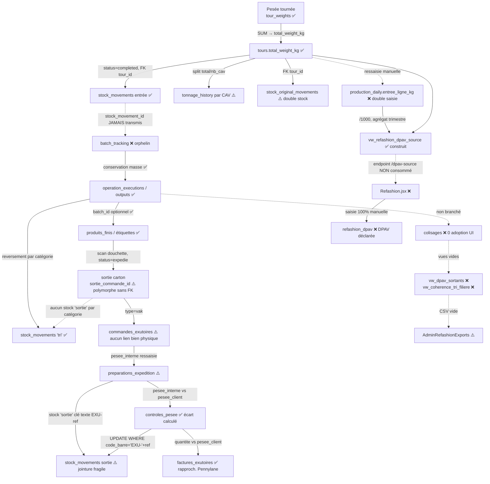

# Audit structurel de flux — Traçabilité matière : du CAV à l'exutoire et à la DPAV

**Périmètre** : SOLIDATA ERP (Solidarité Textiles) — chaîne physique du kilogramme de textile, de la pesée de tournée jusqu'à la déclaration trimestrielle Refashion (DPAV).
**Date** : 11 juillet 2026
**Question centrale** : une masse saisie en amont est-elle reprise de bout en bout, sans rupture, ressaisie ni perte ? Les kilogrammes entrants se réconcilient-ils avec les sortants et les déclarés ?
**Méthode** : lecture du code réel (`init-db.js`, `migrate-exutoires.js`, routes backend, pages React). Constats fondés sur le code, pas sur la documentation.

---

## 1. Synthèse exécutive

La chaîne se divise nettement en **deux moitiés de qualité inégale**.

- **Amont solide (collecte → tri exécution)** : la pesée de tournée alimente automatiquement le stock entrant par une clé étrangère fiable (`stock_movements.tour_id`), un **détecteur d'anomalies** vérifie la cohérence, et l'exécution du tri **conserve la masse** (perte = entrée − sorties) avec reversement en stock par catégorie. C'est bien conçu.

- **Aval rompu (tri → colisage → commande → expédition → DPAV)** : à partir du conditionnement, la traçabilité par identifiant disparaît. Le **workflow de colisage n'est pas adopté** (0 référence frontend), ce qui vide deux vues d'audit Refashion. Les commandes exutoires **ne sont reliées à aucun bien physique**. Les pesées d'expédition sont **ressaisies manuellement** trois fois sans réconciliation croisée avec les cartons scannés. Enfin la **DPAV est saisie 100 % à la main** alors que l'infrastructure de réconciliation existe en base mais **n'est pas branchée à l'écran**.

Le paradoxe central : le projet a construit des vues SQL de réconciliation collecte↔tri↔Refashion (`vw_refashion_dpav_source`, `vw_tonnage_reconciliation_jour`) et un endpoint `/refashion/dpav-source` avec détection d'écart — mais **aucune page React ne les consomme**. La réconciliation existe, elle est simplement débranchée.

---

## 2. Cartographie du flux

Légende : ✅ maillon solide · ⚠️ maillon fragile · ❌ maillon rompu / manuel.

---

## 3. Analyse maillon par maillon

### 3.1 Collecte → stock entrant ✅ (solide)
`backend/src/routes/tours/execution.js` — à la clôture d'une tournée (`status='completed'`, l.199-227) :
- `tonnage_history` reçoit **une ligne par CAV collecté** valorisée à `total_weight_kg / nb_cav` (répartition uniforme). Le total est conservé mais l'**imputation par CAV est une approximation** : le poids réel de chaque borne n'est pas mesuré individuellement (⚠️ mineur, inévitable sans pesée embarquée).
- `stock_movements` reçoit **une entrée** liée par `tour_id` (FK réelle, `init-db.js` l.614). Lien fort, réconciliable.
- `stock_original_movements` reçoit **aussi** une entrée (l.221-227) : le stock est tenu **deux fois** (moderne + « original » à verrouillage trimestriel Refashion, `stock-original.js`). Ce doublement est un choix métier assumé, mais c'est une **double écriture** à maintenir cohérente.

Point fort notable : `tours/stats.js` (l.118-130) détecte les **tournées terminées sans mouvement de stock** (jointure `LEFT JOIN stock_movements ON tour_id`), plus les poids aberrants (>2σ) et les CAV non collectés. Un vrai garde-fou de cohérence, rare et bien vu.

### 3.2 Stock entrant → tri ❌ (rupture + double saisie)
Deux ruptures distinctes ici :

1. **`batch_tracking` orphelin** : la table possède `stock_movement_id REFERENCES stock_movements(id)` (`init-db.js` l.1284), mais `ChaineTri.jsx` (l.78) crée le lot avec `{ chaine_id, poids_initial_kg }` **sans jamais transmettre `stock_movement_id`** (0 occurrence dans tout `frontend/src`). Le poids initial du lot est **retapé manuellement** et le lot n'est **pas rattaché** à l'entrée de collecte. Le lien de traçabilité entrée-physique → lot existe en schéma mais reste toujours `NULL`.

2. **`production_daily` en double saisie** : les vues de réconciliation et de subvention s'appuient sur `production_daily.entree_ligne_kg` (`init-db.js` l.727, 1751, 1772), or ce champ est **saisi à la main** chaque jour par l'encadrant (`production.js` POST l.90-144). Le poids entrant sur ligne de tri est donc **ressaisi** alors que la collecte l'a déjà enregistré. Aucun rapprochement automatique n'est imposé entre les deux.

La table `matieres` (citée comme « stock entrant ») est en réalité **vestigiale** : jamais seedée, vide, sa FK a été repointée vers `categories_sortantes` (migration A1, `init-db.js` l.2316-2337). À signaler comme table morte.

### 3.3 Tri (exécution) ✅ (solide)
`tri.js` — l'exécution d'opération est **transactionnelle, idempotente et conserve la masse** :
- `perte = max(0, poids_entree − Σ poids_sorties)` (l.345-347), verrou `FOR UPDATE`, garde anti-recomplétion (l.336-339).
- `batch_tracking.poids_restant_kg` décrémenté du poids sorti (l.356-360).
- Correctif I4 (l.362-375) : chaque sortie triée est **reversée en stock** par `categorie_sortante_id`. Le stock trié par catégorie est enfin alimenté.

C'est le maillon le mieux tenu de la chaîne. Réserve : cette granularité (`operation_outputs`) **ne remonte pas** dans `production_daily.total_jour_t` (la « sortie tri » de la DPAV), qui reste manuel → les deux systèmes de mesure du tri coexistent sans se contrôler.

### 3.4 Colisage ❌ (rompu — non adopté)
Les routes `tri.js` (l.410-514) gèrent proprement colisages et items (cumul de poids, statuts). Mais :
- **0 référence à « colisage » dans `frontend/src`** : aucun écran ne crée de colisage.
- Le code lui-même le documente (`init-db.js` l.1689-1695) : *« cette vue s'appuie sur la table colisages, une couche de conditionnement aujourd'hui NON adoptée… Elles restent donc vides. »*

Conséquence directe : `vw_dpav_sortants` et `vw_coherence_tri_filiere` (`init-db.js` l.1696, 1768) **produisent zéro ligne**. L'export QHSE `dpav-sortants` (`AdminRefashionExports.jsx`) renvoie un **CSV vide**. La ventilation des sortants par `famille_refashion` — cœur de la DPAV — n'a **aucune source**.

### 3.5 Produits finis / étiquettes ⚠️ (le vrai flux, partiellement tracé)
Le conditionnement réel passe par `produits_finis` (scan douchette, `etiquettes.js`) :
- Création avec `batch_id` optionnel (`init-db.js` l.1386-1391) → **traçabilité lot → carton** exploitée par `tri.js` (l.262-267, « traçabilité aval »). Bon point, **quand** le lot est renseigné.
- **Sortie par scan** (`etiquettes.js` l.304-311) : `status='expedie'`, `sortie_commande_id`. Ce champ est **polymorphe** : `btq`→`boutique_commandes`, `vak`→`commandes_exutoires`, `libre`→rien (l.284-302). **Aucune FK possible** (deux tables cibles) → intégrité référentielle non garantie, jointure applicative fragile.
- La sortie **ne crée aucun `stock_movements` 'sortie' par catégorie**. Le stock trié (§3.3) est incrémenté mais **jamais décrémenté** au départ des cartons → le stock par catégorie **gonfle indéfiniment** et ne reflète pas le réel.

### 3.6 Commande exutoire ⚠️ (îlot déconnecté)
`commandes_exutoires` (`migrate-exutoires.js` l.54-74) ne référence que `clients_exutoires` et son parent de récurrence. **Aucun lien vers les biens physiques** (ni colisages, ni produits_finis). Le `type_produit` est un **enum texte libre** (`'original','csr','effilo_blanc'…`), **sans lien avec `categories_sortantes`** ni avec la famille Refashion. Le `tonnage_prevu` est saisi à la main. La commande est un objet commercial parallèle au flux matière, réconcilié seulement par pesée en fin de course.

Note : les tables de logistique exutoires sont créées dans un **script séparé** (`migrate-exutoires.js`), pas dans `init-db.js` — fragmentation du schéma qui complique l'audit et le déploiement.

### 3.7 Préparation → contrôle pesée ⚠️/✅ (triple pesée manuelle, réconciliation partielle)
- `preparations_expedition.pesee_interne` : **ressaisie manuelle** (tonnes) à la clôture (`preparations.js` l.360-371). À `'expediee'`, création d'un `stock_movements` 'sortie' avec `code_barre = 'EXU-' + reference` et `poids = pesee_interne × 1000` (l.391-399), **sans `matiere_id`, sans `commande_id`**.
- `controles_pesee.pesee_client` : **ressaisie manuelle** depuis le PDF du client (`controles-pesee.js` l.52). L'**écart pesée interne/client est calculé** et classé conforme/acceptable/litige (l.71-82) — **bonne logique de réconciliation**.
- Mais l'ajustement du stock se fait par `UPDATE … WHERE code_barre = 'EXU-'+reference` (l.113-123) : **jointure par chaîne construite**, sans contrainte d'unicité sur `stock_movements.code_barre`. Une re-préparation créerait deux lignes `EXU-` et l'UPDATE frapperait les deux.
- **Angle mort majeur** : les **trois masses** d'une même expédition — Σ poids des cartons scannés (`produits_finis`), `pesee_interne`, `pesee_client` — ne sont **jamais confrontées entre elles**. La `pesee_interne` est tapée, pas dérivée des cartons réellement sortis vers la commande.

### 3.8 Facture ✅ (réconciliation correcte)
`factures-exutoires.js` : flux **PULL** Pennylane, rapproche `quantite_facturee` à `controles_pesee.pesee_client`, calcule `ecart_quantite_pct` (l.32-53), bascule la commande en `cloturee`. C'est un vrai contrôle chiffré, bien fait — le meilleur point de l'aval.

### 3.9 DPAV Refashion ❌ (déclaration 100 % manuelle, source débranchée)
`refashion.js` POST `/dpav` (l.84-129) écrit une déclaration **entièrement manuelle** : `stock_debut_t`, `ventes_reemploi_t`, `ventes_recyclage_t`, `csr_t`, `energie_t`, `tri_t`. Aucune valeur n'est dérivée du flux.

L'infrastructure d'auto-alimentation **existe** : `vw_refashion_dpav_source` (collecte brute vs tri entré, `init-db.js` l.745-767) et l'endpoint `/dpav-source` avec sévérité d'écart (l.405-429). Mais `Refashion.jsx` (l.21-25) n'appelle que `/dpav`, `/communes`, `/subventions` — **jamais `/dpav-source` ni `/reconciliation-jour`**. Le pré-remplissage annoncé dans les commentaires n'est **pas câblé**. De plus la source ne couvre que collecte/tri, **pas la ventilation valorisation** (réemploi/recyclage/CSR/énergie) qui, elle, dépend du colisage vide (§3.4).

---

## 4. Réconciliation des masses : le verdict

| Jonction | Réconciliation ? | Mécanisme |
|---|---|---|
| Pesée tournée → total tournée | ✅ Oui | `SUM(tour_weights)` |
| Total tournée → stock entrant | ✅ Oui, contrôlée | FK `tour_id` + détecteur d'anomalies |
| Collecte → tri entrant (`production_daily`) | ❌ Non | Double saisie manuelle, vue non surfacée |
| Tri entrant → tri sortant | ⚠️ Partiel | Conservé dans `operation_executions` mais 2 systèmes parallèles |
| Tri sortant → colisage/DPAV sortants | ❌ Non | Colisage vide → vues vides |
| Cartons scannés → stock par catégorie | ❌ Non | Sortie carton ne décrémente pas le stock |
| Expédition (interne/client/cartons) | ❌ Non | Triple pesée manuelle jamais confrontée |
| Pesée client → facture | ✅ Oui | Rapprochement Pennylane chiffré |
| Flux ERP → DPAV déclarée | ❌ Non | Saisie manuelle, source débranchée |

**Réponse à la question centrale** : les kilogrammes se réconcilient **sur le premier tiers** (collecte → stock, avec garde-fou). Ensuite la masse est **perdue de vue** au niveau enregistrement : re-saisie à l'entrée du tri, à la sortie d'expédition (×3), et à la déclaration DPAV. La chaîne de traçabilité **par identifiant** casse au conditionnement.

**Unités** : cohérentes en kg dans l'opérationnel, en tonnes (DECIMAL 10,3) côté DPAV/commandes/pesée. Les conversions `×1000` / `/1000` sont éparpillées (`controles-pesee.js`, `preparations.js`, vues). Les vues gèrent correctement le `/1000`, mais la multiplication des points de conversion manuelle est un risque d'erreur d'échelle.

---

## 5. Points solides (à préserver)
- Jonction collecte → stock automatique et **liée par FK** (`tour_id`).
- **Détecteur d'anomalies** tournées (poids aberrants, tours sans stock, CAV non collectés).
- Exécution tri **transactionnelle conservant la masse** (perte calculée, reversement par catégorie).
- Lien `produits_finis.batch_id` → **traçabilité lot ↔ carton** quand renseigné.
- Rapprochement **facture Pennylane ↔ pesée client** chiffré.
- Vues de réconciliation **déjà écrites** (le plus dur est fait ; reste à les brancher).

---

## 6. Recommandations priorisées

| # | Priorité | Effort | Action |
|---|---|---|---|
| R1 | **P0** | M | **Brancher la réconciliation DPAV** : faire consommer `/refashion/dpav-source` par `Refashion.jsx` pour pré-remplir le formulaire et **afficher l'écart collecte↔tri** (l'infra existe déjà, `refashion.js` l.405). |
| R2 | **P0** | L | **Trancher le workflow de conditionnement** : soit adopter `colisages` (UI), soit **repointer `vw_dpav_sortants` / `vw_coherence_tri_filiere` sur `produits_finis`** avec mapping `categorie_eco_org → famille_refashion`. Sans cela la ventilation valorisation DPAV n'a aucune source. |
| R3 | **P1** | M | **Décrémenter le stock par catégorie** à la sortie carton (`etiquettes.js`) : créer un `stock_movements` 'sortie' pour que le stock trié reflète le réel. |
| R4 | **P1** | S | **Fiabiliser la jonction expédition** : remplacer la clé texte `code_barre='EXU-'+ref` par un `commande_id` (FK) sur le mouvement de stock ; ajouter une contrainte d'unicité. |
| R5 | **P1** | M | **Confronter les trois pesées** d'expédition : afficher Σ cartons scannés vs `pesee_interne` vs `pesee_client` et alerter sur écart, au lieu de trois saisies indépendantes. |
| R6 | **P2** | M | **Relier collecte → tri** : transmettre `stock_movement_id` à la création de lot, ou dériver `production_daily.entree_ligne_kg` du stock entrant pour supprimer la double saisie. |
| R7 | **P2** | S | **Nettoyer/documenter** : marquer `matieres` comme table morte ; consolider `migrate-exutoires.js` dans `init-db.js` ; documenter le double stock moderne/original. |

---

*Constats établis par lecture directe de `backend/src/scripts/init-db.js`, `backend/src/scripts/migrate-exutoires.js`, `backend/src/routes/{tours/execution.js,tours/stats.js,tri.js,etiquettes.js,preparations.js,controles-pesee.js,factures-exutoires.js,refashion.js,production.js}` et `frontend/src/pages/{ChaineTri.jsx,Refashion.jsx}`.*
