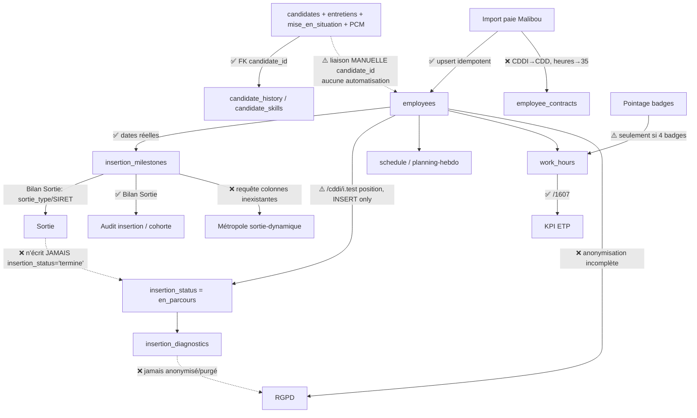

# Audit structurel de flux — Parcours d'une personne : candidature → salarié → insertion → sortie

**Date :** 11 juillet 2026
**Périmètre :** cohérence et continuité de l'identité et de l'historique d'une personne à travers `candidates` → `employees` → contrats → planning/heures → parcours d'insertion → sortie → KPI RH/DREETS → RGPD.
**Méthode :** lecture du code réel (routes, services, `init-db.js`, écrans). Aucun fichier modifié.

---

## 1. Schéma du flux

Légende : ✅ maillon solide · ⚠️ maillon fragile · ❌ maillon rompu.

---

## 2. Étape par étape

### 2.1 Candidature (solide en interne)
`candidates` (`init-db.js` l.119) agrège proprement entretien structuré (`recruitment_interviews`), mises en situation (`mise_en_situation`), documents, compétences et PCM (`pcm_sessions`/`pcm_answers`/`pcm_reports`), **tous rattachés par `candidate_id` avec FK et `ON DELETE CASCADE`**. Le graphe interne du recrutement est cohérent. Petite dette : le CHECK d'origine du statut (`received/preselected/interview/test/hired`) est réécrit plus loin par une migration (`init-db.js` l.2379) en `received/interview/hired/rejected` — deux vocabulaires de statut coexistent dans le code.

### 2.2 Candidature → collaborateur : rupture d'identité (⚠️ structurel)
La règle « seule la paie crée un collaborateur » est correctement implémentée : `POST /convert-to-employee` renvoie 410 (`candidates/conversion.js` l.30), et le rattachement passe par `POST /:id/link-employee` qui renseigne `employees.candidate_id` (UNIQUE, gardes d'unicité bilatérales — `conversion.js` l.94-103). **C'est un point solide sur le plan de l'intégrité (relation 1‑1 garantie).**

Mais la jonction est **entièrement manuelle et non réconciliée** :
- l'import Malibou (`collaborator-import.js`) apparie par `malibou_id` puis nom+prénom et **ne renseigne jamais `candidate_id`**. Les deux espaces d'identité (recrutement saisi main / paie) ne se rejoignent que si un humain clique « Lier » ;
- sans ce clic, **tout l'acquis du recrutement (PCM, entretien, freins repérés à l'embauche) ne remonte jamais** dans l'Insertion, qui joint `pcm_reports → candidates → employees` via `candidate_id` ;
- la liaison **ne met pas à jour `candidates.status`** (`conversion.js` l.106) : une personne embauchée peut rester au statut `interview`.

C'est la première rupture de traçabilité du parcours : l'historique pré-embauche et l'historique salarié vivent dans deux mondes qu'aucun automatisme ne relie.

### 2.3 Contrats : le CDDI disparaît de la table normalisée (❌)
Deux représentations du contrat coexistent : les colonnes plates de `employees` (`contract_type/contract_start/contract_end/weekly_hours`, valeurs réelles) **et** la table `employee_contracts`. L'import alimente les deux, mais `employee_contracts.contract_type` a un CHECK limité à `CDI/CDD/interim/stage/apprentissage` — **`CDDI` n'y figure pas**. Le service contourne le CHECK en rabattant `CDDI → 'CDD'` (`collaborator-import.js` l.489-496, `safeContractType`) et coerce `weekly_hours` vers 26 ou 35 (défaut 35, l.505).

Conséquence : pour **la même personne**, `employees.contract_type = 'CDDI'` mais `employee_contracts.contract_type = 'CDD'`. Or l'Insertion lit la table normalisée (`insertion/routes.js` l.72, l.536, l.880), si bien que la fiche parcours et la timeline affichent « Début du contrat **CDD** » (`engine.js` l.1315) pour un salarié en insertion. **L'objet métier central — le CDDI — est silencieusement perdu** dans la table censée faire référence, et un contrat 30 h devient 35 h dans `employee_contracts`. Heureusement l'ETP ne s'appuie pas sur cette valeur (cf. 2.6), mais tout reporting contractuel branché sur `employee_contracts` serait faux.

### 2.4 Entrée en parcours : détection fragile (⚠️)
L'auto-démarrage du parcours repose sur `/cddi/i.test(c.position)` (`collaborator-import.js` l.427) et **uniquement au moment de l'INSERT** (création). Sur la branche UPDATE (cas normal d'un réimport), `insertion_status` n'est jamais recalculé. Donc : un poste dont le libellé Malibou ne contient pas littéralement « Cddi », ou une fiche créée avant cette logique, reste `insertion_status='none'` et **n'entre jamais dans le suivi CIP** — sans alerte. La détection du cœur d'activité (l'insertion) dépend d'une sous-chaîne de libellé.

### 2.5 Planning / heures / pointage (⚠️ bridge partiel)
`schedule` (prévisionnel, `planning-hebdo.js`) et `work_hours` (réel) sont distincts et non réconciliés (normal). Le pointage badge alimente **automatiquement** `work_hours` via `calculateAndInsertWorkHours` (`pointage.js` l.134) — bon pont. Mais il n'est déclenché **que si exactement 4 badgeages** sont enregistrés dans la journée (`pointage.js` l.112 : `currentCount + 1 === MAX_BADGEAGES_PAR_JOUR`). Une journée à 2 badges (entrée/sortie sans pause) ou un badge oublié **ne produit aucune ligne `work_hours`** — les heures sont perdues et doivent être ressaisies à la main via la page WorkHours (`employees.js`). De plus les heures sup sont figées à « > 7 h/jour » (`pointage.js` l.155) sans tenir compte du contrat (26 h ≠ 35 h). Le pont existe mais fuit.

### 2.6 Parcours d'insertion (globalement solide)
`insertion_diagnostics` (1‑1), `insertion_milestones`, `cip_action_plans`, `insertion_interview_alerts` sont bien reliés par `employee_id`. L'échéancier des jalons est **calé sur les dates réelles du contrat** (`computeMilestoneSchedule`, `engine.js` l.1400 ; dates non coercées, contrairement au type/heures) — bonne conception, réutilisée par les routes et le scheduler. Réserve : le **squelette de diagnostic** créé à la liaison (`conversion.js` l.112) n'insère que `(employee_id, created_by)`, donc les 7 `frein_*` prennent le `DEFAULT 1` du schéma (`init-db.js` l.2567‑2580), alors que la convention applicative est « null = non évalué ». Le calcul des moyennes de freins de cohorte filtre `>= 1` (`insertion/routes.js` l.630) et **inclut donc ces faux « 1 »**, tirant artificiellement la moyenne vers « pas de frein » pour toute personne liée mais non encore diagnostiquée.

### 2.7 Sortie : le parcours ne se clôt jamais (❌ rupture majeure)
La sortie est saisie sur le jalon `Bilan Sortie` (`sortie_classification`, `sortie_type`, `sortie_employeur_siret`, `sortie_duree_contrat_mois` — `insertion/routes.js` l.308‑314). Mais le PUT du jalon **ne touche pas la table `employees`** : aucun passage à `insertion_status='termine'`, aucun `insertion_end_date`. La recherche exhaustive le confirme — **aucun code backend n'écrit jamais `insertion_status='termine'`** (seules des lectures existent : `init-db.js` l.3151, `performance.js` l.313) ; l'UI Employees n'expose pas non plus ce champ. Le seul moyen de clôturer un parcours est un appel API brut manuel.

Conséquence directe sur la cohérence : une personne dont le bilan de sortie est réalisé **reste comptée `en_parcours` indéfiniment**. Elle est alors **doublement comptée** — dans « nb salariés en parcours » (`insertion/routes.js` l.606) *et* dans les sorties (`l.640`). Le cycle de vie de la personne n'a pas d'état terminal fiable.

### 2.8 KPI RH & DREETS
- **ETP** (`employees.js` l.995) : `SUM(work_hours.hours_worked)/1607`. Source correcte et non affectée par la coercition des contrats — bon choix — mais tributaire du remplissage de `work_hours` (cf. 2.5).
- **Taux de sortie dynamique** : calculé à **trois endroits avec trois définitions**, dont l'une est cassée.
  - `metropole.js /sortie-dynamique` (l.306‑312) interroge `insertion_milestones` sur `im.type = 'sortie'`, `im.statut`, `im.date_realisation` — **ces trois colonnes n'existent pas** (le schéma a `milestone_type` [valeur `'Bilan Sortie'`], `status`, `completed_date`). La requête lève `column im.type does not exist` (42703) → 500. Le front `ReportingMetropole.jsx` l.33 l'enveloppe dans `.catch(() => ({ data: null }))` : **l'erreur est silencieusement avalée et le KPI Métropole affiche du vide**. Le critère de « dynamique » y est aussi différent (`sortie_type IN CDI/CDD/formation/creation`).
  - `insertion/routes.js` `/cohorte/stats` (l.637) et `/audit` (l.779) calculent, eux, correctement sur `milestone_type='Bilan Sortie'`, mais définissent « dynamique » par `sortie_classification='positive'`.
  Il n'existe donc **aucune source unique de vérité** pour un indicateur réglementaire clé, et celle destinée au financeur territorial est morte.

### 2.9 RGPD : anonymisation incomplète (❌ risque de conformité)
- **Anonymisation salarié** (`rgpd.js` l.132‑149) : ne réécrit que `first_name/last_name/email/phone/photo/skills` + le user lié. **Restent intacts, requêtables par id** : `disability_status` (RQTH — donnée de santé, catégorie particulière art. 9 RGPD), `birth_date`, `birth_city`, `nationality`, `residence_permit_number`, `address`, `gross_salary`, `siret`, `seniority_date`, **et l'intégralité de `insertion_diagnostics` (contraintes_sante, frein_sante_*, contraintes_familiales), `insertion_milestones` (bilan_social, sortie), `cip_action_plans`, `work_hours`, `pointage_events`**. L'« anonymisation » laisse en clair les données les plus sensibles : ce n'en est pas une.
- **Anonymisation candidat** (l.117) : purge CV/PCM mais laisse `gender` et **ne touche pas `recruitment_interviews` ni `mise_en_situation`** (freins à l'emploi, évaluations).
- **Rétention** : `purge-expired` (l.256) ne traite que les candidats non recrutés > 24 mois, et **n'est appelé par aucun job** du scheduler (purge purement manuelle). **Aucune rétention n'est prévue pour les données d'insertion des ex-salariés** : elles sont conservées indéfiniment.

---

## 3. Synthèse des ruptures

| Maillon | État | Nature |
|---|---|---|
| candidates ↔ tables recrutement/PCM | ✅ | FK cohérentes |
| candidate → employee (candidate_id) | ⚠️ | liaison manuelle, non réconciliée, statut candidat non mis à jour |
| CDDI dans employee_contracts | ❌ | coercition CDDI→CDD, heures→35 |
| entrée en parcours | ⚠️ | test de sous-chaîne de libellé, INSERT-only |
| pointage → work_hours | ⚠️ | déclenché seulement à 4 badges |
| jalons calés sur contrat | ✅ | dates réelles |
| freins squelette | ⚠️ | DEFAULT 1 vs convention null |
| sortie → clôture parcours | ❌ | jamais de passage à `termine` → double comptage |
| ETP | ✅ | source work_hours correcte |
| sortie dynamique Métropole | ❌ | requête sur colonnes inexistantes, erreur avalée |
| anonymisation / rétention | ❌ | données sensibles (RQTH, santé, insertion) non anonymisées, pas de purge ex-salariés |

---

## 4. Recommandations priorisées

**P0 — Anonymisation RGPD complète (effort M).** Étendre `rgpd.js /anonymize/:type/employee` pour effacer/masquer `disability_status`, `birth_date`, `birth_city`, `nationality`, `residence_permit_*`, `address`, `gross_salary`, `seniority_date`, et supprimer/anonymiser `insertion_diagnostics`, `insertion_milestones`, `cip_action_plans` (verbatims santé/social). Idem candidat pour `recruitment_interviews`/`mise_en_situation`.

**P0 — Clôturer le parcours à la sortie (effort S).** Dans `PUT /insertion/milestones/:id`, quand `milestone_type='Bilan Sortie'` passe à `status='realise'`, écrire `employees.insertion_status='termine'` (ou `abandon` selon `sortie_classification`) et `insertion_end_date=completed_date`. Supprime le double comptage en parcours/sortie.

**P0/P1 — Réparer `/metropole/sortie-dynamique` (effort S).** Corriger `im.type→milestone_type='Bilan Sortie'`, `im.statut→status`, `im.date_realisation→completed_date`, et aligner la définition de « dynamique » sur celle de l'Insertion (source unique).

**P1 — Réconcilier le CDDI (effort S/M).** Ajouter `'CDDI'` au CHECK de `employee_contracts.contract_type` (migration idempotente) et cesser la coercition dans `safeContractType`, ou documenter explicitement `employees.contract_type` comme source de vérité contractuelle.

**P1 — Fiabiliser la liaison recrutement↔paie (effort M).** Proposer un rapprochement automatique par nom+prénom (+date de naissance) à l'import, avec validation humaine, pour que `candidate_id` se peuple sans clic oublié ; mettre `candidates.status='hired'` à la liaison.

**P1 — Rétention automatique (effort M).** Brancher `purge-expired` dans le scheduler et définir une durée de conservation des données d'insertion post-sortie (ex. purge N années après `insertion_end_date`).

**P2 — Robustesse pointage (effort S/M).** Calculer `work_hours` dès la sortie du jour (paires disponibles), pas uniquement à 4 badges ; baser les heures sup sur le contrat réel.

**P2 — Freins non faussés (effort S).** Passer `insertion_diagnostics.frein_* DEFAULT` à `NULL`, ou exclure les diagnostics-squelettes des moyennes de cohorte.
