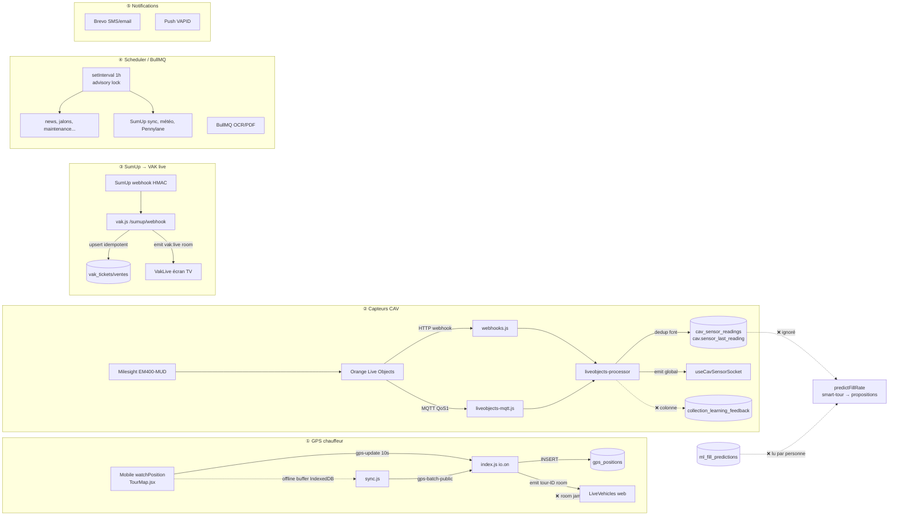

# Audit structurel de flux — Chaîne événementielle temps réel & jobs planifiés

**Projet :** SOLIDATA ERP (Solidarité Textiles)
**Périmètre :** GPS chauffeur → LiveVehicles ; capteurs Milesight → propositions de collecte ; SumUp → VAK live ; scheduler + BullMQ ; notifications Brevo/VAPID
**Date :** 11 juillet 2026
**Question centrale :** une information embarquée est-elle prise en charge de bout en bout, sans rupture, ressaisie ni perte ? Que se passe-t-il quand un maillon tombe ? Y a-t-il un monitoring des chaînes silencieusement cassées ?

---

## 1. Résumé exécutif

Le **transport** des événements est globalement bien conçu : idempotence là où l'argent est en jeu (SumUp), déduplication capteur par `fcnt`, buffer offline mobile avec backoff, verrou distribué sur le scheduler, reconnexion Socket.IO propre. Les fondations sont saines.

En revanche, plusieurs **ruptures sémantiques silencieuses** existent au niveau « la donnée atteint-elle réellement sa destination métier ? » :

- ❌ Le **niveau de remplissage capteur ne pilote pas les propositions de tournée** (le moteur ignore `sensor_last_reading`).
- ❌ La **boucle d'apprentissage capteur est cassée** (mismatch de colonne `observed_fill_rate` vs `observed_fill_level`).
- ❌ La table **`ml_fill_predictions` est écrite mais jamais lue** (cul-de-sac).
- ❌ L'écran de supervision **LiveVehicles ne reçoit jamais les positions temps réel** (room jamais rejointe) — dégradation invisible vers un polling 30 s.
- ⚠️ Le **scheduler** repose sur un `setInterval` horaire fragile qui peut faire **silencieusement sauter des jobs** selon l'heure de redémarrage.
- ⚠️ **Aucune alerte active** n'existe quand une chaîne se casse en silence (capteur muet, webhook SumUp interrompu, scheduler mort).

**Note du module : 6 / 10** — ingénierie de transport solide, mais des jonctions métier rompues et un angle mort de supervision.

---

## 2. Schéma des chaînes

Légende : ✅ solide · ⚠️ fragile · ❌ rompu.

---

## 3. Chaîne ① — GPS chauffeur → supervision web

**Trajet :** `mobile/src/pages/TourMap.jsx` (`watchPosition` → `positionRef`, émission `gps-update` toutes les 10 s) → `backend/src/index.js` (`socket.on('gps-update')` → `INSERT gps_positions` + `emit vehicle-position`) → `frontend/src/pages/LiveVehicles.jsx`.

**Points solides ✅**
- Reconnexion : le mobile ré-émet `join-tour` à chaque `connect` (TourMap.jsx L134-135), donc rejoint sa room après coupure.
- Résilience offline : hors couverture, la position est bufferisée en IndexedDB (`addGpsPosition`) puis rejouée par lots de 50 via `POST /tours/gps-batch-public` avec backoff par catégorie (`sync.js` L193-221). Transaction serveur BEGIN/COMMIT, lot ≤ 500 (`routes/tours/index.js` L263-294).
- Purge RGPD à 90 jours avec trace d'audit (`scheduler.js` `purgeOldGpsPositions`).

**Rupture principale ❌ — LiveVehicles ne reçoit jamais le temps réel.**
Le backend n'émet `vehicle-position`, `cav-status-update` et `tour-status-update` **qu'à la room `tour-<id>`** (`index.js` L329, L400, L405). Or `LiveVehicles.jsx` ouvre bien un socket et écoute ces trois événements (L86-97) **mais n'appelle jamais `join-tour`** — aucun `emit('join-tour')` dans le fichier. Les handlers socket ne se déclenchent donc jamais : l'écran « Collecte en direct » **dégrade silencieusement vers le polling 30 s** de `/tours/active-summary` (L80). Le « temps réel » annoncé n'est pas temps réel. Défaut de conception sous-jacent : un modèle de room *par tournée* ne convient pas à une vue *multi-tournées* (il faudrait rejoindre toutes les rooms actives, ou diffuser sur une room superviseur globale).

**Fragilités ⚠️**
- **`vehicle_id` NOT NULL** (`init-db.js` L2075) mais le mobile émet `vehicleId: parseInt(vehicleId) || null` (TourMap.jsx L162). Si `selected_vehicle_id` est absent du localStorage, l'`INSERT` viole la contrainte → exception capturée et **loggée sans retour au mobile** (index.js L370-372) → position perdue en silence. Le lot offline filtre aussi ces lignes (`index.js` L271-273).
- **Horodatage incohérent** : le chemin en ligne n'envoie pas `recorded_at` → `NOW()` serveur ; le chemin offline rejoue le `recorded_at` client. Un même tracé peut mélanger heure serveur et heure device.
- **Pas d'idempotence** sur `gps_positions` : un lot committé mais dont la réponse HTTP est perdue est reconservé (erreur réseau = `break` sans `delete`, sync.js L217) puis rejoué → points dupliqués (conséquence faible).

---

## 4. Chaîne ② — Capteurs CAV → remplissage → propositions

**Trajet :** capteur Milesight → Orange Live Objects → double entrée (`webhooks.js` HTTP + `liveobjects-mqtt.js` MQTT) → `liveobjects-processor.processUplink` → `cav_sensor_readings` + `cav.sensor_last_reading` → *(théoriquement)* moteur prédictif → `tours/proposals`.

**Points solides ✅**
- Double canal robuste : webhook HTTP protégé par secret partagé en `timingSafeEqual` (webhooks.js L19-29) ; MQTT QoS 1 + reconnexion auto de la lib (`liveobjects-mqtt.js` L47-72). Les deux passent par le même `processUplink`.
- **Idempotence par `fcnt`** : la double livraison (webhook + MQTT simultanés) est dédupliquée sur `(cav_id, fcnt)` (`liveobjects-processor.js` L184-196). Excellent.
- Transaction BEGIN/COMMIT, calcul de remplissage 2 points (vide/plein) avec repli mono-point, alertes dédupliquées par type ouvert, émission **globale** `cav:sensor-reading` (L273) — pas de room, donc le hook `useCavSensorSocket` la reçoit bien.

**Rupture ❌ — le capteur ne pilote pas les propositions de collecte.**
`smart-tour.generateIntelligentTour` sélectionne les CAV via `predictFillRate` (`routes/tours/smart-tour.js` L44-51). Or `predictFillRate` (`routes/tours/predictions.js` L125-230) construit une prédiction **purement statistique** à partir de `tonnage_history` et de facteurs (saison, météo, événements). Il exécute `SELECT * FROM cav` (L139) — donc `sensor_last_reading` est disponible dans la ligne — **mais ne l'utilise jamais**. Un CAV que la sonde indique plein à 98 % en temps réel est scoré exactement comme s'il n'avait pas de capteur. La donnée terrain la plus fiable (le remplissage réel) n'entre pas dans la décision opérationnelle « quels CAV collecter aujourd'hui ». L'investissement capteur alimente uniquement l'affichage carto (`cav.js` L91-95) et l'analyse conversationnelle (`predictive-ai.js`).

**Rupture ❌ — boucle d'apprentissage cassée (mismatch de colonne).**
Le processor insère le retour capteur dans **`observed_fill_rate`** (`liveobjects-processor.js` L234), colonne ajoutée seulement par `migrate-cav-sensors.js` L89. Mais la correction continue de `predictFillRate` lit **`observed_fill_level`** (échelle déclarative 0-5) avec la clause `AND observed_fill_level IS NOT NULL` (`predictions.js` L234, L259, L281). Les lignes issues du capteur (qui remplissent `observed_fill_rate` et laissent `observed_fill_level` NULL) sont donc **systématiquement exclues** de l'auto-correction du modèle. Seules les observations chauffeur (0-5, saisies à la collecte, `execution.js` L238) nourrissent l'apprentissage. Pire, `predictive-ai.js` mélange les deux colonnes (`observed_fill_level*20` en L74/L100 mais `observed_fill_rate` en L120/L124) → deux métriques d'erreur (MAE) incohérentes sur la même table. En prime, le commentaire du processor (L239) avoue que sur un schéma ancien sans la colonne, le feedback capteur **tombe silencieusement**.

**Rupture ❌ — `ml_fill_predictions` en cul-de-sac.**
La table est écrite par `routes/ml.js` (L308, L386) mais **aucune** lecture n'existe (`FROM ml_fill_predictions` introuvable dans routes/, services/, frontend/). Les « prédictions ML » ne pilotent rien.

**Fragilité ⚠️** — la fraîcheur capteur (`sensor_last_reading_at < NOW() - 2×interval` → `offline`, `cav.js` L634-635) et l'état MQTT (`getMqttStatus`, surfacé seulement via `cav.js` L1250) sont **calculés à la demande** : rien n'alerte activement quand une sonde se tait.

---

## 5. Chaîne ③ — SumUp → VAK live

**Trajet :** webhook SumUp → `routes/vak.js` `/sumup/webhook` → `sumup.ingestSumUpTransaction` → `vak_tickets`/`vak_ventes` → `emit vak:live:*` → `frontend/src/pages/VakLive.jsx`.

**Points solides ✅ (la chaîne la mieux tenue)**
- Vérification HMAC SHA-256 en `timingSafeEqual` (`sumup.js` L258-262) ; chaque webhook trace une entrée `vak_sumup_sync_log` (`vak.js` L113-131).
- **Idempotence forte** : `ON CONFLICT (vak_id, ref_transaction) DO UPDATE ... RETURNING (xmax = 0) AS inserted` (`sumup.js` L756-775). Le flag `wasInserted` conditionne l'émission live (L792) → **pas de double comptage** en cas de rejeu webhook + sync de rattrapage.
- Webhook « fin » géré : si le payload n'a pas les `line_items`, appel `/v0.1/me/transactions/{id}` pour enrichir (L697-699).
- VakLive rejoint `vak:live:<id>` à chaque `connect` (VakLive.jsx L99-101) → robuste à la reconnexion. Sync horaire de rattrapage pendant une VAK active (`scheduler.js` L642-650).

**Fragilités ⚠️**
- **Résolution VAK par plage de dates** : `SELECT id FROM vaks WHERE $1 BETWEEN date_debut AND date_fin` (`sumup.js` L687-691). Une vente SumUp dont la date n'est couverte par **aucune** session `vaks` renvoie `false` → **transaction silencieusement ignorée** (ni stockée, ni signalée). La complétude dépend d'un pré-requis humain : avoir créé la VAK avec les bonnes bornes. Un oubli = ventes réelles perdues.
- Expiration de token pendant l'enrichissement → repli sur le résumé (`catch` L699) → ticket rangé en segment `autre`, dégradation silencieuse de la ventilation.

---

## 6. Chaîne ④ — Scheduler & BullMQ

**Fichiers :** `services/scheduler.js`, `services/job-queue.js`.

**Points solides ✅**
- **Verrou distribué** `pg_try_advisory_lock` sur `runAllJobs` (L810) → une seule instance exécute la batterie de jobs. Chaque job a son propre try/catch, l'échec de l'un n'interrompt pas les autres.
- Idempotence des jobs à effet de bord : CSV boutiques dédupliqué par SHA-256 (L718-722), météo `ON CONFLICT DO NOTHING` (L764), purge GPS tracée RGPD.

**Fragilités ⚠️**
- **Cadencement fragile** : le cœur est un `setInterval(..., 60*60*1000)` (L610-687) ancré sur l'heure de démarrage du process, filtrant sur `now.getHours()` et souvent `now.getMinutes() < 30`. Les jobs gardés par `minutes < 30` — dispatch J-1 18h (L622), scan CSV 20h (L634), découverte mensuelle (L658), sync jours fériés annuelle (L678) — ne se déclenchent **que si un tick tombe dans la première demi-heure de l'heure cible**. Un redémarrage à :31–:59 (fréquent lors des déploiements `deploy.sh update`) décale tous les ticks et ces jobs **ne partent jamais** jusqu'au prochain redémarrage bien aligné. Défaut silencieux et difficile à diagnostiquer. Un vrai cron (node-cron) supprimerait le problème.
- **Jobs hors verrou** : les jobs appelés directement dans le corps de l'interval (Pennylane 2h L617, dispatch, CSV, sync VAK du bloc `inVak` L642-650, mensuel/annuel) ne passent **pas** par l'advisory lock (seul `runAllJobs` le prend) → exécution concurrente en cas de multi-instance. Sans conséquence aujourd'hui (mono-instance DEV1-S), mais dette latente.
- **BullMQ** limité à OCR + PDF, déclenché à la demande (pas planifié) ; échecs seulement logués en console ; mode dégradé sans Redis renvoie `queued:false` (le module chiffrement/appel reste synchrone côté appelant).

---

## 7. Chaîne ⑤ — Notifications (Brevo / VAPID)

**Points solides ✅**
- Les alertes métier persistent en base (`insertion_interview_alerts` alimentée par `checkInsertionInterviewAlerts`) : le SMS/email n'est qu'un canal **bonus**, l'information n'est pas perdue si l'envoi échoue.
- Push VAPID purge automatiquement les abonnements `410/404` (`push-notifications.js` L58-61) et se désactive proprement si non configuré.

**Fragilités ⚠️**
- `sendPushToRoles` cible `u.role = ANY($1)` (`push-notifications.js` L82). Avec les **rôles personnalisés** (V2.4.1, où `users.role` peut être une clé custom résolue vers un rôle de base), un utilisateur en rôle custom basé sur MANAGER **n'est pas ciblé** par `sendPushToRoles(['MANAGER'])`.
- Envoi Brevo « fire-and-forget » : pas de retry ni de file de rejeu ; un envoi en échec (quota, numéro invalide) est logué puis perdu.
- **Idempotence pesée** connexe : `weigh-public` fait un `INSERT tour_weights` puis recalcule `tours.total_weight_kg` (`routes/tours/index.js` L305-323), **sans clé de déduplication**. Un rejeu offline après commit-mais-réponse-perdue (sync.js `syncPendingWeights`) crée une **double pesée → tonnage gonflé**, qui remonte ensuite dans le reporting Refashion/DPAV. Même schéma pour `incident-public` (doublon d'incident). Fenêtre étroite mais conséquence réglementaire.

---

## 8. Angle mort transverse — supervision des chaînes cassées

`routes/health.js` ne teste que **DB + Redis + mémoire**. Aucun contrôle de :
- battement du scheduler (dernier `runAllJobs` réussi) ;
- fraîcheur de la sync SumUp / connexion OAuth ;
- état MQTT Live Objects (pourtant exposé par `getMqttStatus`) ;
- sondes CAV muettes ;
- présence des secrets webhook.

L'observabilité existe mais est **exclusivement en pull** (panneaux de diagnostic chargés à la main : `sync-log`, `sensor-diagnostic`, `getMqttStatus`). **Aucun mécanisme n'alerte** quand une chaîne se casse en silence. C'est la réponse directe à la question centrale : les chaînes peuvent tomber sans que personne ne le sache tant qu'un humain n'ouvre pas la bonne page.

---

## 9. Synthèse des ruptures

| # | Rupture | Fichier(s) | Gravité |
|---|---------|-----------|---------|
| R1 | LiveVehicles ne rejoint aucune room → temps réel mort, dégradé en polling 30 s | `LiveVehicles.jsx`, `index.js` L329 | ❌ P1 |
| R2 | Remplissage capteur ignoré par les propositions de tournée | `smart-tour.js`, `predictions.js` L139 | ❌ P1 |
| R3 | Boucle d'apprentissage capteur cassée (`observed_fill_rate` vs `observed_fill_level`) | `liveobjects-processor.js` L234, `predictions.js` | ❌ P1 |
| R4 | `ml_fill_predictions` écrite, jamais lue | `ml.js` | ❌ P2 |
| R5 | Scheduler `setInterval` fragile → jobs `minutes<30` sautés selon l'heure de redémarrage | `scheduler.js` L610-687 | ⚠️ P1 |
| R6 | Vente SumUp hors plage VAK silencieusement ignorée | `sumup.js` L687-691 | ⚠️ P2 |
| R7 | GPS en ligne perdu si `vehicle_id` null (NOT NULL + catch muet) | `index.js` L322-372, `TourMap.jsx` L162 | ⚠️ P2 |
| R8 | Pesée non idempotente → double tonnage au rejeu offline | `tours/index.js` L305-323 | ⚠️ P2 |
| R9 | Aucune alerte active sur chaîne cassée (pull only) | `health.js`, `scheduler.js` | ⚠️ P1 |
| R10 | `sendPushToRoles` rate les rôles personnalisés | `push-notifications.js` L82 | ⚠️ P2 |

---

## 10. Recommandations priorisées

**P0 (aucune)** — pas de perte de données massive ni d'incident bloquant en cours ; les fondations de transport tiennent.

**P1 — à traiter en priorité**
1. **Réparer le temps réel LiveVehicles (R1)** — effort **S**. Émettre `vehicle-position`/`cav-status-update` sur une room superviseur globale (`role:supervisor`) que LiveVehicles rejoint, **ou** faire rejoindre par LiveVehicles toutes les rooms `tour-<id>` actives. Aligner l'intention (socket) et la réalité.
2. **Brancher le capteur sur la décision de collecte (R2+R3+R4)** — effort **M**. Dans `predictFillRate`, si `sensor_last_reading` est frais (< 2×interval), l'utiliser comme prior fort du remplissage. Unifier la colonne de feedback (`observed_fill_rate` réel vs `observed_fill_level*20` déclaratif) et lever la clause `IS NOT NULL` qui exclut le capteur. Décider du sort de `ml_fill_predictions` (le lire, ou le supprimer).
3. **Fiabiliser le cadencement (R5)** — effort **S**. Remplacer le `setInterval` gardé par des `getMinutes()<30` par de vrais cron (node-cron déjà présent ailleurs), alignés sur l'horloge et non sur l'heure de démarrage. Passer les jobs hors verrou sous l'advisory lock.
4. **Watchdog des chaînes (R9)** — effort **M**. Étendre `/api/health` (ou une route dédiée) avec : dernier `runAllJobs`, dernière sync SumUp réussie, `getMqttStatus`, nombre de CAV capteur `offline`. Ajouter un job quotidien qui pousse une alerte (in-app + Brevo) si l'une de ces chaînes dépasse un seuil de silence.

**P2 — améliorations de robustesse**
5. **Idempotence pesée (R8)** — effort **S**. Clé naturelle (ex. `client_id`/`idempotency_key` déjà transmis mais ignoré) + `ON CONFLICT DO NOTHING` sur `tour_weights`.
6. **Garde VAK hors plage (R6)** — effort **S**. Journaliser (et non ignorer) les transactions SumUp sans VAK correspondante dans `vak_sumup_sync_log` avec un compteur « orphelines » visible côté config.
7. **GPS `vehicle_id` null (R7)** — effort **S**. Résoudre `vehicle_id` côté serveur depuis la tournée si absent, ou renvoyer un ack d'erreur au mobile plutôt qu'un catch muet.
8. **Push rôles custom (R10)** — effort **S**. Résoudre `base_role` dans `sendPushToRoles` (le helper `resolveBaseRole` existe déjà).
9. **Horodatage GPS unifié (chaîne ①)** — effort **S**. Faire porter `recorded_at` par le device dans les deux chemins (online et offline) pour un ordonnancement cohérent.

---

*Rapport fondé sur la lecture du code réel (backend/src, frontend/src, mobile/src) au 11/07/2026. Aucun fichier existant n'a été modifié.*
