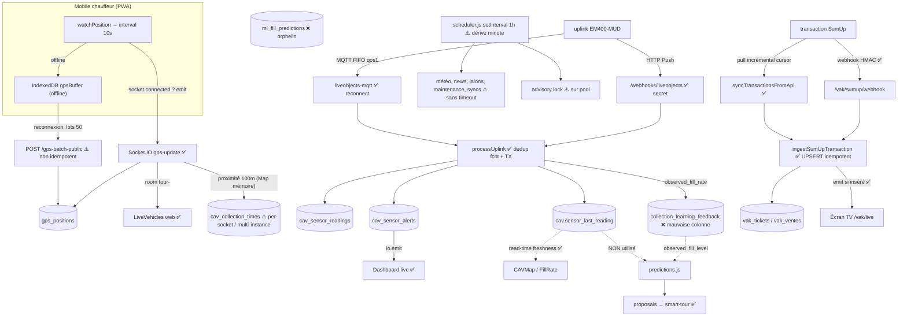

# Audit structurel de flux — Chaîne événementielle temps réel & jobs planifiés

**Projet :** SOLIDATA ERP (Solidarité Textiles)
**Date :** 11 juillet 2026
**Périmètre :** GPS mobile → Socket.IO → LiveVehicles ; capteurs Milesight/Live Objects → CAV → propositions ; SumUp → VAK live ; `scheduler.js` + BullMQ ; notifications (Brevo / push VAPID).
**Question centrale :** une information embarquée est-elle prise en charge de bout en bout, sans rupture, ressaisie ni perte silencieuse ? Que se passe-t-il quand un maillon tombe ? Y a-t-il une supervision des chaînes silencieusement cassées ?

---

## 1. Vue d'ensemble du flux

**Légende :** ✅ maillon solide · ⚠️ fragile · ❌ rompu / donnée non réutilisée.

**Constat d'ensemble.** Le *transport* des événements est globalement bien conçu : idempotence là où l'argent est en jeu (SumUp), déduplication capteur par `fcnt`, buffer offline mobile, verrou distribué (dans l'intention), reconnexion Socket.IO/MQTT propre. Les faiblesses ne sont pas dans le transport mais aux **jonctions métier** (données écrites puis non — ou mal — relues) et dans l'**absence de supervision** des chaînes qui s'arrêtent en silence.

---

## 2. Chaîne 1 — GPS mobile → LiveVehicles

**Trajet :** `mobile/src/pages/TourMap.jsx` (`watchPosition` → `setInterval` 10 s → `socket.emit('gps-update')`) → `backend/src/index.js:322` (`io.on('gps-update')` → `INSERT gps_positions` + broadcast `vehicle-position` sur la room `tour-<id>`).

**Points solides.** Design offline-first réel : hors couverture, la position part dans IndexedDB (`services/db.js › addGpsPosition`, `recordedAt` conservé) puis est rejouée par lots de 50 sur `POST /tours/gps-batch-public` (`routes/tours/index.js:263`), en transaction. Room Socket.IO correcte ; adapter Redis (`index.js:32-47`) pour la diffusion multi-instance ; throttle proximité 5 s (−90 % de requêtes DB).

**Fragilités.**
- ⚠️ **Aucune garantie de livraison en ligne.** La bascule socket-vs-buffer se décide à l'émission sur `socketRef.current.connected` (`TourMap.jsx:167`). Un `emit` sans accusé sur un lien « connecté mais dégradé » est perdu sans jamais être bufferisé. Acceptable pour une trace live, mais seul le buffer offline est durable.
- ⚠️ **Rejeu non idempotent.** `gps_positions` n'a pas de clé naturelle (`init-db.js:543`). Si le POST réussit côté serveur mais que la réponse se perd, `syncGpsBuffer` (`sync.js:212-217`) conserve le lot et le rejoue → doublons. Sévérité faible (trace).
- ⚠️ **État de proximité CAV en mémoire par socket.** `cavProximity` / `tourCavsCache` / `lastProximityCheck` sont déclarées dans la closure de connexion (`index.js:316-318`). À toute reconnexion (nouveau socket), l'heure d'arrivée est perdue → un stationnement pendant une coupure n'écrit pas `cav_collection_times`. Avec l'adapter Redis actif (multi-instance), c'est structurellement cassé : les positions d'une même tournée peuvent atterrir sur des process différents, arrivée et départ n'étant plus vus par le même.

---

## 3. Chaîne 2 — Capteur Milesight → Live Objects → CAV → propositions

**Trajet :** double ingestion (webhook HTTP `routes/webhooks.js` **et** worker MQTT `services/liveobjects-mqtt.js`) convergeant sur `services/liveobjects-processor.js › processUplink`.

**Points solides — parmi les mieux conçus du projet.**
- Dédoublonnage robuste `(cav_id, fcnt)` : garde applicative (`processUplink:184`) **et** index unique partiel `uq_sensor_readings_cav_fcnt` (`init-db.js:2893`). Le double-envoi webhook+MQTT (at-least-once) est neutralisé.
- Traitement transactionnel complet (`BEGIN`/`COMMIT`), dédoublonnage des alertes ouvertes par type (`processUplink:254`), calcul deux-points avec repli mono-point (`utils/milesight-em400mud.js`), tolérance au schéma ancien.
- Secret webhook obligatoire, fail-closed 503 si absent (`webhooks.js:14-18`), `timingSafeEqual`, monté avant le JWT. MQTT `qos:1`, reconnexion lib + compteurs (`getMqttStatus`).
- **Dégradation gracieuse en lecture :** `routes/cav.js` calcule `fill_source` = `sensor` / `sensor_stale` / `calculated` selon la fraîcheur (`cav.js:167-171`) et tague `offline` au-delà de 2× l'intervalle (`cav.js:635`).

**Ruptures identifiées.**
- ❌ **Boucle d'apprentissage capteur cassée par un décalage de colonne.** Le capteur écrit sa vérité terrain dans `collection_learning_feedback.observed_fill_rate` (DOUBLE, ajoutée par `migrate-cav-sensors.js:89` ; écriture `liveobjects-processor.js:234`). Or la calibration qui alimente les prédictions lit `observed_fill_level` (INTEGER 0-5, ×20) et **filtre `WHERE observed_fill_level IS NOT NULL`** (`services/predictive-ai.js:36,78,105` ; `routes/tours/predictions.js:234`). Les lignes issues du capteur ont `observed_fill_level = NULL` → **exclues** de la correction du modèle. Le signal le plus fiable ne nourrit donc quasiment pas l'IA (seule une métrique secondaire de MAE lit `observed_fill_rate`, `predictive-ai.js:120-124`). Trois échelles cohabitent dans la table (0-5, 0-100, 0-120), ce qui est en soi fragile.
- ❌ **Le remplissage temps réel n'est pas consommé par le moteur de propositions.** `proposals/daily` → `smart-tour.js` → `predictions.js › predictFillRate` calcule le remplissage **uniquement au temps écoulé** : `rawFill = daysSince × dailyAccumulation` (`predictions.js:159-165`). Il n'interroge jamais `cav.sensor_last_reading`. Un CAV signalé à 95 % par sa sonde ne sera pas priorisé si l'heuristique jours-depuis-collecte ne l'indique pas. Le capteur sert le tableau de bord et les alertes, pas la planification.
- ❌ **`ml_fill_predictions` est une table orpheline.** Écrite seulement à la demande par `routes/ml.js` (`/predict/:cavId`, `/predict-batch`, `POST /train`), non planifiée, **lue par aucune proposition**. La chaîne documentée « capteur → `ml_fill_predictions` → propositions » n'existe pas : deux systèmes de prédiction parallèles (`ml-model.js` statistique vs heuristique `predictive-ai`/`smart-tour`) coexistent sans se parler.
- ⚠️ **Alertes capteur non escaladées.** Un seuil (fill ≥ 95 %, tilt, batterie, température) crée une `cav_sensor_alerts` + un `io.emit('cav:sensor-reading')` **diffusé à tous** (non filtré par rôle), mais **aucun push VAPID ni SMS/email** — alors que le push est câblé ailleurs (tournées, `routes/tours/*`). Une alerte critique n'atteint que les écrans ouverts à l'instant T.

---

## 4. Chaîne 3 — SumUp → VAK live

**Trajet :** webhook signé (`routes/vak.js:88`) **et** pull incrémental (`services/sumup.js › syncTransactionsFromApi`) convergeant sur `ingestSumUpTransaction`.

**Points solides — chaîne exemplaire.** HMAC SHA-256 `timingSafeEqual` (`sumup.js:256`) ; curseur incrémental via `vak_sumup_sync_log.newest_time` du dernier succès (`sumup.js:609`) ; **UPSERT idempotent** `(vak_id, ref_transaction)` avec détection insert/update par `xmax = 0` (`sumup.js:771`) et **émission live uniquement si réellement inséré** (`wasInserted`, `sumup.js:792`) → pas de double comptage entre webhook et catch-up horaire. `vak_sumup_sync_log` trace chaque exécution (received/inserted/skipped, erreurs). Modèle à généraliser au reste du projet.

**Fragilités.**
- ⚠️ **Dépendance d'ordre VAK/transactions.** `ingestSumUpTransaction` renvoie `false` si aucune VAK ne couvre la date (`sumup.js:691`), mais le curseur avance sur **toutes** les transactions reçues (`sumup.js:655`). Une VAK créée *après* l'arrivée des transactions les fait sauter définitivement par le pull incrémental. Rattrapage uniquement via l'import CSV manuel.
- ⚠️ **Ingestion non transactionnelle.** Ticket UPSERT, puis `DELETE vak_ventes`, puis ré-INSERT des lignes — sans transaction (`sumup.js:756-789`). Un crash entre DELETE et INSERT laisse un ticket sans lignes (contraste avec `processUplink`, lui transactionnel).

---

## 5. Chaîne 4 — Scheduler & jobs planifiés

**`services/scheduler.js`** (orchestrateur maison) + **`services/job-queue.js`** (BullMQ, uniquement OCR CV et parsing PDF — **pas** les jobs métier).

**Fragilités structurelles.**
- ❌ **Ce n'est pas un cron mais un `setInterval(1h)` dérivant.** Déclenchement par test de `now.getHours()` (`scheduler.js:610`). Le premier tick tombant à *démarrage + 1 h*, **la minute de tous les ticks est figée sur la minute de boot du conteneur**. Or plusieurs jobs sont gardés par `now.getMinutes() < 30` : dispatch J-1 18 h (`:622`), scan CSV boutiques 20 h (`:634`), découverte d'événements mensuelle (`:658`), synchro jours fériés annuelle (`:678`). **Si le conteneur a démarré à une minute ≥ 30, ces jobs ne s'exécutent jamais** — panne silencieuse dont la survenue dépend de l'heure de déploiement. Un redémarrage dans une fenêtre 7/12/18 h fait aussi manquer ce passage, sans rattrapage ni trace.
- ⚠️ **`runAllJobs` séquentiel sans timeout.** 13 jobs enchaînés en `await` (`:817-830`) ; les appels externes (Brevo `fetch`, Open-Meteo, SumUp, Pennylane) n'ont **aucun timeout**. Un seul appel bloqué gèle tous les jobs suivants (météo, news, alertes jalons insertion, purges RGPD, refresh des vues) **et** conserve le verrou.
- ⚠️ **Verrou advisory sur connexion mutualisée.** `pg_try_advisory_lock` est un verrou de **session** ; `acquireLock`/`releaseLock` passent par `pool.query` (`:488,497`) et peuvent tomber sur des connexions différentes → le `pg_advisory_unlock` ne libère rien (no-op) et le verrou fuit sur la connexion d'acquisition jusqu'à son recyclage. En mono-instance cela survit souvent, mais la protection anti-concurrence n'est pas fiable. Tenir un `client` dédié (`pool.connect`) pour tout le run.

**Points solides.** Intention de verrou distribué présente ; purges RGPD (candidats 24 mois, GPS 90 j) automatisées et tracées dans `rgpd_audit_log` ; dédoublonnage des jalons/alertes insertion (`checkInsertionMilestones`, `createInsertionAlert`) ; rotation 21 j du fil de veille ; **observabilité réelle pour Pennylane et SumUp** via leurs tables `*_sync_log`.

---

## 6. Chaîne 5 — Notifications (Brevo / push VAPID)

`services/push-notifications.js` est propre : Web Push, **auto-purge des abonnements 410/404** (`push-notifications.js:58`), diffusion par utilisateur ou rôle ; bien câblé dans les chaînes tournées. Deux réserves : (a) `services/notification.js` (Brevo) est **dupliqué** à l'identique dans `scheduler.js:17-55` — risque de divergence ; (b) les alertes **capteur** n'empruntent aucun de ces canaux (cf. §3).

---

## 7. Synthèse — état des maillons

| Chaîne | Bout-en-bout | Idempotence | Reconnexion / pertes | Supervision |
|---|---|---|---|---|
| GPS live → LiveVehicles | ✅ | ⚠️ rejeu dup. | ⚠️ emit sans ack ; proximité per-socket | ❌ |
| GPS → `cav_collection_times` | ⚠️ | — | ❌ multi-instance / reconnexion | ❌ |
| Capteur → CAV (dashboard/alertes) | ✅ | ✅ (fcnt) | ✅ MQTT reconnect | ⚠️ `getMqttStatus` non alerté |
| Capteur → apprentissage → propositions | ❌ colonne + heuristique | — | — | ❌ |
| `ml_fill_predictions` → propositions | ❌ orphelin | — | — | — |
| SumUp → VAK live | ✅ | ✅ (UPSERT/xmax) | ✅ curseur | ✅ `sync_log` |
| Scheduler / jobs | ⚠️ dérive minute | ✅/⚠️ | ❌ pas de rattrapage | ⚠️ (2 îlots) |
| Notifications push | ✅ | ✅ purge | — | — |

**Angle mort transverse le plus important : aucune supervision des chaînes silencieusement cassées.** `/api/health` (`routes/health.js`) ne couvre que DB, Redis et mémoire. Rien ne surveille : état de l'adapter Socket.IO, connexion MQTT (`getMqttStatus` exposé seulement via un endpoint admin `cav.js:1250`, jamais alerté), **silence** d'une sonde (détecté uniquement à la lecture d'un écran), ni dernière exécution réussie des jobs météo/news/jalons/maintenance/vues matérialisées. Si un maillon s'arrête, personne n'est prévenu — c'est précisément le risque central de ce type d'architecture.

---

## 8. Recommandations priorisées

| # | Recommandation | Prio | Effort |
|---|---|---|---|
| 1 | **Corriger la colonne de feedback capteur** : écrire `observed_fill_level` (ou faire lire `observed_fill_rate` par la calibration) pour rebrancher la vérité terrain sur l'IA de prédiction. | P1 | S |
| 2 | **Fiabiliser le scheduler** : passer à `node-cron` (déjà crédible) ou remplacer les gardes `getMinutes()<30` par un déclenchement aligné sur l'horloge + table `job_runs(job, last_success_at, status)`. | P1 | M |
| 3 | **Superviser les chaînes** : étendre `/api/health`/`/ready` avec statut MQTT, âge de la dernière lecture capteur, dernier succès de chaque job ; alerter au-delà d'un seuil. | P1 | M |
| 4 | **Timeouts sur tous les appels externes** des jobs (Brevo, Open-Meteo, SumUp, Pennylane) + isolation par job (`Promise.allSettled`). | P1 | S |
| 5 | **Détection de sonde silencieuse** : job générant `cav_sensor_alerts` + push quand `sensor_last_reading_at` dépasse 2× l'intervalle ; escalader les alertes capteur critiques en push/SMS. | P1 | M |
| 6 | **Verrou distribué correct** : tenir un `pool.connect()` dédié pendant `runAllJobs` (acquire/release même session) ou lock Redis. | P2 | S |
| 7 | **Statuer sur la prédiction** : brancher le remplissage capteur sur les propositions (ou acter la déconnexion) et décider du sort de `ml_fill_predictions` (l'alimenter/consommer ou la retirer). | P2 | M |
| 8 | **Idempotence GPS & proximité multi-instance** : dédup sur le rejeu offline batch ; sortir l'état de proximité de la closure socket (Redis ou recalcul serveur). | P2 | M |

---

*Rapport limité au flux temps réel & jobs. Les chaînes SumUp et Live Objects sont, individuellement, d'excellente facture (idempotence, dédoublonnage, transactions) ; les faiblesses se concentrent aux jonctions métier et dans l'absence de supervision d'ensemble.*
