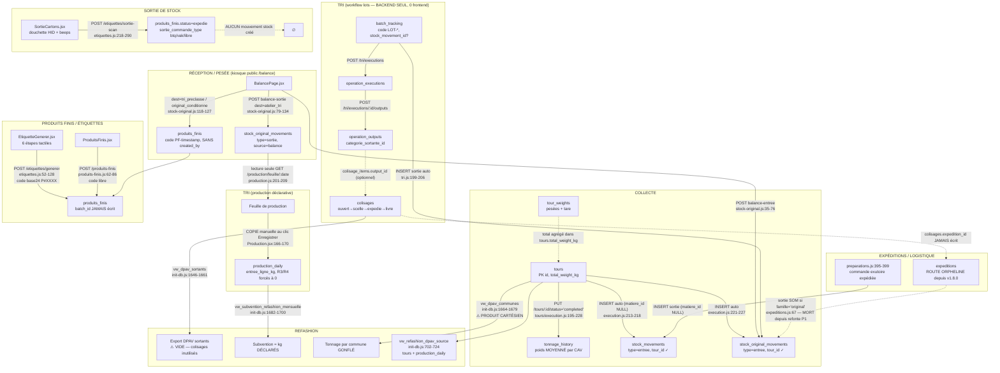

# Audit exhaustif SOLIDATA — Rapport 04 : Tri & Production, Stock, Produits finis, Étiquettes — Traçabilité industrielle des flux

> Date : 3-4 juillet 2026 · Périmètre : modules 7 (Tri & Production) et 8 (Stock), produits finis, étiquettes, traçabilité bout-en-bout collecte → Refashion.
> Méthode : lecture intégrale de `backend/src/routes/{tri,production,produits-finis,etiquettes,stock,stock-original,expeditions}.js`, `backend/src/scripts/init-db.js` (tables + vues + seeds), `backend/src/utils/base24.js`, `backend/src/data/catalogue-base.json`, pages frontend `ChaineTri/Production/Stock/ProduitsFinis/EtiquetteGenerer/SortieCartons/BalancePage/AdminStockOriginal/InventaireOriginal/AdminCatalogue`, composants `DiagrammeFluxTri/EtiquetteA4`, plus les écrivains périphériques (`tours/execution.js`, `preparations.js`, `boutique-commandes.js`, `finance.js`, `refashion.js`).
> Toute affirmation est référencée `fichier:ligne`. Aucun fichier de code n'a été modifié.
>
> Note de périmètre : les endpoints publics `/api/stock-original/balance-*` (kiosque pesée sans authentification, route web `/balance` hors ProtectedRoute — `frontend/src/App.jsx:118`) sont déjà recensés par le rapport 01 (sécurité). Ils ne sont mentionnés ici que sous l'angle intégrité des données (§1.4, anomalie A5).

---

## 1. SCHÉMA D'INFORMATION DE TRAÇABILITÉ (section centrale)

### 1.1 Le flux tel qu'il EST dans le code



### 1.2 Tableau maillon par maillon (table, clé, lien amont)

| # | Maillon | Table | Clé | Lien vers l'amont | État du lien |
|---|---------|-------|-----|-------------------|--------------|
| 1 | Pesée tournée | `tour_weights` | id | `tour_id` → tours | ✓ solide |
| 2 | Tonnage par CAV | `tonnage_history` | id | `cav_id`, mais poids = total/nb CAV (`tours/execution.js:204`) | ⚠ grandeur **recalculée** (moyenne), pas mesurée |
| 3 | Entrée stock brute | `stock_original_movements` | id | `tour_id` ✓ (`execution.js:221-227`) | ✓ |
| 4 | Entrée stock « moderne » | `stock_movements` | id | `tour_id` ✓ mais `matiere_id` NULL (`execution.js:213-218`) | ⚠ poids jamais catégorisé |
| 5 | Pesée balance atelier | `stock_original_movements` (source='balance') | id | AUCUN lien tournée/lot ; champ `operateur` prévu (→ `notes`, `stock-original.js:64-69`) mais jamais envoyé par l'UI (`BalancePage.jsx:300-306`) | ✗ rupture + anonyme |
| 6 | Entrée ligne de tri | `production_daily.entree_ligne_kg` | date | **copie manuelle** du total balance au clic (`Production.jsx:166-170`) | ✗ snapshot, pas de FK |
| 7 | Lot de tri | `batch_tracking` | id, code LOT-* | `stock_movement_id` optionnel (`tri.js:187-195`) | ✗ table **vide** (aucun frontend) |
| 8 | Exécution opération | `operation_executions` | id | `batch_id` NOT NULL ✓ | ✗ vide (aucun frontend) |
| 9 | Sortie catégorisée | `operation_outputs` | id | `execution_id`, `categorie_sortante_id` | ✗ vide + **jamais reversée dans `stock_movements`** |
| 10 | Colisage | `colisages` / `colisage_items` | id, code COL-* | `output_id` / `produit_fini_id` optionnels, non uniques | ✗ vide + un même output colisable N fois (`tri.js:441-470`) |
| 11 | Produit fini (carton) | `produits_finis` | `code_barre` UNIQUE | `batch_id` existe en DDL (`init-db.js:1343-1348`) mais **écrit par aucune route** ; `poste_etiquetage_id` ✓ | ✗ rupture carton ↔ lot ↔ tournée |
| 12 | Sortie carton | `produits_finis.status='expedie'` | code_barre | `sortie_commande_type/id` (btq/vak/libre), `scanned_by` ✓ (`etiquettes.js:270-276`) | ⚠ tracé côté PF, **aucun mouvement de stock** |
| 13 | Expédition | `expeditions` | id | `categorie_sortante_id` ✓ mais route **orpheline** (0 appel frontend) ; `colisages.expedition_id` jamais écrit | ✗ maillon mort |
| 14 | Sortie exutoire réelle | `stock_movements` sortie via `preparations.js:395-399` | id | `code_barre='EXU-'+ref` (texte), `matiere_id` NULL | ⚠ lien par convention texte, pas FK |
| 15 | Refashion DPAV | `refashion_dpav` (saisie) + 5 vues `vw_*` | periode | cf. §1.5 | ⚠ 2 des 5 vues structurellement fausses/vides |

### 1.3 Les RUPTURES DE CHAÎNE (constat central)

**R1 — Le poids par CAV est une moyenne, pas une mesure.** `tours/execution.js:204` : `weightPerCav = total_weight_kg / nb_cav_collectés`. `tonnage_history` (base des KPI Métropole/captation par commune) enregistre une répartition uniforme. Toute analyse « par CAV » ou « par commune » en aval hérite de cette fiction.

**R2 — Le poids collecté entre en stock sans catégorie.** Les entrées auto de `stock_movements` ont `matiere_id NULL` (`execution.js:214`). Le « stock par catégorie » (`stock.js:36-69`) classe donc l'essentiel du tonnage en « Non classé ».

**R3 — Balance → production : double saisie par copie.** La feuille de production affiche les pesées balance (`production.js:201-209`, source vérité), mais `entree_ligne_kg` n'est renseigné que si le manager clique « Enregistrer » (`Production.jsx:166-170`), en copiant le total du moment. Pesées postérieures au clic = perdues sauf re-clic. `entree_recyclage_r3_kg` et `r4` sont **forcés à 0** (`Production.jsx:172-174`) alors que le dashboard et les vues Refashion les additionnent.

**R4 — Le cœur de la traçabilité (lots) n'existe qu'en backend.** `batch_tracking → operation_executions → operation_outputs → colisages` : 16 endpoints dans `tri.js:179-537`, **zéro appel frontend** (vérifié par grep exhaustif quotes + backticks sur `frontend/src` et `mobile/src` : seuls `GET /tri/chaines`, `GET /tri/chaines/:id`, `GET /tri/categories` sont appelés — `ChaineTri.jsx:36-37,54`, `Stock.jsx:24`). Ces 6 tables sont donc vides en production.

**R5 — La documentation ment sur le lien tri → stock.** `docs/LOGIQUE_STOCK_INVENTAIRES.md:311` affirme « Les opérations de tri (tri.js) créent des stock_movements entrants par catégorie sortante ». **Aucun `INSERT INTO stock_movements` n'existe dans tri.js** (seul un `stock_original_movements` sortie à `tri.js:199-206`). Le stock trié par catégorie n'est alimenté par rien d'automatique.

**R6 — `produits_finis.batch_id` : colonne de traçabilité morte.** Ajoutée avec index pour l'audit Refashion P1#11 (`init-db.js:1340-1348`), elle n'est renseignée par **aucun** des 3 points de création de PF (`etiquettes.js:98-105`, `produits-finis.js:72-77`, `stock-original.js:121-126`). Le carton étiqueté ne sait pas de quel lot ni de quelle tournée il provient.

**R7 — Colisage ↔ expédition : lien prévu, jamais écrit.** `colisages.expedition_id` (`init-db.js:1293`) n'apparaît dans aucun UPDATE/INSERT. Le statut colisage `expedie` est déclaratif, sans objet expédition ni bon de livraison.

**R8 — Trois registres de stock parallèles, jamais réconciliés.** (a) `stock_original_movements` (brut), (b) `stock_movements` (trié, théorique), (c) `produits_finis.status` (conditionné). La sortie douchette (`etiquettes.js:270-279`) ne décrémente que (c) ; la balance ne touche que (a) ; les préparations exutoires ne touchent que (b). Aucun total n'est comparable à un autre.

**R9 — La sortie automatique du stock original à l'expédition est du code mort.** `expeditions.js:67` teste `famille === 'original'` ; depuis la refonte P1 les familles sont `Réutilisation/Recyclage/Chiffons/CSR/Élimination` (`init-db.js:1583-1601`, upsert par nom qui écrase l'ancienne valeur). De plus la route POST /expeditions entière est orpheline (page supprimée en v1.8.0, 0 appel — grep quotes+backticks).

**R10 — Unités incohérentes.** Tout est en kg sauf : `production_daily.total_jour_t` (tonnes), `preparations.pesee_interne` (tonnes converties ×1000 — `preparations.js:391`), `colisages.nb_articles` (pièces) sans poids unitaire, et la catégorie « Pré-classé Chaussures par paire » (paires) sans aucune colonne de comptage pièces dans `operation_outputs`/`produits_finis` (kg uniquement). Le passage kg ↔ pièces requis par la vente boutique n'est pas modélisé.

**R11 — L'inventaire physique validé n'a aucun effet.** `POST /stock/inventories/:id/validate` (`stock.js:298-311`) fige le statut mais **ne crée aucun mouvement de régularisation** : l'écart constaté ne corrige jamais le stock théorique — le prochain inventaire repart du même théorique faux.

**R12 — `vw_dpav_communes` : produit cartésien.** `init-db.js:1671-1673` : `tours JOIN tour_weights JOIN tour_cav` — chaque pesée est dupliquée pour chaque CAV collecté du tour, et chaque commune reçoit le poids TOTAL du tour. Pour une tournée de 10 CAV, le tonnage territorial est compté ~10 fois. (À comparer avec `tonnage_history` qui, lui, divise.)

### 1.4 Verrouillage trimestriel Refashion : périmètre réel

`isQuarterLocked()` n'est appliqué que sur `/pesee`, `/regularisation`, `PUT /:id` (`stock-original.js:365,400,438-453`). **Contournements existants** :
- endpoints balance publics (`stock-original.js:35-155`) : aucune vérification de verrou, et la **date vient du client** — un POST avec `date=2026-01-15` écrit dans un trimestre déclaré ;
- `tri.js:199-206` (sortie auto création de lot) : aucune vérification (risque faible, CURRENT_DATE) ;
- `tours/execution.js:221-227` (entrée auto) : aucune vérification — une tournée re-complétée à date passée modifierait un trimestre verrouillé.

**Anonymat des pesées balance** : le backend prévoit un champ `operateur` (stocké en `notes`, `stock-original.js:37,68`), mais `BalancePage.jsx:300-306` ne l'envoie jamais (payload = date/poids_brut_kg/contenant/tare_kg/origine|destination). Toutes les pesées du flux le plus utilisé de l'atelier sont donc **100 % anonymes** (ni `created_by` — endpoint public — ni nom d'opérateur), alors que ce registre alimente la déclaration Refashion.

### 1.5 Fiabilité des 5 exports Refashion (`GET /api/refashion/exports/:slug`, refashion.js:225-254)

| Vue | Source réelle | Fiabilité |
|-----|--------------|-----------|
| `vw_tonnage_annuel_tournee` | tours + tour_weights | ✓ correcte |
| `vw_dpav_sortants` | **colisages** (init-db.js:1646-1661) | ✗ **structurellement vide** (R4) |
| `vw_dpav_communes` | tours × tour_weights × tour_cav | ✗ **gonflée** (R12) |
| `vw_subvention_refashion_mensuelle` | `production_daily.entree_ligne_kg` | ⚠ kg déclaratifs copiés à la main (R3) |
| `vw_coherence_tri_filiere` | production_daily vs colisages | ✗ écart permanent ~100 % (colisages vides) |

---

## 2. PRÉPARATION SONDE MATIÈRE/COULEUR (NIR)

### 2.1 Verdict de préparation : squelette conceptuel bon, adoption nulle → **préparation FAIBLE en l'état, MOYENNE si le workflow lots est activé**

Points favorables :
- La chaîne `batch_tracking → operation_executions → operation_outputs` est exactement la granularité dont une sonde a besoin pour rattacher ses lectures (lot × opération). Les tables existent, avec `categorie_sortante_id` et `famille_refashion` déjà en place.
- Précédent IoT réutilisable : le pipeline capteurs LoRaWAN (`cav_sensor_readings`, webhook + processor + Socket.IO, v1.4.2) fournit le patron exact « flux machine → table de lectures → agrégats ».
- `categories_sortantes` porte déjà `famille_refashion` (enum, `init-db.js:1572-1573`) — le mapping sortie sonde → filière réglementaire a un point d'ancrage.

Points bloquants :
- **R4/R6** : tant que lots et `batch_id` ne vivent pas, une lecture sonde n'a RIEN à quoi se rattacher — elle tomberait dans le même vide que `operation_outputs`.
- Aucune modélisation de la **pièce** : le grain le plus fin du schéma actuel est le carton (`produits_finis`, poids agrégé). Une sonde NIR lit pièce par pièce (matière, couleur, confiance) à cadence convoyeur.
- `categories_sortantes` ne porte ni matière ni couleur : « Effilochage Coton » encode la matière dans le libellé — non exploitable par une machine.

### 2.2 Où brancher la sonde (recommandation)

Point d'insertion physique : **entre le crackage et les postes R1-R4** (convoyeur), soit dans le modèle : une lecture est rattachée à l'`operation_execution` en cours (chaîne + lot + créneau) et, en aval, agrégée sur l'`operation_output` puis sur le carton (`produits_finis`).

Granularités à supporter (les 3) :
1. **pièce** : événement brut sonde (haute fréquence, ~1-3 pièces/s) ;
2. **balle/carton** : agrégat de composition (ex. 62 % coton, 23 % polyester / dominante bleue) ;
3. **lot** : bilan matière du lot pour la déclaration Refashion et le contrôle qualité entrée/sortie.

### 2.3 DDL cible esquissé

```sql
-- Référentiel machine des matières/couleurs (mapping NIR → catégories métier)
CREATE TABLE IF NOT EXISTS ref_matieres_nir (
  id SERIAL PRIMARY KEY,
  code VARCHAR(30) NOT NULL UNIQUE,          -- ex. 'COTTON', 'PES', 'WO', 'CO_PES_MIX'
  libelle VARCHAR(100) NOT NULL,
  categorie_sortante_id INTEGER REFERENCES categories_sortantes(id), -- routage tri
  famille_refashion VARCHAR(30) CHECK (famille_refashion IN
    ('reutilisation','recyclage','csr','elimination','retour')),
  is_active BOOLEAN DEFAULT true
);

-- Lectures brutes de la sonde (grain pièce) — table à fort volume, partitionnable par mois
CREATE TABLE IF NOT EXISTS tri_lectures_sonde (
  id BIGSERIAL PRIMARY KEY,
  device_id VARCHAR(60) NOT NULL,             -- identifiant sonde (multi-sondes possible)
  lu_at TIMESTAMPTZ NOT NULL DEFAULT NOW(),
  batch_id INTEGER REFERENCES batch_tracking(id),          -- lot en cours (nullable au début)
  operation_execution_id INTEGER REFERENCES operation_executions(id),
  chaine_id INTEGER REFERENCES chaines_tri(id),
  matiere_code VARCHAR(30) REFERENCES ref_matieres_nir(code),
  matiere_confiance NUMERIC(4,3),             -- 0.000-1.000
  couleur_hex CHAR(7),                        -- '#1A2B3C' mesure colorimétrique
  couleur_famille VARCHAR(20),                -- 'bleu','rouge'… (classif embarquée)
  poids_estime_g INTEGER,                     -- si cellule de pesée en ligne
  decision_routage VARCHAR(30),               -- sortie proposée/effectuée
  raw JSONB                                    -- payload constructeur intégral
);
CREATE INDEX IF NOT EXISTS idx_lectures_sonde_batch ON tri_lectures_sonde(batch_id, lu_at);
CREATE INDEX IF NOT EXISTS idx_lectures_sonde_exec ON tri_lectures_sonde(operation_execution_id);

-- Agrégat de composition au grain output/carton (calculé par job, pas à la volée)
ALTER TABLE operation_outputs ADD COLUMN IF NOT EXISTS composition JSONB;
  -- ex. {"CO":0.62,"PES":0.23,"autres":0.15,"couleurs":{"bleu":0.4,"noir":0.3}}
ALTER TABLE produits_finis   ADD COLUMN IF NOT EXISTS composition JSONB;
ALTER TABLE produits_finis   ADD COLUMN IF NOT EXISTS nb_pieces INTEGER;      -- comble R10 (kg vs pièces)
ALTER TABLE produits_finis   ADD COLUMN IF NOT EXISTS dpp_uid VARCHAR(64) UNIQUE; -- Passeport Numérique Produit
```

Événements/ingestion : reprendre le patron Live Objects — `POST /api/tri/sonde/webhook` (HMAC, monté avant `authenticate` comme le webhook SumUp — `index.js` rawBody déjà en place) ou MQTT ; un `sonde-processor` (même modèle que `services/` capteurs) bufferise et insère par lots de 100-500 lectures ; émission Socket.IO `tri:sonde:stats` pour un futur écran atelier temps réel (patron VakLive réutilisable tel quel).

### 2.4 Lien Passeport Numérique Produit (DPP / règlement ESPR)

L'ESPR imposera à l'horizon 2027-2030 un DPP textile (composition, recyclabilité, origine). Le chemin critique SOLIDATA pour y répondre : `tri_lectures_sonde` (mesure) → `produits_finis.composition` + `dpp_uid` (agrégat carton) → export par carton/balle vers le registre DPP. **Prérequis absolu : réparer R6 (batch_id) et donner un frontend au workflow lots (R4)** — sans chaîne lot→carton, la composition mesurée ne sera pas opposable. Le code-barres base24 actuel (6 caractères, 331 776 combinaisons/poste — `utils/base24.js:27-34`) est trop petit pour servir d'identifiant DPP public : prévoir `dpp_uid` distinct (UUID/GS1), le code base24 restant l'identifiant atelier.

---

## 3. PROMESSE vs RÉALITÉ

| Promesse (CLAUDE.md §5, docs) | Réalité constatée | Écart |
|---|---|---|
| « 2 chaînes » de tri | Seed « Qualité » (5 opérations, 10+ postes) + « Recyclage Exclusif » (1 opération) (`init-db.js:1846-1912`), affichage read-only `ChaineTri.jsx` | ✓ descriptif. Usage réel unique du référentiel : le **planning hebdo** (affectations `schedule.poste_code` → `postes_operation.code`, jointure `production.js:177-191`). Aucune exécution/pesée ne s'y rattache |
| « batch tracking » | 6 tables + 16 endpoints (`tri.js:179-537`) | ✗ **0 frontend, tables vides** (R4) |
| « code-barres » | 3 formats coexistent : base24 `P#XXXX` (étiquettes), `PF-<timestamp>` (balance, `stock-original.js:120`), libre (POST produits-finis) ; scan douchette OK | ⚠ fonctionne, mais 3 conventions non documentées ; `parseId` ne reconnaît que le format base24 (`base24.js:36-44`) |
| « KPI productivité » | `production_daily.productivite_kg_per` = (ligne+R3+R4)/effectif (`production.js:107`) | ⚠ calculé sur des kg copiés à la main ; **500 sur les mois de 28/29/30 jours** (A3) |
| « Mouvements entrée/sortie » (Stock) | `POST /api/stock` existe | ✗ **création impossible depuis l'UI** : violation FK `matieres` (A1) |
| « Inventaire physique » | Création/saisie/validation OK techniquement (`stock.js:181-311`, transactions ✓) | ⚠ théorique construit sur une jointure inter-référentiels + mouvements auto exclus + validation sans effet (A6, R11) |
| « Grand livre brut » | `GET /stock-original/ledger` avec solde cumulé fenêtré (`stock-original.js:279-342`) | ✓ le module le plus sain de l'audit |
| « Verrouillage trimestriel Refashion » | locks + vérifs sur pesée/régul/PUT (`stock-original.js:163-180,344-497`) | ⚠ bypassé par balance publique et écritures auto (§1.4) |
| « Étiquettes A4 CODE128 + sortie douchette HID » | `etiquettes.js` : transactions, `FOR UPDATE`, compteur base24, idempotence scan (409 `ALREADY_OUT`) ; UI tactile 6 étapes + beeps | ✓ **meilleur module du périmètre** ; manque réimpression + annulation UI (A11, A14) |
| « Auto-seed catalogue 103 produits » | `catalogue-base.json` : 103 produits, 10 genres, 3 saisons, 4 gammes ; seed conditionnel (`init-db.js:1423-1460`) | ✓ conforme |

---

## 4. ANOMALIES

### BLOQUANT

**A1 — Le formulaire « Mouvement de stock » ne peut jamais aboutir (FK vers un référentiel jamais peuplé).**
- Preuve : `Stock.jsx:51-58` envoie `matiere_id: form.categorie_sortante_id` (le select est peuplé par `/tri/categories` = `categories_sortantes`, `Stock.jsx:24,315-317`) ; `stock_movements.matiere_id REFERENCES matieres(id)` (`init-db.js:560`) ; **aucun seed ni script n'insère dans `matieres`** (grep exhaustif : seul l'endpoint orphelin `POST /stock/matieres`, `stock.js:118`, sans UI).
- Impact : sur base neuve, tout enregistrement avec catégorie → 500 (`insert or update violates foreign key constraint`), avalé par `console.error` (`Stock.jsx:61`) → l'opérateur clique, la modale se ferme ou rien ne se passe, aucun message. La saisie manuelle d'entrées/sorties triées est **hors service**.
- Correctif : trancher le référentiel — renommer la colonne en `categorie_sortante_id REFERENCES categories_sortantes(id)` (migration + reprise des données NULL) ; à défaut quick-win : seeder `matieres` en miroir des 18 catégories avec IDs alignés (fragile). Ajouter un toast d'erreur.

**A2 — Le workflow d'exécution du tri n'a aucun frontend ; les exports Refashion officiels qui s'y adossent sont vides.**
- Preuve : cf. R4 (liste exhaustive des appels frontend `/tri/*` ; grep étendu à `mobile/src` et `ai-agent` : zéro appel à `tri/batches|executions|colisages|inventory|postes|sorties|operations`) ; vues `vw_dpav_sortants` et `vw_coherence_tri_filiere` construites sur `colisages` (`init-db.js:1646-1661,1702-1727`) ; page d'export QHSE `/admin/refashion-exports` sert donc du vide.
- Impact : la promesse centrale du module 7 (traçabilité lot → catégorie → colisage → exutoire) est inopérante ; le DPAV « sortants » exporté est un CSV vide ; la cohérence tri/filière affiche un écart permanent. Victime collatérale : le **CO₂ évité Métropole** censé utiliser le « mix observé depuis les colisages scellés » (`metropole.js:35-66`) retombe **systématiquement** sur le mix codé en dur 40/35/15/10 (`metropole.js:41`) — l'indicateur affiché comme « observé » ne l'est jamais.
- Correctif : soit livrer l'UI lots (voir §7 — une UI minimale de 2 écrans suffit pour démarrer), soit ré-adosser temporairement `vw_dpav_sortants` sur `produits_finis` (qui contient les vrais cartons) + `expeditions`/`preparations`.

**A3 — `month + '-31'` : les endpoints mensuels production plantent 5 mois sur 12.**
- Preuve : `production.js:24-26` (`GET /api/production?month=`) et `production.js:57` (`/dashboard`) font `date BETWEEN $1 AND $2` avec `month+'-01'`/`month+'-31'`. **Vérifié empiriquement sur PostgreSQL 16** (forme littérale et forme paramétrée `PREPARE/EXECUTE`) : `ERROR: date/time field value out of range: "2026-06-31"`. Même motif dans `expeditions.js:98`.
- Impact : en février, avril, juin, septembre, novembre → 500 silencieux (catch `console.error` `Production.jsx:136`, `ChaineTri.jsx:49`) : vue mensuelle Production et onglet « Production & Effectifs » de ChaineTri **vides tout le mois**. Bug vivant (juin 2026 vient de l'illustrer).
- Correctif (2 lignes) : `AND date >= $1::date AND date < ($1::date + interval '1 month')` avec le seul paramètre `month+'-01'`, ou `date_trunc('month', date) = $1::date`.

### MAJEUR

**A4 — Re-complétion d'une tournée = double comptage du tonnage.**
- Preuve : `PUT /tours/:id/status` (`tours/execution.js:165-228`) : l'UPDATE n'exclut pas l'état courant `completed` et les 3 inserts (tonnage_history, stock_movements, stock_original_movements) ne vérifient pas l'existence d'un mouvement pour ce `tour_id`. Pas d'index unique `stock_movements(tour_id)`.
- Impact : double clic, retry réseau, ou aller-retour de statut → tonnage collecté compté 2×, propagé à Refashion, Métropole, stock. `GET /stock/reconciliation` (orphelin, sans UI) produirait d'ailleurs des lignes dupliquées (LEFT JOIN 1-n).
- Correctif : `WHERE id=$X AND status <> 'completed'` sur le passage à completed + `CREATE UNIQUE INDEX ... ON stock_movements(tour_id) WHERE tour_id IS NOT NULL AND type='entree'` + envelopper les 4 écritures dans une transaction.

**A5 — Les endpoints balance publics ignorent le verrouillage trimestriel (intégrité Refashion).**
- Preuve : `stock-original.js:35-134` — aucun appel à `isQuarterLocked` ; `date` fournie par le client sans borne. (Exposition publique elle-même : cf. rapport 01.)
- Impact : n'importe quel visiteur du kiosque (ou script) peut écrire un mouvement dans Q1 2026 déjà déclaré à Refashion, invalidant le grand livre verrouillé.
- Correctif : appliquer `isQuarterLocked(date)` + contraindre `date` à ±48 h de la date serveur sur `/balance-*`.

**A6 — Inventaire physique : théorique construit sur une jointure inter-référentiels et jamais corrigé.**
- Preuve : `stock.js:191-198` — `LEFT JOIN stock_movements sm ON sm.matiere_id = cs.id` compare un id `matieres` à un id `categories_sortantes` (référentiels distincts) ; les entrées auto de collecte (`matiere_id` NULL) sont exclues ; la validation (`stock.js:298-311`) n'émet aucun mouvement de régularisation (R11).
- Impact : le théorique par catégorie est faux par construction ; l'écart saisi ne sert à rien ; l'inventaire donne une illusion de contrôle.
- Correctif : après A1 (référentiel unifié), inclure un mouvement `regularisation` par item à la validation (pattern déjà éprouvé dans stock-original).

**A7 — `vw_dpav_communes` : tonnage territorial multiplié par le nombre de CAV.**
- Preuve : `init-db.js:1671-1673` (jointure cartésienne tour_weights × tour_cav, aucune division).
- Impact : reporting communes Métropole/Refashion surestimé d'un facteur ≈ nb CAV/tournée (souvent ×8-15).
- Correctif : passer par `tonnage_history` (déjà réparti), ou diviser par `COUNT(tc) OVER (PARTITION BY t.id)`.

**A8 — Chaîne expéditions morte : route orpheline + condition famille obsolète.**
- Preuve : 0 appel frontend à `/expeditions` (grep) ; `expeditions.js:67` `famille === 'original'` vs familles seedées `Réutilisation/Recyclage/Chiffons/CSR/Élimination` (`init-db.js:1583-1601`).
- Impact : plus aucun moyen UI de créer une expédition « classique » ; même via API, la sortie stock original auto ne se déclenche plus → stock original jamais décrémenté par les expéditions → solde gonflé, déclarations faussées.
- Correctif : décider du sort du module (fusion avec préparations exutoires ?) ; si conservé, tester `famille_refashion = 'reutilisation' AND nom = 'Original'` ou un flag dédié.

**A9 — Comptabilité des lots incohérente dans `tri.js` (quand le workflow sera utilisé).**
- Preuve : `PUT /executions/:id/complete` (`tri.js:305-342`) : `poids_restant_kg -= poids_sortie_total` — la perte (`perte_kg`) n'est jamais déduite → elle reste éternellement « restante » ; les sorties `vers_operation` (transfert interne, `sorties_operation.type_sortie`, `init-db.js:819-820`) sont décomptées comme des sorties définitives puis re-sorties à l'opération suivante (double décompte) ; 2 UPDATE sans transaction ; aucune vérification que l'exécution est `en_cours`, complétable 2× (le batch serait re-décrémenté).
- Correctif : machine à états sur executions (le moteur `services/state-machine` existe depuis V6.1), déduire `perte`, ne décompter que les sorties terminales, transaction.

**A10 — La clôture de journée production n'est pas opposable côté API.**
- Preuve : `POST /api/production` (`production.js:109-155`) upsert `ON CONFLICT (date) DO UPDATE` sans condition sur `validated_at` ; idem `POST /chariots` (`production.js:253-281`). Seul le bouton frontend est désactivé (`Production.jsx:382`).
- Impact : une feuille clôturée (signée encadrant/direction) reste modifiable par tout MANAGER via API — la valeur probante de la clôture est nulle.
- Correctif : `... DO UPDATE SET ... WHERE production_daily.validated_at IS NULL` + 409 explicite.

**A11 — Aucune réimpression d'étiquette possible.**
- Preuve : `EtiquetteGenerer.jsx:64-92` — après `reset()`, plus aucun chemin vers le code généré ; aucune route/page de réimpression (le `GET /produits-finis/scan/:codeBarre` qui aurait pu servir est orphelin, `produits-finis.js:89-101`).
- Impact : bourrage papier ou étiquette déchirée → l'opérateur régénère → carton fantôme en stock (poids compté 2×) + compteur consommé. C'est LE cas d'usage réel qui produira des écarts d'inventaire.
- Correctif : bouton « Réimprimer la dernière » (state local) + recherche par code (réutilise `/scan/:codeBarre`) + éventuellement `DELETE` ADMIN d'un PF jamais sorti.

**A12 — `produits_finis.batch_id` jamais alimenté** (détail en R6) — la colonne livrée pour l'audit éco-organisme P1#11 est de la traçabilité de papier.

**A25 — Vue « Synthèse » de ProduitsFinis : mismatch de noms de champs → cartes toujours à zéro.**
- Preuve : le backend renvoie `nb_produits` / `poids_total_kg` / `nb_sortis` / `nb_en_stock` (`produits-finis.js:48-50`) ; le frontend lit `s.count` et `s.total_kg` (`ProduitsFinis.jsx:98,102`) — champs inexistants → « Articles 0 / Poids total 0 kg » pour toutes les gammes.
- Impact : récidive du pattern de bug « noms de champs » corrigé en V1.5.0 sur la vue Liste (fix O2/O10 documenté dans `produits-finis.js:14-15`) mais jamais sur la vue Synthèse ; l'écran de pilotage du stock PF est décoratif.
- Correctif : lire `s.nb_produits`/`s.poids_total_kg` et afficher `nb_en_stock`/`nb_sortis` (données déjà renvoyées).

**A26 — Trois générations de « gammes » coexistent sans arbitrage.**
- Preuve : le formulaire ProduitsFinis code en dur `A/B/C` (`ProduitsFinis.jsx:139-143`) ; le référentiel actif est `EXTRA/STANDARD/VAK/EXPORT` (`catalogue-base.json`, refonte v2.0.0) ; `SortieCartons.jsx:8-14` et `EtiquetteA4.jsx:3-12` colorisent encore `BTQ STAND/BTQ EXTRA/CHIF/Pvak` (+ `A/B/C`) ; les PF issus de la balance ont `gamme NULL` (`stock-original.js:121-126`).
- Impact : le résumé par gamme (`/produits-finis/summary`) agrège des valeurs de 3 générations + NULL — inagrégeable pour Refashion ou la boutique ; badges gris sur les nouvelles gammes.
- Correctif : brancher le select sur `GET /etiquettes/dimensions` (gammes actives de `ref_dimensions`) et mapper les couleurs sur ces valeurs ; script de migration des anciennes valeurs.

### MINEUR

- **A13** — `ChaineTri.jsx:178-183` affiche `cat.couleur`, `cat.code`, `cat.categorie_refashion` : colonnes inexistantes dans `categories_sortantes` (`init-db.js:764-770` + migration :1572-1578 → `famille_refashion`) → pastilles toutes teal, codes « — ». Page écrite contre un schéma imaginaire.
- **A14** — `SortieCartons.jsx` : pas de mode « commande VAK/exutoire » dans l'UI alors que le backend le supporte entièrement (`etiquettes.js:259-268`, `GET /commandes-actives/vak`) — la sortie douchette vers exutoire n'est accessible qu'en « scan libre », perdant le rattachement commande ; pas de bouton « annuler le dernier scan » alors que l'endpoint existe (`etiquettes.js:313-336`). (Couleurs gammes : cf. A26.)
- **A15** — `GET /tri/inventory` (`tri.js:516-537`) ne « voit » que les colisages → inventaire temps réel vide par construction (dépend d'A2).
- **A16** — `balance-sortie` crée le mouvement + le PF sans transaction ni `created_by` (`stock-original.js:110-129`) ; échec du 2e insert = poids sorti sans carton créé.
- **A17** — `POST /production/chariots` orphelin (0 appel frontend) : la table `production_chariots` lue par la feuille (`production.js:192`) n'est jamais écrite → panneau chariots toujours vide.
- **A18** — `GET /produits-finis/scan/:codeBarre` et `PUT /produits-finis/:id/sortie` orphelins ; ce dernier est en outre non idempotent (chaque appel réécrit `date_sortie = NOW()`, `produits-finis.js:104-117`) et redondant avec `sortie-scan` sans en avoir les gardes.
- **A19** — `annuler-scan` efface `scanned_by` et toute trace (`etiquettes.js:321-327`) : une annulation n'est historisée nulle part (pas de ligne d'audit).
- **A20** — `PUT /stock-original/:id` écrit l'audit **avant** l'UPDATE, hors transaction (`stock-original.js:460-490`) : un échec de l'UPDATE laisse des lignes d'audit décrivant une modification jamais appliquée.
- **A21** — `GET /stock/reconciliation` (`stock.js:128-157`), le seul outil de rapprochement tournées/stock, n'a aucune UI.
- **A22** — `POST /tri/colisages/:id/items` : un même `output_id`/`produit_fini_id` peut être ajouté à N colisages (aucune contrainte d'unicité, `tri.js:441-470` / `init-db.js:1302-1312`) et la mise à jour des totaux n'est pas transactionnelle.
- **A23** — (hors périmètre strict, signalé) `finance.js:1275-1290` « rentabilité matière » interroge `expeditions.date_expedition` et `matieres.name` — colonnes inexistantes → deux `.catch(() => rows:[])` silencieux : l'écran finance correspondant repose sur des requêtes mortes.
- **A24** — `POST /etiquettes/generer` auto-insère dans `produits_catalogue` toute combinaison inconnue (`etiquettes.js:79-85`) : le référentiel « 103 produits » gonfle silencieusement à chaque variante (utile pour ne pas bloquer l'atelier, mais sans marquage `source='auto'` ni revue).
- **A27** — Référentiel des **tares contenants dupliqué** : codé en dur côté serveur (`stock-original.js:12-27`) ET côté client (`BalancePage.jsx:6-57`, mêmes 14 valeurs). Non administrable ; tout nouveau contenant ou re-pesée de tare = 2 fichiers + redéploiement ; risque de divergence d'affichage (le serveur recalcule heureusement avec SA table).
- **A28** — `DiagrammeFluxTri.jsx` est un schéma pédagogique codé en dur qui annonce « 114 produits » et les gammes obsolètes « BTQ Standard / VAK / CHIF / Pvak » (`DiagrammeFluxTri.jsx:140-142`) — décalé du référentiel réel (103 produits, EXTRA/STANDARD/VAK/EXPORT) ; son bandeau « flux entrant ce mois » consomme `/production/dashboard?month=` et disparaît donc les mois courts (A3, catch silencieux `DiagrammeFluxTri.jsx:20`).

---

## 5. LOGIQUE DES ROUTEURS (auth, validation, transactions, idempotence)

| Routeur | Auth | Validation | Transactions | Notes |
|---|---|---|---|---|
| `tri.js` | `authenticate` global (:9) ; POST/PUT `authorize('ADMIN','MANAGER')` ; **GET accessibles à tous les rôles** (AUTORITE, RESP_BTQ compris) | express-validator sur les POST principaux ✓ | **Aucune** : batch+sortie SO (:192-206), complete 2 UPDATE (:322-335), colisage item+totaux (:450-463) | Transitions colisage codées en dur (:478-482) au lieu du moteur `state-machine` (V6.1) ; pas de vérif que `sortie_id` appartient à l'opération de l'exécution (:344-364) |
| `production.js` | `authenticate + authorize('ADMIN','MANAGER')` global (:9) ✓ | minimale (date) ; pas de bornes numériques (effectifs négatifs acceptés) | chariots = DELETE+INSERT **hors transaction** (:261-269) | clôture non opposable (A10) ; `managers-tri` heuristique LIKE sur libellés de poste (:511-524) — fragile mais assumé |
| `stock.js` | global ADMIN/MANAGER (:9) ✓ | type/date/poids ✓ ; **pas de contrôle stock négatif** en sortie | inventories : BEGIN/COMMIT ✓ (:183-226, :248-295) | référentiel croisé (A1/A6) |
| `stock-original.js` | balance-* **publics** ; reste ADMIN/MANAGER, régul/locks/PUT/audit ADMIN ✓ | pesée/régul validées ✓ ; balance : whitelist origine/destination/contenant ✓ | pesée+audit hors transaction ; PUT : audit avant update (A20) | verrou trimestriel : cf. §1.4 ; tares contenants codées en dur serveur (:12-27) = bonne défense |
| `produits-finis.js` | global ADMIN/MANAGER (:8) | code_barre+poids ✓ ; 409 sur doublon code (idempotence création ✓ :82) | aucune (mono-table, acceptable) | 2 routes orphelines (A18) |
| `etiquettes.js` | `authenticate` ; generer/sortie-scan/annuler `COLLABORATEUR` inclus ✓ (cohérent atelier) ; `sortie-session`/`commandes-actives` sans `authorize` (lecture, tous rôles) | à la main mais complète (:53-56, :219-228) | **exemplaires** : BEGIN + `FOR UPDATE` sur compteur poste (:60-113) et sur carton (:230-279) | Idempotence scan : re-scan → 409 `ALREADY_OUT` avec beep dédié ✓ ; double-clic « generer » → 2 cartons distincts (pas de garde côté UI, `submitting` la couvre en pratique) |
| `expeditions.js` | global ADMIN/MANAGER ✓ | à la main ✓ | expédition + sortie SO hors transaction | route morte (A8) |

**Idempotence des scans (synthèse)** : sortie douchette = correcte (verrou + état). Balance kiosque = protection **client uniquement** (état `saving` désactivant le bouton, `BalancePage.jsx:296-315`) ; côté API aucune clé d'idempotence ni déduplication : un retry réseau ou un second onglet crée deux pesées identiques. Génération étiquette = compteur transactionnel sûr (`FOR UPDATE`), mais rejouable à l'identique (2 cartons pour 1 carton physique) — seule la discipline opérateur protège.

---

## 6. SIMPLICITÉ D'USAGE (opérateurs de tri, public le moins à l'aise)

**EtiquetteGenerer (workflow tactile 6 étapes) — 8/10, utilisable sans formation.** Boutons pleine largeur, une décision par écran, pavé numérique géant, fil d'Ariane cliquable, écran de succès plein écran vert avec le code en 6xl (`EtiquetteGenerer.jsx:256-266`), messages d'erreur visibles (bandeau rose :118-120) et même un message « Catalogue vide » pédagogique (:147-152). À corriger pour cet usage : pas de réimpression (A11 — le vrai point de douleur), poids tapé à la main (risque `12` vs `1,2` — envisager une confirmation si > seuil par produit), pas de choix de poste si plusieurs postes actifs (`setPoste(p.data[0])`, :39).

**SortieCartons (douchette + beeps) — 8/10.** Écoute clavier globale, retours plein écran vert/orange/rouge + 3 beeps distincts (`utils/beep`, `SortieCartons.jsx:38-67`), reprise de session par commande (:73-82), astuce affichée « cliquez si rien ne se passe » (:241). À corriger : impossible d'annuler un scan erroné (endpoint prêt, A14) ; l'écran rouge titre toujours « Code inconnu » même quand l'erreur est « Commande BTQ inactive » (:196-201 — `flash.message` calculé :62 mais jamais affiché) → l'opérateur ne peut pas comprendre ; gammes en gris (A14).

**BalancePage (kiosque pesée) — 9/10, la meilleure UX opérateur du périmètre.** Parcours en étapes avec gros pavés colorés par groupe de contenants (emoji + tare affichée), fil d'Ariane « ← Retour », écran succès auto-reset 3,5 s, historique du jour repliable avec totaux (`BalancePage.jsx:139-228,330+`). Deux réserves : l'opérateur n'est jamais demandé (pesées anonymes, §1.4) et les mouvements du kiosque ne sont ni annulables ni corrigeables depuis le kiosque (une erreur de contenant → il faut un ADMIN sur AdminStockOriginal).

**ChaineTri — vitrine.** Lecture seule pour l'encadrement ; convient. Mais c'est le SEUL écran « tri » : l'opérateur de chaîne n'a AUCUN écran d'exécution (pas de saisie de sortie par poste, pas de lot) — cohérent avec R4.

**Stock / Inventaire (Stock.jsx) — 3/10.** Formulaire cassé (A1) avec échec silencieux (`console.error`, `Stock.jsx:61`) ; inventaire : table dense, saisie au clavier, pas de mode tactile, théorique faux (A6). Réservé de fait à l'admin. À noter le contraste : `InventaireOriginal.jsx:98-105` et `AdminStockOriginal.jsx:104-108` affichent, eux, de vrais messages succès/erreur (`setMessage type success/error`) — le pattern existe dans le code, Stock.jsx ne l'applique simplement pas.

**Production (feuille) — 5/10 pour un manager, inadapté à un opérateur** (nombreux champs, vocabulaire gestionnaire). La bascule automatique du total balance est une bonne idée mais son caractère « snapshot au clic » n'est pas signalé à l'utilisateur (R3).

**Pistes de simplification prioritaires** : (1) bouton unique « ⚠ Réimprimer » sur l'écran de succès étiquette ; (2) bouton « Annuler le dernier scan » (l'API existe) ; (3) afficher le vrai message d'erreur en gros sur l'écran rouge de scan ; (4) remplacer la saisie kg par presets par produit ± ajustement ; (5) toast d'erreur générique sur toutes les mutations silencieuses (`console.error`) des pages stock.

---

## 7. OPTIMISATIONS + ÉVOLUTIONS

### Quick wins sûrs (< 1 jour chacun, sans refonte)
1. **Fix bornes de mois** (`production.js:24-26,57`, `expeditions.js:98`) : `>= $1::date AND < $1::date + interval '1 month'` — répare 5 mois/an de dashboards (A3).
2. **Garde anti re-complétion tournée** + index unique partiel `stock_movements(tour_id) WHERE type='entree'` (A4).
3. **`isQuarterLocked` sur `/balance-*`** + date bornée à ±48 h (A5).
4. **Seed/alignement du référentiel matières** ou bascule de `matiere_id` vers `categories_sortantes` (A1) — débloque la saisie stock.
5. **Bouton réimpression étiquette** (state local `success`) + bouton « Annuler dernier scan » (endpoint déjà livré) (A11/A14).
6. **Écrire `batch_id`** dans `POST /etiquettes/generer` quand un lot `en_cours` existe sur la chaîne (1 SELECT + 1 colonne dans l'INSERT) — première maille réparée de la chaîne carton↔lot (A12/R6).
7. **Corriger `vw_dpav_communes`** (division par nb CAV ou passage par `tonnage_history`) (A7).
8. Supprimer ou re-router `expeditions.js` + retirer la condition `famille='original'` morte (A8).
9. **Fix Synthèse ProduitsFinis** : 2 noms de champs à aligner (A25) + select gammes branché sur `ref_dimensions` (A26).
10. **Envoyer `operateur`** depuis BalancePage (le backend l'accepte déjà — 1 écran « qui es-tu ? » à 4-6 prénoms au premier tap, cf. §1.4).

### Optimisations structurelles
- **Un seul registre par état de matière** : décréter `stock_original_movements` = brut, `produits_finis` = conditionné, et faire de `stock_movements` le registre *trié en vrac* alimenté automatiquement par `operation_outputs` (trigger applicatif dans `PUT /executions/:id/complete`). Publier un tableau de réconciliation quotidien brut vs trié vs conditionné (la vue `vw_tonnage_reconciliation_jour` existe déjà pour moitié, `init-db.js:679-698`).
- **Transactions systématiques** sur les écritures multi-tables recensées (§5) — le pattern existe déjà dans `etiquettes.js` et `stock.js`, il suffit de le généraliser.
- **State machine** `executions` + `colisages` via `services/state-machine` (V6.1) au lieu des tables de transitions inline.
- **Index** : `stock_movements(matiere_id, type, date)`, `stock_original_movements(source, date)` (requête feuille de production :201-209), `produits_finis(sortie_commande_type, sortie_commande_id)` (session douchette :299-304).

### Évolutions (ordre recommandé)
1. **UI minimale « lot »** (2 écrans) : un bouton « Démarrer un lot » sur la sortie balance `atelier_tri` (crée `batch_tracking` lié au mouvement — le champ `stock_movement_id` existe) et un écran tablette par opération « saisir les sorties du jour » (crée executions/outputs). Cela remplit R4/R5, réactive `vw_dpav_sortants` et prépare la sonde.
2. **Sonde NIR** selon §2 (webhook + `tri_lectures_sonde` + agrégats composition) — après l'étape 1.
3. **DPP/ESPR** : `dpp_uid` + export composition par carton (§2.4).
4. **Pont sortie douchette → stock** : à chaque `sortie-scan`, écrire aussi la sortie dans le registre trié (aujourd'hui le seul flux sortant fiable est produits_finis.status).
5. **Pesée connectée** (balance → API au lieu de saisie du poids) : le kiosque balance existe déjà, le brancher sur l'étiqueteuse supprimerait la double pesée carton.

---

## SYNTHÈSE

Le périmètre tri/stock présente un **paradoxe** : les briques les plus récentes (étiquettes base24, sortie douchette, grand livre original + verrouillage) sont robustes et remarquablement adaptées au public opérateur, tandis que la **colonne vertébrale de traçabilité industrielle** (lots → opérations → sorties → colisages → expéditions), pourtant entièrement modélisée en base et exposée en API, **n'est branchée à rien** : ni frontend, ni stock, ni cartons (`batch_id` mort), ni expéditions (`expedition_id` mort). Les 12 ruptures listées en §1.3 font que le tonnage Refashion/Métropole repose sur 3 registres parallèles non réconciliés, des copies manuelles et deux vues SQL fausses ou vides. La bonne nouvelle : la réparation est plus une affaire de **câblage** (quick wins 1-8, UI lot minimale) que de refonte, et ce câblage est exactement le prérequis de la sonde NIR et du futur Passeport Numérique Produit.

*Rapport rédigé le 3-4 juillet 2026 — audit statique du code, base non inspectée (les volumétries « tables vides » sont déduites de l'absence totale d'écrivain applicatif).*
